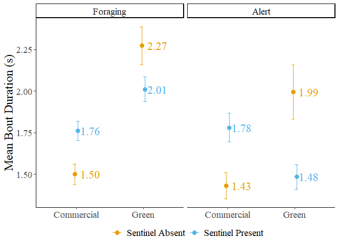
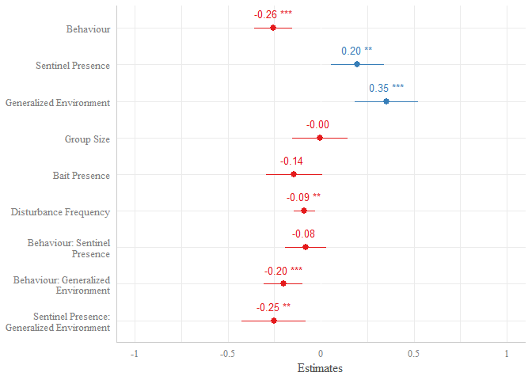
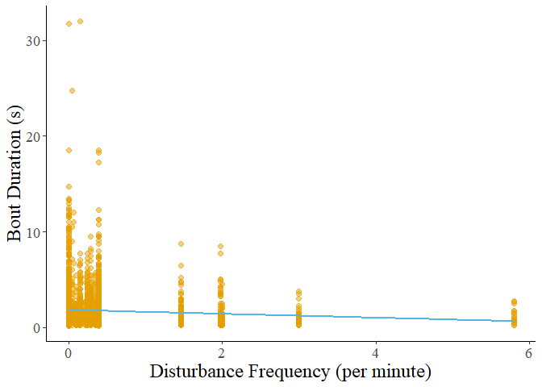
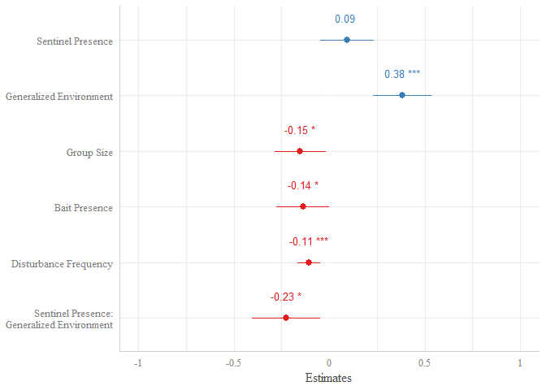
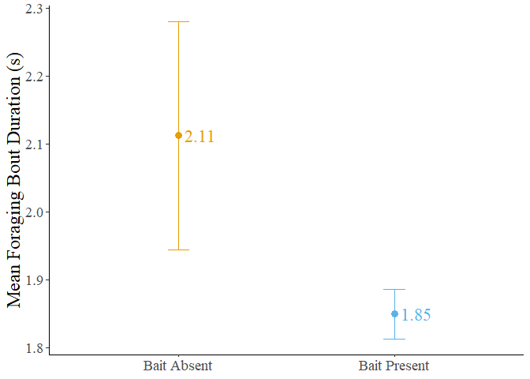
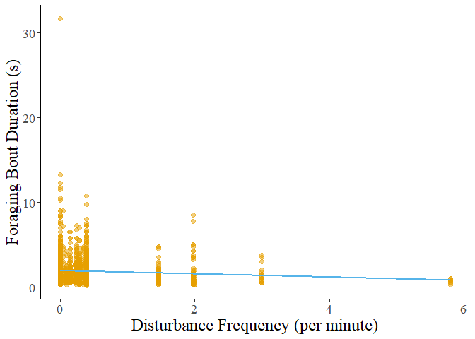
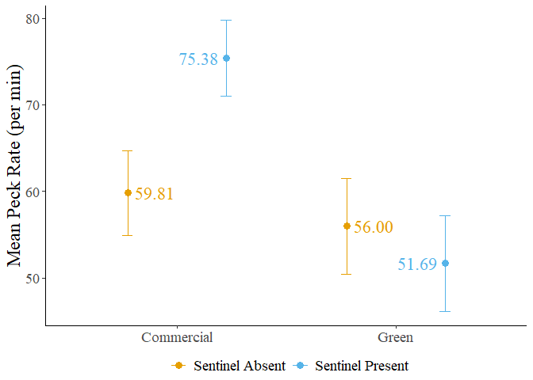
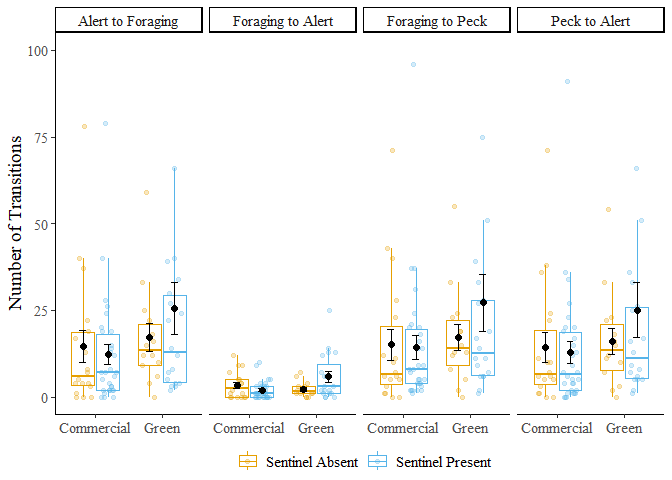

# Bookkeeping


```r
DATA.SR<-read.csv("DATA.SR.csv", stringsAsFactors = T) %>%
  rename("VIDEO_ID" = "VIDEO_ID."
         , "ID" = "ID.")
BOUT.raw<-read.csv("BOUT.csv", stringsAsFactors = T)
```

# Proportion Data


```r
PROP<-DATA.SR[,c(1,2,15,17,19,22,30,36,41,46)] %>% 
  subset(.
         , HU_BEHAVIOR_PROPORTION_... != 0 
         & HD_BEHAVIOR_PROPORTION_... != 0 
         ) %>% #Remove cases where proportion = 1 or 0
  rename("HU" = "HU_BEHAVIOR_PROPORTION_..."
         , "HD" = "HD_BEHAVIOR_PROPORTION_..."
         , "M" = "M_BEHAVIOR_PROPORTION_..."
         , "DISTURBANCE_FREQUENCY" = "TOTAL_FREQUENCY_OF_DISTURBANCES"
         ) %>%
  pivot_longer(., cols = c("HU"
                              , "HD"
                              , "M"
                           )
               , names_to = "BEHAVIOR"
               , values_to = "PROPORTION")

str(PROP)
```

```
## tibble [231 × 9] (S3: tbl_df/tbl/data.frame)
##  $ VIDEO_ID               : Factor w/ 25 levels "037-2","038-2",..: 4 4 4 4 4 4 5 5 5 5 ...
##  $ ID                     : Factor w/ 64 levels "020-01-01","020-01-02",..: 1 1 1 2 2 2 3 3 3 3 ...
##  $ GENERALIZED_ENVIRONMENT: Factor w/ 2 levels "Commercial","Green Area": 2 2 2 2 2 2 2 2 2 2 ...
##  $ SENTINEL_PRESENCE      : Factor w/ 2 levels "NO","YES": 1 1 1 1 1 1 1 1 1 2 ...
##  $ BAIT_PRESENCE          : Factor w/ 2 levels "NO","YES": 1 1 1 1 1 1 1 1 1 1 ...
##  $ GROUP_SIZE             : Factor w/ 2 levels "LARGE","SMALL": 2 2 2 2 2 2 2 2 2 2 ...
##  $ DISTURBANCE_FREQUENCY  : num [1:231] 0 0 0 0 0 0 0 0 0 0 ...
##  $ BEHAVIOR               : chr [1:231] "HU" "HD" "M" "HU" ...
##  $ PROPORTION             : num [1:231] 0.301 0.522 0.177 0.354 0.375 ...
```

For every individual, I divided the time spent performing each behavior
by the total time the individual was recorded. To remove outliers, I
removed all observations with no time spent performing one or more
behaviors (4 observations).


```r
PROP.SUMMARY <- summarySE(data = PROP
            , measurevar = "PROPORTION"
            , groupvars = c("GENERALIZED_ENVIRONMENT"
                            , "BEHAVIOR"
                            , "SENTINEL_PRESENCE"
                            )
            )
PROP.SUMMARY$SENTINEL_PRESENCE<-as.factor(replace(as.character(PROP.SUMMARY$SENTINEL_PRESENCE)
                                                  , PROP.SUMMARY$SENTINEL_PRESENCE=="NO"
                                                  , "Sentinel Absent"
                                                  )
                                          )

PROP.SUMMARY$SENTINEL_PRESENCE<-as.factor(replace(as.character(PROP.SUMMARY$SENTINEL_PRESENCE)
                                                  , PROP.SUMMARY$SENTINEL_PRESENCE=="YES"
                                                  , "Sentinel Present"
                                                  )
                                          )

PROP.SUMMARY
```

```
## # A tibble: 12 × 8
##    GENERALIZED_ENVIRONMENT BEHAVIOR SENTINEL…¹     N PROPO…²    sd     se     ci
##    <fct>                   <chr>    <fct>      <dbl>   <dbl> <dbl>  <dbl>  <dbl>
##  1 Commercial              HD       Sentinel …    16   0.338 0.174 0.0434 0.0925
##  2 Commercial              HD       Sentinel …    29   0.331 0.151 0.0280 0.0573
##  3 Commercial              HU       Sentinel …    16   0.411 0.180 0.0450 0.0959
##  4 Commercial              HU       Sentinel …    29   0.365 0.118 0.0219 0.0448
##  5 Commercial              M        Sentinel …    16   0.251 0.181 0.0453 0.0965
##  6 Commercial              M        Sentinel …    29   0.304 0.163 0.0302 0.0618
##  7 Green Area              HD       Sentinel …    13   0.412 0.136 0.0376 0.0820
##  8 Green Area              HD       Sentinel …    19   0.383 0.112 0.0258 0.0542
##  9 Green Area              HU       Sentinel …    13   0.424 0.104 0.0289 0.0630
## 10 Green Area              HU       Sentinel …    19   0.367 0.145 0.0333 0.0700
## 11 Green Area              M        Sentinel …    13   0.164 0.108 0.0299 0.0651
## 12 Green Area              M        Sentinel …    19   0.249 0.103 0.0237 0.0498
## # … with abbreviated variable names ¹​SENTINEL_PRESENCE, ²​PROPORTION
```

## PROP Stacked barplot


```r
PROP.BARPLOT<-ggplot(PROP.SUMMARY
                 , aes(x = GENERALIZED_ENVIRONMENT
                       , y = PROPORTION
                       , fill = BEHAVIOR))+
  geom_bar(stat = 'identity'
           , position = 'stack')+
  geom_text(aes(label = paste0(formattable::digits(PROPORTION*100, dig=2)
                               , "%"))
            , position = position_stack(vjust = 0.5)
            , size = 4
            , family = "serif") +
  scale_y_continuous(labels = scales::percent) +
  theme_classic()+
  ylab("Proportion of time")+
  scale_x_discrete(labels=c("Commercial"
                            , "Green"))+
  scale_fill_manual(values = cbPalette, labels = c("Foraging"
                                                   , "Alert"
                                                   , "Moving")
                    , name="")+
  theme(legend.position = "bottom"
        , text = element_text(size = 18, family = "serif")
        , axis.title.x = element_blank()) +
  facet_grid(~SENTINEL_PRESENCE)
PROP.BARPLOT
```

<!-- -->

To better visualize the effects of generalized environment and sentinel
presence, I calculated the mean proportion for each behavior and plotted
a stacked barplot for each combination of factors.

## PROP Model


```r
PROP.MOD<-lm(PROPORTION~BEHAVIOR+SENTINEL_PRESENCE+GENERALIZED_ENVIRONMENT, data = subset(PROP, PROP$BEHAVIOR != "M"))

sjPlot::tab_model(PROP.MOD
                  , pred.labels = labs.prop
                  , show.stat = T
                  , show.se = T
                  , digits = 4
                  , show.re.var = T
                  , title = ""
                  , dv.labels = ""
                  , file = "Proportion_Table.html")
```

<table style="border-collapse:collapse; border:none;">
<caption style="font-weight: bold; text-align:left;"></caption>
<tr>
<td style=" text-align:center; border-bottom:1px solid; font-style:italic; font-weight:normal;nodv  text-align:left; ">Predictors</td>
<td style=" text-align:center; border-bottom:1px solid; font-style:italic; font-weight:normal;nodv  ">Estimates</td>
<td style=" text-align:center; border-bottom:1px solid; font-style:italic; font-weight:normal;nodv  ">std. Error</td>
<td style=" text-align:center; border-bottom:1px solid; font-style:italic; font-weight:normal;nodv  ">CI</td>
<td style=" text-align:center; border-bottom:1px solid; font-style:italic; font-weight:normal;nodv  ">Statistic</td>
<td style=" text-align:center; border-bottom:1px solid; font-style:italic; font-weight:normal;nodv  ">p</td>
</tr>
<tr>
<td style=" padding:0.2cm; text-align:left; vertical-align:top; text-align:left; ">Intercept</td>
<td style=" padding:0.2cm; text-align:left; vertical-align:top; text-align:center;  ">0.3658</td>
<td style=" padding:0.2cm; text-align:left; vertical-align:top; text-align:center;  ">0.0240</td>
<td style=" padding:0.2cm; text-align:left; vertical-align:top; text-align:center;  ">0.3185&nbsp;&ndash;&nbsp;0.4132</td>
<td style=" padding:0.2cm; text-align:left; vertical-align:top; text-align:center;  ">15.2636</td>
<td style=" padding:0.2cm; text-align:left; vertical-align:top; text-align:center;  "><strong>&lt;0.001</strong></td>
</tr>
<tr>
<td style=" padding:0.2cm; text-align:left; vertical-align:top; text-align:left; ">Behaviour</td>
<td style=" padding:0.2cm; text-align:left; vertical-align:top; text-align:center;  ">0.0263</td>
<td style=" padding:0.2cm; text-align:left; vertical-align:top; text-align:center;  ">0.0226</td>
<td style=" padding:0.2cm; text-align:left; vertical-align:top; text-align:center;  ">&#45;0.0185&nbsp;&ndash;&nbsp;0.0710</td>
<td style=" padding:0.2cm; text-align:left; vertical-align:top; text-align:center;  ">1.1600</td>
<td style=" padding:0.2cm; text-align:left; vertical-align:top; text-align:center;  ">0.248</td>
</tr>
<tr>
<td style=" padding:0.2cm; text-align:left; vertical-align:top; text-align:left; ">Sentinel Presence</td>
<td style=" padding:0.2cm; text-align:left; vertical-align:top; text-align:center;  ">&#45;0.0335</td>
<td style=" padding:0.2cm; text-align:left; vertical-align:top; text-align:center;  ">0.0234</td>
<td style=" padding:0.2cm; text-align:left; vertical-align:top; text-align:center;  ">&#45;0.0797&nbsp;&ndash;&nbsp;0.0127</td>
<td style=" padding:0.2cm; text-align:left; vertical-align:top; text-align:center;  ">&#45;1.4314</td>
<td style=" padding:0.2cm; text-align:left; vertical-align:top; text-align:center;  ">0.154</td>
</tr>
<tr>
<td style=" padding:0.2cm; text-align:left; vertical-align:top; text-align:left; ">Generalized Environment</td>
<td style=" padding:0.2cm; text-align:left; vertical-align:top; text-align:center;  ">0.0336</td>
<td style=" padding:0.2cm; text-align:left; vertical-align:top; text-align:center;  ">0.0230</td>
<td style=" padding:0.2cm; text-align:left; vertical-align:top; text-align:center;  ">&#45;0.0118&nbsp;&ndash;&nbsp;0.0791</td>
<td style=" padding:0.2cm; text-align:left; vertical-align:top; text-align:center;  ">1.4625</td>
<td style=" padding:0.2cm; text-align:left; vertical-align:top; text-align:center;  ">0.146</td>
</tr>
<tr>
<td style=" padding:0.2cm; text-align:left; vertical-align:top; text-align:left; padding-top:0.1cm; padding-bottom:0.1cm; border-top:1px solid;">Observations</td>
<td style=" padding:0.2cm; text-align:left; vertical-align:top; padding-top:0.1cm; padding-bottom:0.1cm; text-align:left; border-top:1px solid;" colspan="5">154</td>
</tr>
<tr>
<td style=" padding:0.2cm; text-align:left; vertical-align:top; text-align:left; padding-top:0.1cm; padding-bottom:0.1cm;">R<sup>2</sup> / R<sup>2</sup> adjusted</td>
<td style=" padding:0.2cm; text-align:left; vertical-align:top; padding-top:0.1cm; padding-bottom:0.1cm; text-align:left;" colspan="5">0.037 / 0.018</td>
</tr>

</table>


A linear model was performed. While all behaviors were included in the
model, "Moving" behavior was omitted from analysis, as not all bouts of
movement were recorded in their entirety.

Results: Crows allocate similar time to foraging and vigilance (Estimate
= 0.0263, SE = 0.0236, t-stat = 1.16, p = 0.248), and neither the
presence of a sentinel (Estimate = -0.0335, SE = 0.0234, t-stat =
-1.4314, p = 0.154) or the generalized environment (Estimate = 0.0336,
SE = 0.0230, t-stat = 1.4625, p = 0.146 have an effect on the
proportion of time allocated to either alert or foraging behavior.

# Bout Data


```r
BOUT<-BOUT.raw %>%
  filter(.
         , DURATION > 0.01) %>% #Remove impossibly small values
  filter(.
         , BEHAVIOR != "M") %>% #Remove "M"
  mutate(SENTINEL_PRESENCE = recode_factor(SENTINEL_PRESENCE
                                           , 'NO' = "Sentinel Absent"
                         , 'YES' = "Sentinel Present"
                         ))
BOUT$LDURATION<-log(BOUT$DURATION) #Transform data for normality
str(BOUT)
```

```
## 'data.frame':	3897 obs. of  16 variables:
##  $ VIDEO_ID               : Factor w/ 25 levels "037-2","038-2",..: 4 4 4 4 4 4 4 4 4 4 ...
##  $ ID                     : Factor w/ 67 levels "020-01-01","020-01-02",..: 1 1 1 1 1 1 1 1 1 1 ...
##  $ JULIAN_DATE            : int  20227825 20227825 20227825 20227825 20227825 20227825 20227825 20227825 20227825 20227825 ...
##  $ DECIMAL_TIME           : num  6.33 6.33 6.33 6.33 6.33 ...
##  $ LATITUDE               : num  43.2 43.2 43.2 43.2 43.2 ...
##  $ LONGITUDE              : num  -79.2 -79.2 -79.2 -79.2 -79.2 ...
##  $ TEMPERATURE            : int  18 18 18 18 18 18 18 18 18 18 ...
##  $ WEATHER                : Factor w/ 6 levels "Cloudy","Foggy",..: 6 6 6 6 6 6 6 6 6 6 ...
##  $ GROUP_SIZE             : Factor w/ 2 levels "LARGE","SMALL": 2 2 2 2 2 2 2 2 2 2 ...
##  $ BAIT_PRESENCE          : Factor w/ 2 levels "NO","YES": 1 1 1 1 1 1 1 1 1 1 ...
##  $ GENERALIZED_ENVIRONMENT: Factor w/ 2 levels "Commercial","Green Area": 2 2 2 2 2 2 2 2 2 2 ...
##  $ SENTINEL_PRESENCE      : Factor w/ 2 levels "Sentinel Absent",..: 1 1 1 1 1 1 1 1 1 1 ...
##  $ DISTURBANCE_FREQUENCY  : num  0 0 0 0 0 0 0 0 0 0 ...
##  $ BEHAVIOR               : Factor w/ 3 levels "HD","HU","M": 1 1 1 1 1 1 1 1 1 1 ...
##  $ DURATION               : num  2.38 2.51 3.51 1.75 10.5 ...
##  $ LDURATION              : num  0.869 0.919 1.255 0.56 2.351 ...
```

In order to analyze the effects of generalized environment and the
presence of a sentinel on the duration of bouts, I first removed all
bouts of a duration shorter than 0.01s to remove impossibly small
outliers (likely artifacts from video coding in BORIS, 21 observations
removed), and removed all bouts where the individuals were moving as
they were not always recorded in their entirety (1173 observations
removed).


```r
BOUT.SUMMARY <- summarySE(data = BOUT
                      , measurevar = "DURATION"
                      , groupvars = c("GENERALIZED_ENVIRONMENT"
                                      , "BEHAVIOR"
                                      , "SENTINEL_PRESENCE"
                                      )
                      ) %>%
  mutate(BEHAVIOR = recode_factor(BEHAVIOR
                                  ,'HD' = 'Foraging'#Rename HD as 'foraging'
                                  , 'HU' = 'Alert') #Rename HU as 'Alert'
                           )

BOUT.SUMMARY
```

```
##   GENERALIZED_ENVIRONMENT BEHAVIOR SENTINEL_PRESENCE   N DURATION       sd
## 1              Commercial Foraging   Sentinel Absent 336 1.500423 1.136791
## 2              Commercial Foraging  Sentinel Present 503 1.760944 1.283057
## 3              Commercial    Alert   Sentinel Absent 422 1.431455 1.611098
## 4              Commercial    Alert  Sentinel Present 627 1.781003 2.173001
## 5              Green Area Foraging   Sentinel Absent 275 2.272862 1.882358
## 6              Green Area Foraging  Sentinel Present 673 2.010571 1.919007
## 7              Green Area    Alert   Sentinel Absent 324 1.993713 2.949379
## 8              Green Area    Alert  Sentinel Present 737 1.484700 2.025277
##           se        ci
## 1 0.06201706 0.1219919
## 2 0.05720870 0.1123980
## 3 0.07842704 0.1541574
## 4 0.08678130 0.1704177
## 5 0.11351045 0.2234634
## 6 0.07397229 0.1452446
## 7 0.16385436 0.3223565
## 8 0.07460204 0.1464582
```

## BOUT Dot Plot


```r
BOUT.DOTPLOT<-BOUT.SUMMARY %>%
           ggplot(.
               , aes(x = GENERALIZED_ENVIRONMENT
                     , y = DURATION
                     , colour = SENTINEL_PRESENCE))+
  geom_point(position = position_dodge(width = 0.1)
             , size = 3
             ) +
  geom_errorbar(aes(ymin=(DURATION-se)
                    , ymax=(DURATION+se))
                , width = 0.1
                , position = position_dodge(width=0.1))+
  geom_text(aes(label =  scales::label_number(accuracy=0.01)(DURATION))
            , hjust = -0.2
            , size = 6
            , show.legend = F
            , family = "serif") +
  theme_classic() +
  ylab("Mean Bout Duration (s)") +
  scale_colour_manual(values = cbPalette
                      , name = "") +
  scale_x_discrete(labels = c("Commercial", "Green"))+
  theme(axis.title.x = element_blank()
        , legend.position = "bottom"
        , legend.box="vertical"
        , legend.margin=margin()
        , text = element_text(size = 18, family = "serif")
        ) +
  facet_grid(~BEHAVIOR)

BOUT.DOTPLOT
```

<!-- -->

> The error bars represent the standard error, while the symbols are the
> mean duration of bouts.

## BOUT Model - All behaviors


```r
BOUT.MOD<-rlmer(LDURATION~BEHAVIOR*SENTINEL_PRESENCE+BEHAVIOR*GENERALIZED_ENVIRONMENT+SENTINEL_PRESENCE*GENERALIZED_ENVIRONMENT+GROUP_SIZE+BAIT_PRESENCE+DISTURBANCE_FREQUENCY+(1|ID), data = BOUT)

sjPlot::tab_model(BOUT.MOD
                  , pred.labels = labs.bout.1
                  , show.re.var = T
                  , show.se = T
                  , show.stat = T
                  , digits = 4
                  , title = ""
                  , dv.labels = "")
```

<table style="border-collapse:collapse; border:none;">
<caption style="font-weight: bold; text-align:left;"></caption>
<tr>
<td style=" text-align:center; border-bottom:1px solid; font-style:italic; font-weight:normal;nodv  text-align:left; ">Predictors</td>
<td style=" text-align:center; border-bottom:1px solid; font-style:italic; font-weight:normal;nodv  ">Estimates</td>
<td style=" text-align:center; border-bottom:1px solid; font-style:italic; font-weight:normal;nodv  ">std. Error</td>
<td style=" text-align:center; border-bottom:1px solid; font-style:italic; font-weight:normal;nodv  ">CI</td>
<td style=" text-align:center; border-bottom:1px solid; font-style:italic; font-weight:normal;nodv  ">Statistic</td>
<td style=" text-align:center; border-bottom:1px solid; font-style:italic; font-weight:normal;nodv  ">p</td>
</tr>
<tr>
<td style=" padding:0.2cm; text-align:left; vertical-align:top; text-align:left; ">Intercept</td>
<td style=" padding:0.2cm; text-align:left; vertical-align:top; text-align:center;  ">0.3330</td>
<td style=" padding:0.2cm; text-align:left; vertical-align:top; text-align:center;  ">0.1032</td>
<td style=" padding:0.2cm; text-align:left; vertical-align:top; text-align:center;  ">0.1307&nbsp;&ndash;&nbsp;0.5354</td>
<td style=" padding:0.2cm; text-align:left; vertical-align:top; text-align:center;  ">3.2263</td>
<td style=" padding:0.2cm; text-align:left; vertical-align:top; text-align:center;  "><strong>0.001</strong></td>
</tr>
<tr>
<td style=" padding:0.2cm; text-align:left; vertical-align:top; text-align:left; ">Behaviour</td>
<td style=" padding:0.2cm; text-align:left; vertical-align:top; text-align:center;  ">&#45;0.2557</td>
<td style=" padding:0.2cm; text-align:left; vertical-align:top; text-align:center;  ">0.0511</td>
<td style=" padding:0.2cm; text-align:left; vertical-align:top; text-align:center;  ">&#45;0.3559&nbsp;&ndash;&nbsp;-0.1555</td>
<td style=" padding:0.2cm; text-align:left; vertical-align:top; text-align:center;  ">&#45;5.0024</td>
<td style=" padding:0.2cm; text-align:left; vertical-align:top; text-align:center;  "><strong>&lt;0.001</strong></td>
</tr>
<tr>
<td style=" padding:0.2cm; text-align:left; vertical-align:top; text-align:left; ">Sentinel Presence</td>
<td style=" padding:0.2cm; text-align:left; vertical-align:top; text-align:center;  ">0.1974</td>
<td style=" padding:0.2cm; text-align:left; vertical-align:top; text-align:center;  ">0.0720</td>
<td style=" padding:0.2cm; text-align:left; vertical-align:top; text-align:center;  ">0.0562&nbsp;&ndash;&nbsp;0.3385</td>
<td style=" padding:0.2cm; text-align:left; vertical-align:top; text-align:center;  ">2.7406</td>
<td style=" padding:0.2cm; text-align:left; vertical-align:top; text-align:center;  "><strong>0.006</strong></td>
</tr>
<tr>
<td style=" padding:0.2cm; text-align:left; vertical-align:top; text-align:left; ">Generalized Environment</td>
<td style=" padding:0.2cm; text-align:left; vertical-align:top; text-align:center;  ">0.3534</td>
<td style=" padding:0.2cm; text-align:left; vertical-align:top; text-align:center;  ">0.0873</td>
<td style=" padding:0.2cm; text-align:left; vertical-align:top; text-align:center;  ">0.1823&nbsp;&ndash;&nbsp;0.5245</td>
<td style=" padding:0.2cm; text-align:left; vertical-align:top; text-align:center;  ">4.0482</td>
<td style=" padding:0.2cm; text-align:left; vertical-align:top; text-align:center;  "><strong>&lt;0.001</strong></td>
</tr>
<tr>
<td style=" padding:0.2cm; text-align:left; vertical-align:top; text-align:left; ">Group Size</td>
<td style=" padding:0.2cm; text-align:left; vertical-align:top; text-align:center;  ">&#45;0.0046</td>
<td style=" padding:0.2cm; text-align:left; vertical-align:top; text-align:center;  ">0.0766</td>
<td style=" padding:0.2cm; text-align:left; vertical-align:top; text-align:center;  ">&#45;0.1548&nbsp;&ndash;&nbsp;0.1455</td>
<td style=" padding:0.2cm; text-align:left; vertical-align:top; text-align:center;  ">&#45;0.0603</td>
<td style=" padding:0.2cm; text-align:left; vertical-align:top; text-align:center;  ">0.952</td>
</tr>
<tr>
<td style=" padding:0.2cm; text-align:left; vertical-align:top; text-align:left; ">Bait Presence</td>
<td style=" padding:0.2cm; text-align:left; vertical-align:top; text-align:center;  ">&#45;0.1430</td>
<td style=" padding:0.2cm; text-align:left; vertical-align:top; text-align:center;  ">0.0760</td>
<td style=" padding:0.2cm; text-align:left; vertical-align:top; text-align:center;  ">&#45;0.2920&nbsp;&ndash;&nbsp;0.0060</td>
<td style=" padding:0.2cm; text-align:left; vertical-align:top; text-align:center;  ">&#45;1.8811</td>
<td style=" padding:0.2cm; text-align:left; vertical-align:top; text-align:center;  ">0.060</td>
</tr>
<tr>
<td style=" padding:0.2cm; text-align:left; vertical-align:top; text-align:left; ">Disturbance Frequency</td>
<td style=" padding:0.2cm; text-align:left; vertical-align:top; text-align:center;  ">&#45;0.0878</td>
<td style=" padding:0.2cm; text-align:left; vertical-align:top; text-align:center;  ">0.0295</td>
<td style=" padding:0.2cm; text-align:left; vertical-align:top; text-align:center;  ">&#45;0.1457&nbsp;&ndash;&nbsp;-0.0300</td>
<td style=" padding:0.2cm; text-align:left; vertical-align:top; text-align:center;  ">&#45;2.9748</td>
<td style=" padding:0.2cm; text-align:left; vertical-align:top; text-align:center;  "><strong>0.003</strong></td>
</tr>
<tr>
<td style=" padding:0.2cm; text-align:left; vertical-align:top; text-align:left; ">Behaviour: Sentinel<br>Presence</td>
<td style=" padding:0.2cm; text-align:left; vertical-align:top; text-align:center;  ">&#45;0.0810</td>
<td style=" padding:0.2cm; text-align:left; vertical-align:top; text-align:center;  ">0.0563</td>
<td style=" padding:0.2cm; text-align:left; vertical-align:top; text-align:center;  ">&#45;0.1913&nbsp;&ndash;&nbsp;0.0294</td>
<td style=" padding:0.2cm; text-align:left; vertical-align:top; text-align:center;  ">&#45;1.4382</td>
<td style=" padding:0.2cm; text-align:left; vertical-align:top; text-align:center;  ">0.150</td>
</tr>
<tr>
<td style=" padding:0.2cm; text-align:left; vertical-align:top; text-align:left; ">Behaviour: Generalized<br>Environment</td>
<td style=" padding:0.2cm; text-align:left; vertical-align:top; text-align:center;  ">&#45;0.2023</td>
<td style=" padding:0.2cm; text-align:left; vertical-align:top; text-align:center;  ">0.0537</td>
<td style=" padding:0.2cm; text-align:left; vertical-align:top; text-align:center;  ">&#45;0.3074&nbsp;&ndash;&nbsp;-0.0971</td>
<td style=" padding:0.2cm; text-align:left; vertical-align:top; text-align:center;  ">&#45;3.7690</td>
<td style=" padding:0.2cm; text-align:left; vertical-align:top; text-align:center;  "><strong>&lt;0.001</strong></td>
</tr>
<tr>
<td style=" padding:0.2cm; text-align:left; vertical-align:top; text-align:left; ">Sentinel Presence:<br>Generalized Environment</td>
<td style=" padding:0.2cm; text-align:left; vertical-align:top; text-align:center;  ">&#45;0.2524</td>
<td style=" padding:0.2cm; text-align:left; vertical-align:top; text-align:center;  ">0.0882</td>
<td style=" padding:0.2cm; text-align:left; vertical-align:top; text-align:center;  ">&#45;0.4251&nbsp;&ndash;&nbsp;-0.0796</td>
<td style=" padding:0.2cm; text-align:left; vertical-align:top; text-align:center;  ">&#45;2.8630</td>
<td style=" padding:0.2cm; text-align:left; vertical-align:top; text-align:center;  "><strong>0.004</strong></td>
</tr>
<tr>
<td colspan="6" style="font-weight:bold; text-align:left; padding-top:.8em;">Random Effects</td>
</tr>

<tr>
<td style=" padding:0.2cm; text-align:left; vertical-align:top; text-align:left; padding-top:0.1cm; padding-bottom:0.1cm;">&sigma;<sup>2</sup></td>
<td style=" padding:0.2cm; text-align:left; vertical-align:top; padding-top:0.1cm; padding-bottom:0.1cm; text-align:left;" colspan="5">0.65</td>
</tr>

<tr>
<td style=" padding:0.2cm; text-align:left; vertical-align:top; text-align:left; padding-top:0.1cm; padding-bottom:0.1cm;">&tau;<sub>00</sub> <sub>ID</sub></td>
<td style=" padding:0.2cm; text-align:left; vertical-align:top; padding-top:0.1cm; padding-bottom:0.1cm; text-align:left;" colspan="5">0.03</td>

<tr>
<td style=" padding:0.2cm; text-align:left; vertical-align:top; text-align:left; padding-top:0.1cm; padding-bottom:0.1cm;">ICC</td>
<td style=" padding:0.2cm; text-align:left; vertical-align:top; padding-top:0.1cm; padding-bottom:0.1cm; text-align:left;" colspan="5">0.04</td>

<tr>
<td style=" padding:0.2cm; text-align:left; vertical-align:top; text-align:left; padding-top:0.1cm; padding-bottom:0.1cm;">N <sub>ID</sub></td>
<td style=" padding:0.2cm; text-align:left; vertical-align:top; padding-top:0.1cm; padding-bottom:0.1cm; text-align:left;" colspan="5">64</td>
<tr>
<td style=" padding:0.2cm; text-align:left; vertical-align:top; text-align:left; padding-top:0.1cm; padding-bottom:0.1cm; border-top:1px solid;">Observations</td>
<td style=" padding:0.2cm; text-align:left; vertical-align:top; padding-top:0.1cm; padding-bottom:0.1cm; text-align:left; border-top:1px solid;" colspan="5">3897</td>
</tr>
<tr>
<td style=" padding:0.2cm; text-align:left; vertical-align:top; text-align:left; padding-top:0.1cm; padding-bottom:0.1cm;">Marginal R<sup>2</sup> / Conditional R<sup>2</sup></td>
<td style=" padding:0.2cm; text-align:left; vertical-align:top; padding-top:0.1cm; padding-bottom:0.1cm; text-align:left;" colspan="5">0.076 / 0.113</td>
</tr>

</table>

```r
sjPlot::plot_model(BOUT.MOD
                  , axis.labels = labs.bout.1
                  , show.values=T
                  , show.p=T
                  , value.offset = 0.4
                  , value.size = 3.5
                  , wrap.title = 48
                  , show.re.var = T
                  , title = ""
                  ) +
  theme_sjplot(base_family = "serif" )
```

<!-- -->

I then visualized the data and ran a robust linear mixed model on the
bouts of all behaviors using the following structure:

\$Log(Bout Duration) \~ Behavior X Sentinel Presence + Behavior X
Generalized Environment + Sentinel Presence X Generalized Environment +
Group Size + Bait Presence + Disturbance Frequency + ( 1 \| Individual
ID ) \$

Where the behavior, presence of a sentinel, generalized environment,
group size, bait presence, and disturbance frequency are fixed effects,
while the individual ID is the random effect.

I subsequently ran robust linear mixed models on each behavior
separately, using a similar formula as described above.

RESULTS: Bouts of alertness and foraging were significantly different
(Estimate = -0.2557, SE = 0.0511, t-stat = -5.002, p = \<0.001), with
bouts of alertness being significantly shorter than bouts of vigilance.

Sentinel presence increased the duration of all bouts significantly
(Estimate = 0.1974, SE = 0.0720, t-stat = 2.7406, p = 0.006). All bouts
in green areas were significantly longer than those in commercial areas
(Estimate = 0.3534, SE = 0.0873, t-stat = 4.0482, p = \<0.001). The
interaction between generalized environment and sentinel presence had a
significant effect (Estimate = -0.2524, SE = 0.0882, t-stat = -2.8630, p
= 0.004).

The interaction between behavior type and generalized environment was
also significant (Estimate = -0.2023, SE = 0.0537, t-stat = -3.7690, p =
\<0.001).

Lastly, disturbance frequency had a significant effect on the duration
of all bouts (Estimate = -0.0878, SE = 0.0295, t-stat = -2.9748, p =
0.003), with bout duration decreasing as disturbance frequency
increased.


```r
BOUT.DIFF.ALL_BEHAVIORS<-emmeans(BOUT.MOD, ~SENTINEL_PRESENCE*GENERALIZED_ENVIRONMENT, pbkrtest.limit = 5070)
kbl(test(pairs(BOUT.DIFF.ALL_BEHAVIORS), by = NULL, adjust="fdr"), format = "html", digits = 4, caption = "Bout post hoc - All behaviors", col.names = c("Contrast", "Estimate", "SE", "df", "z-ratio", "p"), align = "lccccc" )%>%
  kable_classic(html_font = "Times New Roman") %>%
  save_kable(file = "Bout_PH_All Behaviors.html", self_contained = T)
```


RESULTS Post-hoc pairwise testing revealed significant differences in
the duration of all bouts. The following results are averaged over the
levels of bait, group size and bait presence, and the p-values are
adjusted using the 'FDR' method for 6 tests. In commercial areas, the
presence of a sentinel increased the duration of foraging bouts
(Estimate = -0.157, SE = 0.0653, z-ratio = -2.402, p = 0.0489). In the
absence of a sentinel, foragers in green areas had longer foraging bouts
(Estimate = -0.252, SE = 0.0821, z-ratio = -3.074, p = 0.0127). Foragers
in commercial areas and in the absence of a sentinel had a marginally
significant effect, shortening foraging bouts in green areas and in the
presence of a sentinel (Estimate = -0.157, SE = 0.0720, z-ratio =
-2.117, p = 0.0589). All other comparisons were not significant (p \<
0.3430)


```r
BOUT.DOTPLOT.DISTURBANCES<-BOUT %>%
           ggplot(.
               , aes(x = DISTURBANCE_FREQUENCY
                     , y = DURATION
                     ))+
  geom_point(size = 2
             , colour = cbPalette[1]
             , alpha = 0.5
             )+
  geom_smooth(method = "lm"
              , se = F
              , colour = cbPalette [2]) +
  theme_classic() +
  xlab("Disturbance Frequency (per minute)") +
  ylab("Bout Duration (s)") +
  theme(legend.position = "none"
        , text = element_text(size = 18, family = "serif")
        )

BOUT.DOTPLOT.DISTURBANCES
```

```
## `geom_smooth()` using formula = 'y ~ x'
```

<!-- -->

## BOUT Model - Head Down


```r
BOUT.MOD.HD<-rlmer(LDURATION~SENTINEL_PRESENCE*GENERALIZED_ENVIRONMENT+GROUP_SIZE+BAIT_PRESENCE+DISTURBANCE_FREQUENCY+(1|ID), data = subset(BOUT, BEHAVIOR == "HD"))

sjPlot::tab_model(BOUT.MOD.HD
                  , pred.labels = labs.bout.2
                  , show.re.var = T
                  , show.se = T
                  , show.stat = T
                  , digits = 4
                  , title = ""
                  , dv.labels = "")
```

<table style="border-collapse:collapse; border:none;">
<caption style="font-weight: bold; text-align:left;"></caption>
<tr>
<td style=" text-align:center; border-bottom:1px solid; font-style:italic; font-weight:normal;nodv  text-align:left; ">Predictors</td>
<td style=" text-align:center; border-bottom:1px solid; font-style:italic; font-weight:normal;nodv  ">Estimates</td>
<td style=" text-align:center; border-bottom:1px solid; font-style:italic; font-weight:normal;nodv  ">std. Error</td>
<td style=" text-align:center; border-bottom:1px solid; font-style:italic; font-weight:normal;nodv  ">CI</td>
<td style=" text-align:center; border-bottom:1px solid; font-style:italic; font-weight:normal;nodv  ">Statistic</td>
<td style=" text-align:center; border-bottom:1px solid; font-style:italic; font-weight:normal;nodv  ">p</td>
</tr>
<tr>
<td style=" padding:0.2cm; text-align:left; vertical-align:top; text-align:left; ">Intercept</td>
<td style=" padding:0.2cm; text-align:left; vertical-align:top; text-align:center;  ">0.4370</td>
<td style=" padding:0.2cm; text-align:left; vertical-align:top; text-align:center;  ">0.0929</td>
<td style=" padding:0.2cm; text-align:left; vertical-align:top; text-align:center;  ">0.2548&nbsp;&ndash;&nbsp;0.6192</td>
<td style=" padding:0.2cm; text-align:left; vertical-align:top; text-align:center;  ">4.7017</td>
<td style=" padding:0.2cm; text-align:left; vertical-align:top; text-align:center;  "><strong>&lt;0.001</strong></td>
</tr>
<tr>
<td style=" padding:0.2cm; text-align:left; vertical-align:top; text-align:left; ">Sentinel Presence</td>
<td style=" padding:0.2cm; text-align:left; vertical-align:top; text-align:center;  ">0.0919</td>
<td style=" padding:0.2cm; text-align:left; vertical-align:top; text-align:center;  ">0.0718</td>
<td style=" padding:0.2cm; text-align:left; vertical-align:top; text-align:center;  ">&#45;0.0488&nbsp;&ndash;&nbsp;0.2327</td>
<td style=" padding:0.2cm; text-align:left; vertical-align:top; text-align:center;  ">1.2799</td>
<td style=" padding:0.2cm; text-align:left; vertical-align:top; text-align:center;  ">0.201</td>
</tr>
<tr>
<td style=" padding:0.2cm; text-align:left; vertical-align:top; text-align:left; ">Generalized Environment</td>
<td style=" padding:0.2cm; text-align:left; vertical-align:top; text-align:center;  ">0.3826</td>
<td style=" padding:0.2cm; text-align:left; vertical-align:top; text-align:center;  ">0.0778</td>
<td style=" padding:0.2cm; text-align:left; vertical-align:top; text-align:center;  ">0.2302&nbsp;&ndash;&nbsp;0.5351</td>
<td style=" padding:0.2cm; text-align:left; vertical-align:top; text-align:center;  ">4.9194</td>
<td style=" padding:0.2cm; text-align:left; vertical-align:top; text-align:center;  "><strong>&lt;0.001</strong></td>
</tr>
<tr>
<td style=" padding:0.2cm; text-align:left; vertical-align:top; text-align:left; ">Group Size</td>
<td style=" padding:0.2cm; text-align:left; vertical-align:top; text-align:center;  ">&#45;0.1519</td>
<td style=" padding:0.2cm; text-align:left; vertical-align:top; text-align:center;  ">0.0684</td>
<td style=" padding:0.2cm; text-align:left; vertical-align:top; text-align:center;  ">&#45;0.2860&nbsp;&ndash;&nbsp;-0.0178</td>
<td style=" padding:0.2cm; text-align:left; vertical-align:top; text-align:center;  ">&#45;2.2205</td>
<td style=" padding:0.2cm; text-align:left; vertical-align:top; text-align:center;  "><strong>0.026</strong></td>
</tr>
<tr>
<td style=" padding:0.2cm; text-align:left; vertical-align:top; text-align:left; ">Bait Presence</td>
<td style=" padding:0.2cm; text-align:left; vertical-align:top; text-align:center;  ">&#45;0.1385</td>
<td style=" padding:0.2cm; text-align:left; vertical-align:top; text-align:center;  ">0.0697</td>
<td style=" padding:0.2cm; text-align:left; vertical-align:top; text-align:center;  ">&#45;0.2751&nbsp;&ndash;&nbsp;-0.0020</td>
<td style=" padding:0.2cm; text-align:left; vertical-align:top; text-align:center;  ">&#45;1.9885</td>
<td style=" padding:0.2cm; text-align:left; vertical-align:top; text-align:center;  "><strong>0.047</strong></td>
</tr>
<tr>
<td style=" padding:0.2cm; text-align:left; vertical-align:top; text-align:left; ">Disturbance Frequency</td>
<td style=" padding:0.2cm; text-align:left; vertical-align:top; text-align:center;  ">&#45;0.1075</td>
<td style=" padding:0.2cm; text-align:left; vertical-align:top; text-align:center;  ">0.0301</td>
<td style=" padding:0.2cm; text-align:left; vertical-align:top; text-align:center;  ">&#45;0.1665&nbsp;&ndash;&nbsp;-0.0484</td>
<td style=" padding:0.2cm; text-align:left; vertical-align:top; text-align:center;  ">&#45;3.5664</td>
<td style=" padding:0.2cm; text-align:left; vertical-align:top; text-align:center;  "><strong>&lt;0.001</strong></td>
</tr>
<tr>
<td style=" padding:0.2cm; text-align:left; vertical-align:top; text-align:left; ">Sentinel Presence:<br>Generalized Environment</td>
<td style=" padding:0.2cm; text-align:left; vertical-align:top; text-align:center;  ">&#45;0.2272</td>
<td style=" padding:0.2cm; text-align:left; vertical-align:top; text-align:center;  ">0.0914</td>
<td style=" padding:0.2cm; text-align:left; vertical-align:top; text-align:center;  ">&#45;0.4063&nbsp;&ndash;&nbsp;-0.0480</td>
<td style=" padding:0.2cm; text-align:left; vertical-align:top; text-align:center;  ">&#45;2.4849</td>
<td style=" padding:0.2cm; text-align:left; vertical-align:top; text-align:center;  "><strong>0.013</strong></td>
</tr>
<tr>
<td colspan="6" style="font-weight:bold; text-align:left; padding-top:.8em;">Random Effects</td>
</tr>

<tr>
<td style=" padding:0.2cm; text-align:left; vertical-align:top; text-align:left; padding-top:0.1cm; padding-bottom:0.1cm;">&sigma;<sup>2</sup></td>
<td style=" padding:0.2cm; text-align:left; vertical-align:top; padding-top:0.1cm; padding-bottom:0.1cm; text-align:left;" colspan="5">0.45</td>
</tr>

<tr>
<td style=" padding:0.2cm; text-align:left; vertical-align:top; text-align:left; padding-top:0.1cm; padding-bottom:0.1cm;">&tau;<sub>00</sub> <sub>ID</sub></td>
<td style=" padding:0.2cm; text-align:left; vertical-align:top; padding-top:0.1cm; padding-bottom:0.1cm; text-align:left;" colspan="5">0.01</td>

<tr>
<td style=" padding:0.2cm; text-align:left; vertical-align:top; text-align:left; padding-top:0.1cm; padding-bottom:0.1cm;">ICC</td>
<td style=" padding:0.2cm; text-align:left; vertical-align:top; padding-top:0.1cm; padding-bottom:0.1cm; text-align:left;" colspan="5">0.03</td>

<tr>
<td style=" padding:0.2cm; text-align:left; vertical-align:top; text-align:left; padding-top:0.1cm; padding-bottom:0.1cm;">N <sub>ID</sub></td>
<td style=" padding:0.2cm; text-align:left; vertical-align:top; padding-top:0.1cm; padding-bottom:0.1cm; text-align:left;" colspan="5">64</td>
<tr>
<td style=" padding:0.2cm; text-align:left; vertical-align:top; text-align:left; padding-top:0.1cm; padding-bottom:0.1cm; border-top:1px solid;">Observations</td>
<td style=" padding:0.2cm; text-align:left; vertical-align:top; padding-top:0.1cm; padding-bottom:0.1cm; text-align:left; border-top:1px solid;" colspan="5">1787</td>
</tr>
<tr>
<td style=" padding:0.2cm; text-align:left; vertical-align:top; text-align:left; padding-top:0.1cm; padding-bottom:0.1cm;">Marginal R<sup>2</sup> / Conditional R<sup>2</sup></td>
<td style=" padding:0.2cm; text-align:left; vertical-align:top; padding-top:0.1cm; padding-bottom:0.1cm; text-align:left;" colspan="5">0.050 / 0.075</td>
</tr>

</table>

```r
sjPlot::plot_model(BOUT.MOD.HD
                  , axis.labels = labs.bout.2
                  , show.values=T
                  , show.p=T
                  , value.offset = 0.4
                  , value.size = 3.5
                  , wrap.title = 48
                  , show.re.var = T
                  , title = "") +
  theme_sjplot(base_family = "serif")
```

<!-- -->

RESULTS: Sentinel presence had no significant effect on the duration of
bouts of foraging (Estimate = 0.0919, SE = 0.0718, t-stat = 1.2799, p =
0.201).

Generalized environment had a significant effect on the duration of
bouts of foraging, with bouts being longer in green areas (Estimate =
0.3826, SE = 0.0778, t-stat = 4.9194, p = \<0.001). The interaction
between generalized environment and sentinel presence was also
significant (Estimate = -0.2272, SE = 0.0914, t-stat = -2.4849, p =
0.013).

Increasing group size significantly increased the duration of bouts of
foraging behavior (Estimate = -0.1519, SE = 0.0684, t-stat = -2.2205, p
= 0.026).

The presence of bait decreased the duration of foraging bouts (Estimate
= -0.1385, SE = 0.0697, t-stat = -1.9885, p = 0.047).

Increasing disturbance frequency significantly decreased the duration of
foraging bouts (Estimate = -0.1075, SE = 0.0301, t-stat = -3.5664, p =
\<0.001).


```r
BOUT.DIFF.HD<-emmeans(BOUT.MOD.HD, ~SENTINEL_PRESENCE*GENERALIZED_ENVIRONMENT, pbkrtest.limit = 5070)
kbl(test(pairs(BOUT.DIFF.HD), by = NULL, adjust="fdr"), format = "html", digits = 4, caption = "Bout post hoc - Foraging", col.names = c("Contrast", "Estimate", "SE", "df", "z-ratio", "p"), align = "lccccc" )%>%
  kable_classic(html_font = "Times New Roman") %>%
  save_kable(file = "Bout_PH_HD.html", self_contained = T)
```


```r
BOUT.DOTPLOT.GROUP_SIZE<-BOUT %>%
  filter(., BEHAVIOR == "HD") %>%
  summarySE(., measurevar = "DURATION", groupvar = "GROUP_SIZE") %>%
           ggplot(.
               , aes(x = GROUP_SIZE
                     , y = DURATION
                     , colour = GROUP_SIZE
                     ))+
  geom_point(position = position_dodge(width = 0.1)
             , size = 3
             ) +
  geom_errorbar(aes(ymin=(DURATION-se)
                    , ymax=(DURATION+se))
                , width = 0.1
                , position = position_dodge(width=0.1))+
  geom_text(aes(label = round(DURATION, 2))
            , hjust = -0.2
            , size = 6
            , show.legend = F
            , family = "serif"
            ) +
  theme_classic() +
  xlab("Group Size") +
  ylab("Mean Foraging Bout Duration (s)") +
  scale_color_manual(values = cbPalette) +
  scale_x_discrete(labels = c("Small Group"
                                  , "Large Group")
                   , limits = c("SMALL", "LARGE")) +
  theme(axis.title.x = element_blank()
        , legend.position = "none"
        , legend.box="vertical"
        , legend.margin=margin()
        , text = element_text(size = 18, family = "serif")
        )

BOUT.DOTPLOT.GROUP_SIZE
```

<!-- -->


```r
BOUT.DOTPLOT.BAIT<-BOUT %>%
  filter(., BEHAVIOR == "HD") %>%
  summarySE(., measurevar = "DURATION", groupvar = "BAIT_PRESENCE") %>%
           ggplot(.
               , aes(x = BAIT_PRESENCE
                     , y = DURATION
                     , colour = BAIT_PRESENCE
                     ))+
  geom_point(position = position_dodge(width = 0.1)
             , size = 3
             ) +
  geom_errorbar(aes(ymin=(DURATION-se)
                    , ymax=(DURATION+se))
                , width = 0.1
                , position = position_dodge(width=0.1))+
  geom_text(aes(label = round(DURATION, 2))
            , hjust = -0.2
            , size = 6
            , show.legend = F
            , family = "serif") +
  theme_classic() +
  ylab("Mean Foraging Bout Duration (s)") +
  scale_color_manual(values = cbPalette) +
  scale_x_discrete(labels = c("Bait Absent"
                                  , "Bait Present")) +
  theme(axis.title.x = element_blank()
        , legend.position = "none"
        , legend.box="vertical"
        , legend.margin=margin()
        , text = element_text(size = 18, family = "serif")
        )

BOUT.DOTPLOT.BAIT
```

<!-- -->


```r
BOUT.DOTPLOT.DISTURBANCES.HD<-BOUT %>%
  filter(., BEHAVIOR == "HD") %>%
           ggplot(.
               , aes(x = DISTURBANCE_FREQUENCY
                     , y = DURATION
                     ))+
  geom_point(size = 2
             , colour = cbPalette[1]
             , alpha = 0.5
             )+
  geom_smooth(method = "lm"
              , se = F
              , colour = cbPalette [2]) +
  theme_classic() +
  xlab("Disturbance Frequency (per minute)") +
  ylab("Foraging Bout Duration (s)") +
  theme(legend.position = "none"
        , text = element_text(size = 18, family = "serif")
        )

BOUT.DOTPLOT.DISTURBANCES.HD
```

```
## `geom_smooth()` using formula = 'y ~ x'
```

<!-- -->

## BOUT Model - Head Up


```r
BOUT.MOD.HU<-rlmer(LDURATION~SENTINEL_PRESENCE*GENERALIZED_ENVIRONMENT+GROUP_SIZE+BAIT_PRESENCE+DISTURBANCE_FREQUENCY+(1|ID), data = subset(BOUT, BEHAVIOR == "HU"))

sjPlot::tab_model(BOUT.MOD.HU
                  , pred.labels = labs.bout.2
                  , show.re.var = T
                  , show.se = T
                  , show.stat = T
                  , digits = 4
                  , title = "Head Up"
                  , dv.labels = " Effects on alert bout duration")
```

<table style="border-collapse:collapse; border:none;">
<caption style="font-weight: bold; text-align:left;">Head Up</caption>
<tr>
<th style="border-top: double; text-align:center; font-style:normal; font-weight:bold; padding:0.2cm;  text-align:left; ">&nbsp;</th>
<th colspan="5" style="border-top: double; text-align:center; font-style:normal; font-weight:bold; padding:0.2cm; "> Effects on alert bout duration</th>
</tr>
<tr>
<td style=" text-align:center; border-bottom:1px solid; font-style:italic; font-weight:normal;  text-align:left; ">Predictors</td>
<td style=" text-align:center; border-bottom:1px solid; font-style:italic; font-weight:normal;  ">Estimates</td>
<td style=" text-align:center; border-bottom:1px solid; font-style:italic; font-weight:normal;  ">std. Error</td>
<td style=" text-align:center; border-bottom:1px solid; font-style:italic; font-weight:normal;  ">CI</td>
<td style=" text-align:center; border-bottom:1px solid; font-style:italic; font-weight:normal;  ">Statistic</td>
<td style=" text-align:center; border-bottom:1px solid; font-style:italic; font-weight:normal;  ">p</td>
</tr>
<tr>
<td style=" padding:0.2cm; text-align:left; vertical-align:top; text-align:left; ">Intercept</td>
<td style=" padding:0.2cm; text-align:left; vertical-align:top; text-align:center;  ">0.0165</td>
<td style=" padding:0.2cm; text-align:left; vertical-align:top; text-align:center;  ">0.1530</td>
<td style=" padding:0.2cm; text-align:left; vertical-align:top; text-align:center;  ">&#45;0.2833&nbsp;&ndash;&nbsp;0.3163</td>
<td style=" padding:0.2cm; text-align:left; vertical-align:top; text-align:center;  ">0.1078</td>
<td style=" padding:0.2cm; text-align:left; vertical-align:top; text-align:center;  ">0.914</td>
</tr>
<tr>
<td style=" padding:0.2cm; text-align:left; vertical-align:top; text-align:left; ">Sentinel Presence</td>
<td style=" padding:0.2cm; text-align:left; vertical-align:top; text-align:center;  ">0.1480</td>
<td style=" padding:0.2cm; text-align:left; vertical-align:top; text-align:center;  ">0.1005</td>
<td style=" padding:0.2cm; text-align:left; vertical-align:top; text-align:center;  ">&#45;0.0489&nbsp;&ndash;&nbsp;0.3450</td>
<td style=" padding:0.2cm; text-align:left; vertical-align:top; text-align:center;  ">1.4733</td>
<td style=" padding:0.2cm; text-align:left; vertical-align:top; text-align:center;  ">0.141</td>
</tr>
<tr>
<td style=" padding:0.2cm; text-align:left; vertical-align:top; text-align:left; ">Generalized Environment</td>
<td style=" padding:0.2cm; text-align:left; vertical-align:top; text-align:center;  ">0.1619</td>
<td style=" padding:0.2cm; text-align:left; vertical-align:top; text-align:center;  ">0.1258</td>
<td style=" padding:0.2cm; text-align:left; vertical-align:top; text-align:center;  ">&#45;0.0847&nbsp;&ndash;&nbsp;0.4085</td>
<td style=" padding:0.2cm; text-align:left; vertical-align:top; text-align:center;  ">1.2866</td>
<td style=" padding:0.2cm; text-align:left; vertical-align:top; text-align:center;  ">0.198</td>
</tr>
<tr>
<td style=" padding:0.2cm; text-align:left; vertical-align:top; text-align:left; ">Group Size</td>
<td style=" padding:0.2cm; text-align:left; vertical-align:top; text-align:center;  ">0.1057</td>
<td style=" padding:0.2cm; text-align:left; vertical-align:top; text-align:center;  ">0.1186</td>
<td style=" padding:0.2cm; text-align:left; vertical-align:top; text-align:center;  ">&#45;0.1268&nbsp;&ndash;&nbsp;0.3382</td>
<td style=" padding:0.2cm; text-align:left; vertical-align:top; text-align:center;  ">0.8913</td>
<td style=" padding:0.2cm; text-align:left; vertical-align:top; text-align:center;  ">0.373</td>
</tr>
<tr>
<td style=" padding:0.2cm; text-align:left; vertical-align:top; text-align:left; ">Bait Presence</td>
<td style=" padding:0.2cm; text-align:left; vertical-align:top; text-align:center;  ">&#45;0.1378</td>
<td style=" padding:0.2cm; text-align:left; vertical-align:top; text-align:center;  ">0.1180</td>
<td style=" padding:0.2cm; text-align:left; vertical-align:top; text-align:center;  ">&#45;0.3690&nbsp;&ndash;&nbsp;0.0934</td>
<td style=" padding:0.2cm; text-align:left; vertical-align:top; text-align:center;  ">&#45;1.1678</td>
<td style=" padding:0.2cm; text-align:left; vertical-align:top; text-align:center;  ">0.243</td>
</tr>
<tr>
<td style=" padding:0.2cm; text-align:left; vertical-align:top; text-align:left; ">Disturbance Frequency</td>
<td style=" padding:0.2cm; text-align:left; vertical-align:top; text-align:center;  ">&#45;0.0624</td>
<td style=" padding:0.2cm; text-align:left; vertical-align:top; text-align:center;  ">0.0453</td>
<td style=" padding:0.2cm; text-align:left; vertical-align:top; text-align:center;  ">&#45;0.1513&nbsp;&ndash;&nbsp;0.0264</td>
<td style=" padding:0.2cm; text-align:left; vertical-align:top; text-align:center;  ">&#45;1.3768</td>
<td style=" padding:0.2cm; text-align:left; vertical-align:top; text-align:center;  ">0.169</td>
</tr>
<tr>
<td style=" padding:0.2cm; text-align:left; vertical-align:top; text-align:left; ">Sentinel Presence:<br>Generalized Environment</td>
<td style=" padding:0.2cm; text-align:left; vertical-align:top; text-align:center;  ">&#45;0.2736</td>
<td style=" padding:0.2cm; text-align:left; vertical-align:top; text-align:center;  ">0.1352</td>
<td style=" padding:0.2cm; text-align:left; vertical-align:top; text-align:center;  ">&#45;0.5385&nbsp;&ndash;&nbsp;-0.0087</td>
<td style=" padding:0.2cm; text-align:left; vertical-align:top; text-align:center;  ">&#45;2.0243</td>
<td style=" padding:0.2cm; text-align:left; vertical-align:top; text-align:center;  "><strong>0.043</strong></td>
</tr>
<tr>
<td colspan="6" style="font-weight:bold; text-align:left; padding-top:.8em;">Random Effects</td>
</tr>

<tr>
<td style=" padding:0.2cm; text-align:left; vertical-align:top; text-align:left; padding-top:0.1cm; padding-bottom:0.1cm;">&sigma;<sup>2</sup></td>
<td style=" padding:0.2cm; text-align:left; vertical-align:top; padding-top:0.1cm; padding-bottom:0.1cm; text-align:left;" colspan="5">0.81</td>
</tr>

<tr>
<td style=" padding:0.2cm; text-align:left; vertical-align:top; text-align:left; padding-top:0.1cm; padding-bottom:0.1cm;">&tau;<sub>00</sub> <sub>ID</sub></td>
<td style=" padding:0.2cm; text-align:left; vertical-align:top; padding-top:0.1cm; padding-bottom:0.1cm; text-align:left;" colspan="5">0.07</td>

<tr>
<td style=" padding:0.2cm; text-align:left; vertical-align:top; text-align:left; padding-top:0.1cm; padding-bottom:0.1cm;">ICC</td>
<td style=" padding:0.2cm; text-align:left; vertical-align:top; padding-top:0.1cm; padding-bottom:0.1cm; text-align:left;" colspan="5">0.08</td>

<tr>
<td style=" padding:0.2cm; text-align:left; vertical-align:top; text-align:left; padding-top:0.1cm; padding-bottom:0.1cm;">N <sub>ID</sub></td>
<td style=" padding:0.2cm; text-align:left; vertical-align:top; padding-top:0.1cm; padding-bottom:0.1cm; text-align:left;" colspan="5">63</td>
<tr>
<td style=" padding:0.2cm; text-align:left; vertical-align:top; text-align:left; padding-top:0.1cm; padding-bottom:0.1cm; border-top:1px solid;">Observations</td>
<td style=" padding:0.2cm; text-align:left; vertical-align:top; padding-top:0.1cm; padding-bottom:0.1cm; text-align:left; border-top:1px solid;" colspan="5">2110</td>
</tr>
<tr>
<td style=" padding:0.2cm; text-align:left; vertical-align:top; text-align:left; padding-top:0.1cm; padding-bottom:0.1cm;">Marginal R<sup>2</sup> / Conditional R<sup>2</sup></td>
<td style=" padding:0.2cm; text-align:left; vertical-align:top; padding-top:0.1cm; padding-bottom:0.1cm; text-align:left;" colspan="5">0.011 / 0.086</td>
</tr>

</table>

```r
sjPlot::plot_model(BOUT.MOD.HU
                  , axis.labels = labs.bout.2
                  , show.values=T
                  , show.p=T
                  , value.offset = 0.4
                  , value.size = 3.5
                  , wrap.title = 48
                  , show.re.var = T
                  , title = "Effects on alert bout duration") +
  theme_sjplot(base_family = "serif")
```

<!-- -->

RESULTS: In contrast to foraging behavior, generalized environment,
group size, bait presence and disturbance frequency had no significant
effect on the duration of bouts of alert behavior (p \< 0.141).

Sentinel behavior did not have an effect on the duration of alert
behavior.

However, the interaction between sentinel behavior and generalized
environment was significant (Estimate = -0.2736, SE = 0.1352, t-stat =
-2.0243, p = 0.043).


#Peck Rate


```r
PECK<-DATA.SR[,c(1,2,15,17,19,22,30,38,48)] %>%
  subset(., HD_BEHAVIOR_DURATION > 0) %>%
  rename("DISTURBANCE_FREQUENCY" = "TOTAL_FREQUENCY_OF_DISTURBANCES")
  
str(PECK)
```

```
## 'data.frame':	79 obs. of  9 variables:
##  $ VIDEO_ID               : Factor w/ 25 levels "037-2","038-2",..: 4 4 5 5 5 6 7 8 9 10 ...
##  $ ID                     : Factor w/ 64 levels "020-01-01","020-01-02",..: 1 2 3 3 4 5 6 7 8 9 ...
##  $ GENERALIZED_ENVIRONMENT: Factor w/ 2 levels "Commercial","Green Area": 2 2 2 2 2 2 2 2 2 2 ...
##  $ SENTINEL_PRESENCE      : Factor w/ 2 levels "NO","YES": 1 1 1 2 1 1 2 1 2 1 ...
##  $ BAIT_PRESENCE          : Factor w/ 2 levels "NO","YES": 1 1 1 1 1 2 2 2 2 2 ...
##  $ GROUP_SIZE             : Factor w/ 2 levels "LARGE","SMALL": 2 2 2 2 2 2 2 2 2 2 ...
##  $ DISTURBANCE_FREQUENCY  : num  0 0 0 0 0 ...
##  $ HD_BEHAVIOR_DURATION   : num  39.76 18.77 22.15 4.22 9.25 ...
##  $ PECK_RATE              : num  46.8 63.9 24.4 14.2 13 ...
```

The peck rate was calculated for every individual by dividing the total
number of pecks at food performed by the total duration of foraging (or
'Head Down') behavior. Individuals that did not forage were excluded.


```
##   GENERALIZED_ENVIRONMENT SENTINEL_PRESENCE  N PECK_RATE       sd       se
## 1              Commercial                NO 17  59.80777 20.28898 4.920800
## 2              Commercial               YES 30  75.37699 24.01898 4.385246
## 3              Green Area                NO 13  55.99726 19.95921 5.535689
## 4              Green Area               YES 19  51.68760 24.07706 5.523656
##          ci
## 1 10.431630
## 2  8.968835
## 3 12.061229
## 4 11.604770
```

## PECK Dot Plot


```r
PECK.DOTPLOT<-ggplot(data = PECK.SUMMARY
               , aes(x = GENERALIZED_ENVIRONMENT
                     , y = PECK_RATE
                     , color = SENTINEL_PRESENCE))+
  geom_point(position = position_dodge(width = 0.9)
             , size = 3
             ) +
  geom_errorbar(aes(ymin=(PECK_RATE-se)
                    , ymax=(PECK_RATE+se))
                , width = 0.1
                , position = position_dodge(width=0.9))+
  geom_text(aes(label = scales::label_number(accuracy=0.01)(PECK_RATE))
            , position = position_dodge(width = 0.4)
            , size = 6
            , show.legend = F
            , family = "serif"
            ) +
  theme_classic() +
  ylab("Mean Peck Rate (per min)") +
  scale_colour_manual(values = cbPalette
                      , labels = c("Sentinel Absent", "Sentinel Present")
                      , name = "")+
  scale_x_discrete(labels = c("Commercial"
                                  , "Green")) +
  theme(axis.title.x = element_blank()
        , legend.position = "bottom"
        , legend.box="vertical"
        , legend.margin=margin()
        , text = element_text(size = 18, family = "serif"))

PECK.DOTPLOT
```

<!-- -->

## PECK Model

I then ran another robust linear mixed model using a similar formula as
for the bout duration. Sentinel presence, generalized environment, group
size, bait presence and the total frequency of disturbances per minute
were used as fixed effects, with the individual ID used as a random
factor.


```r
PECK.MOD<-rlmer(PECK_RATE~SENTINEL_PRESENCE*GENERALIZED_ENVIRONMENT+GENERALIZED_ENVIRONMENT*DISTURBANCE_FREQUENCY+GROUP_SIZE+BAIT_PRESENCE+(1|ID), data = PECK)

sjPlot::tab_model(PECK.MOD
                  , pred.labels = labs.peck
                  , show.re.var = T
                  , show.se = T
                  , show.stat = T
                  , digits = 4
                  , title = ""
                  , dv.labels = ""
                  , file = "Peck_Table.html")
```

<table style="border-collapse:collapse; border:none;">
<caption style="font-weight: bold; text-align:left;"></caption>
<tr>
<td style=" text-align:center; border-bottom:1px solid; font-style:italic; font-weight:normal;nodv  text-align:left; ">Predictors</td>
<td style=" text-align:center; border-bottom:1px solid; font-style:italic; font-weight:normal;nodv  ">Estimates</td>
<td style=" text-align:center; border-bottom:1px solid; font-style:italic; font-weight:normal;nodv  ">std. Error</td>
<td style=" text-align:center; border-bottom:1px solid; font-style:italic; font-weight:normal;nodv  ">CI</td>
<td style=" text-align:center; border-bottom:1px solid; font-style:italic; font-weight:normal;nodv  ">Statistic</td>
<td style=" text-align:center; border-bottom:1px solid; font-style:italic; font-weight:normal;nodv  ">p</td>
</tr>
<tr>
<td style=" padding:0.2cm; text-align:left; vertical-align:top; text-align:left; ">Intercept</td>
<td style=" padding:0.2cm; text-align:left; vertical-align:top; text-align:center;  ">54.3410</td>
<td style=" padding:0.2cm; text-align:left; vertical-align:top; text-align:center;  ">7.5358</td>
<td style=" padding:0.2cm; text-align:left; vertical-align:top; text-align:center;  ">39.5710&nbsp;&ndash;&nbsp;69.1109</td>
<td style=" padding:0.2cm; text-align:left; vertical-align:top; text-align:center;  ">7.2110</td>
<td style=" padding:0.2cm; text-align:left; vertical-align:top; text-align:center;  "><strong>&lt;0.001</strong></td>
</tr>
<tr>
<td style=" padding:0.2cm; text-align:left; vertical-align:top; text-align:left; ">Sentinel Presence</td>
<td style=" padding:0.2cm; text-align:left; vertical-align:top; text-align:center;  ">&#45;0.8275</td>
<td style=" padding:0.2cm; text-align:left; vertical-align:top; text-align:center;  ">6.4243</td>
<td style=" padding:0.2cm; text-align:left; vertical-align:top; text-align:center;  ">&#45;13.4190&nbsp;&ndash;&nbsp;11.7640</td>
<td style=" padding:0.2cm; text-align:left; vertical-align:top; text-align:center;  ">&#45;0.1288</td>
<td style=" padding:0.2cm; text-align:left; vertical-align:top; text-align:center;  ">0.898</td>
</tr>
<tr>
<td style=" padding:0.2cm; text-align:left; vertical-align:top; text-align:left; ">Generalized Environment</td>
<td style=" padding:0.2cm; text-align:left; vertical-align:top; text-align:center;  ">&#45;2.7678</td>
<td style=" padding:0.2cm; text-align:left; vertical-align:top; text-align:center;  ">7.2437</td>
<td style=" padding:0.2cm; text-align:left; vertical-align:top; text-align:center;  ">&#45;16.9652&nbsp;&ndash;&nbsp;11.4295</td>
<td style=" padding:0.2cm; text-align:left; vertical-align:top; text-align:center;  ">&#45;0.3821</td>
<td style=" padding:0.2cm; text-align:left; vertical-align:top; text-align:center;  ">0.702</td>
</tr>
<tr>
<td style=" padding:0.2cm; text-align:left; vertical-align:top; text-align:left; ">Disturbance Frequency</td>
<td style=" padding:0.2cm; text-align:left; vertical-align:top; text-align:center;  ">5.2900</td>
<td style=" padding:0.2cm; text-align:left; vertical-align:top; text-align:center;  ">2.2877</td>
<td style=" padding:0.2cm; text-align:left; vertical-align:top; text-align:center;  ">0.8061&nbsp;&ndash;&nbsp;9.7739</td>
<td style=" padding:0.2cm; text-align:left; vertical-align:top; text-align:center;  ">2.3123</td>
<td style=" padding:0.2cm; text-align:left; vertical-align:top; text-align:center;  "><strong>0.021</strong></td>
</tr>
<tr>
<td style=" padding:0.2cm; text-align:left; vertical-align:top; text-align:left; ">Group Size</td>
<td style=" padding:0.2cm; text-align:left; vertical-align:top; text-align:center;  ">&#45;6.8477</td>
<td style=" padding:0.2cm; text-align:left; vertical-align:top; text-align:center;  ">5.7369</td>
<td style=" padding:0.2cm; text-align:left; vertical-align:top; text-align:center;  ">&#45;18.0918&nbsp;&ndash;&nbsp;4.3963</td>
<td style=" padding:0.2cm; text-align:left; vertical-align:top; text-align:center;  ">&#45;1.1936</td>
<td style=" padding:0.2cm; text-align:left; vertical-align:top; text-align:center;  ">0.233</td>
</tr>
<tr>
<td style=" padding:0.2cm; text-align:left; vertical-align:top; text-align:left; ">Bait Presence</td>
<td style=" padding:0.2cm; text-align:left; vertical-align:top; text-align:center;  ">13.9915</td>
<td style=" padding:0.2cm; text-align:left; vertical-align:top; text-align:center;  ">6.0294</td>
<td style=" padding:0.2cm; text-align:left; vertical-align:top; text-align:center;  ">2.1742&nbsp;&ndash;&nbsp;25.8089</td>
<td style=" padding:0.2cm; text-align:left; vertical-align:top; text-align:center;  ">2.3206</td>
<td style=" padding:0.2cm; text-align:left; vertical-align:top; text-align:center;  "><strong>0.020</strong></td>
</tr>
<tr>
<td style=" padding:0.2cm; text-align:left; vertical-align:top; text-align:left; ">Sentinel Presence:<br>Generalized Environment</td>
<td style=" padding:0.2cm; text-align:left; vertical-align:top; text-align:center;  ">&#45;13.1026</td>
<td style=" padding:0.2cm; text-align:left; vertical-align:top; text-align:center;  ">9.0853</td>
<td style=" padding:0.2cm; text-align:left; vertical-align:top; text-align:center;  ">&#45;30.9094&nbsp;&ndash;&nbsp;4.7042</td>
<td style=" padding:0.2cm; text-align:left; vertical-align:top; text-align:center;  ">&#45;1.4422</td>
<td style=" padding:0.2cm; text-align:left; vertical-align:top; text-align:center;  ">0.149</td>
</tr>
<tr>
<td style=" padding:0.2cm; text-align:left; vertical-align:top; text-align:left; ">Generalized Environment:<br>Disturbance Frequency</td>
<td style=" padding:0.2cm; text-align:left; vertical-align:top; text-align:center;  ">16.1482</td>
<td style=" padding:0.2cm; text-align:left; vertical-align:top; text-align:center;  ">5.3012</td>
<td style=" padding:0.2cm; text-align:left; vertical-align:top; text-align:center;  ">5.7580&nbsp;&ndash;&nbsp;26.5383</td>
<td style=" padding:0.2cm; text-align:left; vertical-align:top; text-align:center;  ">3.0461</td>
<td style=" padding:0.2cm; text-align:left; vertical-align:top; text-align:center;  "><strong>0.002</strong></td>
</tr>
<tr>
<td colspan="6" style="font-weight:bold; text-align:left; padding-top:.8em;">Random Effects</td>
</tr>

<tr>
<td style=" padding:0.2cm; text-align:left; vertical-align:top; text-align:left; padding-top:0.1cm; padding-bottom:0.1cm;">&sigma;<sup>2</sup></td>
<td style=" padding:0.2cm; text-align:left; vertical-align:top; padding-top:0.1cm; padding-bottom:0.1cm; text-align:left;" colspan="5">308.60</td>
</tr>

<tr>
<td style=" padding:0.2cm; text-align:left; vertical-align:top; text-align:left; padding-top:0.1cm; padding-bottom:0.1cm;">&tau;<sub>00</sub> <sub>ID</sub></td>
<td style=" padding:0.2cm; text-align:left; vertical-align:top; padding-top:0.1cm; padding-bottom:0.1cm; text-align:left;" colspan="5">0.00</td>

<tr>
<td style=" padding:0.2cm; text-align:left; vertical-align:top; text-align:left; padding-top:0.1cm; padding-bottom:0.1cm;">ICC</td>
<td style=" padding:0.2cm; text-align:left; vertical-align:top; padding-top:0.1cm; padding-bottom:0.1cm; text-align:left;" colspan="5">0.00</td>

<tr>
<td style=" padding:0.2cm; text-align:left; vertical-align:top; text-align:left; padding-top:0.1cm; padding-bottom:0.1cm;">N <sub>ID</sub></td>
<td style=" padding:0.2cm; text-align:left; vertical-align:top; padding-top:0.1cm; padding-bottom:0.1cm; text-align:left;" colspan="5">64</td>
<tr>
<td style=" padding:0.2cm; text-align:left; vertical-align:top; text-align:left; padding-top:0.1cm; padding-bottom:0.1cm; border-top:1px solid;">Observations</td>
<td style=" padding:0.2cm; text-align:left; vertical-align:top; padding-top:0.1cm; padding-bottom:0.1cm; text-align:left; border-top:1px solid;" colspan="5">79</td>
</tr>
<tr>
<td style=" padding:0.2cm; text-align:left; vertical-align:top; text-align:left; padding-top:0.1cm; padding-bottom:0.1cm;">Marginal R<sup>2</sup> / Conditional R<sup>2</sup></td>
<td style=" padding:0.2cm; text-align:left; vertical-align:top; padding-top:0.1cm; padding-bottom:0.1cm; text-align:left;" colspan="5">0.395 / 0.395</td>
</tr>

</table>

```r
sjPlot::plot_model(PECK.MOD
                  , axis.labels = labs.peck
                  , show.values=T
                  , show.p=T
                  , value.offset = 0.4
                  , value.size = 3.5
                  , wrap.title = 48
                  , show.re.var = T
                  , title = "" ) +
  theme_sjplot(base_family = "serif")
```

<!-- -->


RESULTS Neither the presence of a sentinel nor the generalized
environment alone had a significant effect on the peck rate of foragers
(p \> 0.702).

Peck rate increases significantly as disturbance frequency increases
(Estimate = 5.29, t = 2.312, p = 0.021), with the interaction between
generalized environment and disturbance frequency also significantly
affecting peck rate (Estimate = 16.15, t = 3.046, p = 0.002).

Lastly, the presence of bait significantly increased the peck rate of
foragers (Estimate = 13.99, t = 2.231, p = 0.020).

## Disturbance Frequency x Generalized Environment


```r
PECK.DOTPLOT.DISTURBANCE<-PECK %>%
    ggplot(aes(x = DISTURBANCE_FREQUENCY
               , y = PECK_RATE
               , color = GENERALIZED_ENVIRONMENT))+
  geom_point(size = 3) +
  geom_smooth(method = "lm", se = F) +
  theme_classic() +
  labs(y="Peck Rate (per min)", x="Disturbance Frequency (per min)")+
  scale_x_continuous(n.breaks=14)+
  theme(legend.position = "bottom"
        , text = element_text(size = 18, family = "serif"))+
  scale_color_manual(values = cbPalette
                    , labels = c("Commercial Area"
                                 , "Green Area")
                    , name="")
  

PECK.DOTPLOT.DISTURBANCE
```

```
## `geom_smooth()` using formula = 'y ~ x'
```

<!-- -->

RESULTS Green areas appear to have much fewer disturbances than
commercial areas.


```r
PECK.DOTPLOT.BAIT<-PECK %>%
  summarySE(.
            , measurevar = "PECK_RATE"
            , groupvars = "BAIT_PRESENCE") %>%
  ggplot(.
         , aes(x = BAIT_PRESENCE
                     , y = PECK_RATE
                     , colour = BAIT_PRESENCE
               ))+
  geom_point(position = position_dodge(width = 0.1)
             , size = 3
             ) +
  geom_errorbar(aes(ymin=(PECK_RATE-se)
                    , ymax=(PECK_RATE+se))
                , width = 0.1
                , position = position_dodge(width=0.1))+
  geom_text(aes(label = round(PECK_RATE, 2))
            , hjust = -0.2
            , size = 6
            , show.legend = F
            , family = "serif") +
  theme_classic() +
  ylab("Mean Peck Rate (per min)") +
  scale_x_discrete(labels = c("Baited Absent"
                                  , "Bait Present")) +
  scale_color_manual(values = cbPalette) +
  theme(axis.title.x = element_blank()
        , legend.position = "none"
        , legend.box="vertical"
        , legend.margin=margin()
        , text = element_text(size = 18, family = "serif"))

PECK.DOTPLOT.BAIT
```

<!-- -->

# Sentinel Likelihood


```r
SENT<-DATA.SR[1:81,c(1,7,10,15,17,19,20,22,30,31)] %>%
  distinct()
str(SENT)
```

```
## 'data.frame':	33 obs. of  10 variables:
##  $ VIDEO_ID                       : Factor w/ 25 levels "037-2","038-2",..: 4 5 5 6 7 8 9 10 10 11 ...
##  $ DECIMAL_TIME                   : num  6.33 6.22 6.22 6.3 6.52 ...
##  $ TEMPERATURE                    : int  18 16 16 16 19 22 24 21 21 22 ...
##  $ GENERALIZED_ENVIRONMENT        : Factor w/ 2 levels "Commercial","Green Area": 2 2 2 2 2 2 2 2 2 2 ...
##  $ SENTINEL_PRESENCE              : Factor w/ 2 levels "NO","YES": 1 1 2 1 2 1 2 1 2 2 ...
##  $ BAIT_PRESENCE                  : Factor w/ 2 levels "NO","YES": 1 1 1 2 2 2 2 2 2 2 ...
##  $ NUMBER_OF_CROWS_RECORDED       : int  2 2 2 1 1 1 1 2 2 1 ...
##  $ GROUP_SIZE                     : Factor w/ 2 levels "LARGE","SMALL": 2 2 2 2 2 2 2 2 2 2 ...
##  $ TOTAL_FREQUENCY_OF_DISTURBANCES: num  0 0 0 0.142 0.223 ...
##  $ DISTURBANCE_FREQUENCY          : Factor w/ 3 levels "HIGH","LOW","MEDIUM": 2 2 2 3 3 3 3 3 3 2 ...
```

A chi-squared test was performed to determine if there were
environmental or social factors that affected the likelihood of a
sentinel being present in our videos.


```r
SENT.SUMMARY <- summarySE(data = SENT
                      , measurevar = "GROUP_SIZE" #Random
                      , groupvars = c("GENERALIZED_ENVIRONMENT"
                                      , "SENTINEL_PRESENCE"
                                      )
                      )

SENT.SUMMARY
```

```
##   GENERALIZED_ENVIRONMENT SENTINEL_PRESENCE  N GROUP_SIZE        sd         se
## 1              Commercial                NO  6   1.666667 0.5163978 0.21081851
## 2              Commercial               YES  7   1.571429 0.5345225 0.20203051
## 3              Green Area                NO  8   2.000000 0.0000000 0.00000000
## 4              Green Area               YES 12   1.916667 0.2886751 0.08333333
##          ci
## 1 0.5419262
## 2 0.4943508
## 3 0.0000000
## 4 0.1834154
```

## SENT Barplot


```r
SENT.BARPLOT <- ggplot(SENT.SUMMARY, aes(x=GENERALIZED_ENVIRONMENT
                 , fill = SENTINEL_PRESENCE
                 , y = N
                 , group = SENTINEL_PRESENCE)) + 
  geom_bar(stat='identity', width=.5, position = "dodge") +
  geom_text(aes(label = N, group = SENTINEL_PRESENCE)
            , position = position_dodge(width = 0.5)
            , vjust = 1.5
            , size = 8
            , family = "serif") +
  ylab("Number of observations") +
  theme_classic() +
  scale_fill_manual(""
                    , values = cbPalette
                    , labels = c("Sentinel Absent", "Sentinel Present")
                      ) +
  scale_x_discrete(labels = c("Commercial"
                              , "Green")) +
  theme(axis.title.x = element_blank()
        , text = element_text(size = 18, family = "serif")
        , legend.position = "bottom"
        , legend.box="vertical"
        , legend.margin=margin())
  
SENT.BARPLOT
```

<!-- -->

## SENT Chi-Squared


```r
SENT.CHISQ<-lapply(SENT[,c("GENERALIZED_ENVIRONMENT"
                      , "GROUP_SIZE"
                      , "DISTURBANCE_FREQUENCY"
                      )
                              ]
                         , function(x) CrossTable(x,SENT$SENTINEL_PRESENCE
                                                  , fisher = T
                                                  , chisq = T
                                                  , expected = T
                                                  , prop.c = F
                                                  , prop.t = F
                                                  , prop.chisq = F
                                                  , sresid = T
                                                  , format = 'SPSS'
                                                  )
                         )
```

```
## Warning in chisq.test(tab, correct = FALSE, ...): Chi-squared approximation may
## be incorrect
```

```
## Warning in chisq.test(tab, correct = TRUE, ...): Chi-squared approximation may
## be incorrect
```

```
## Warning in chisq.test(tab, correct = FALSE, ...): Chi-squared approximation may
## be incorrect
```

```r
SENT.CHISQ
```

```
## $GENERALIZED_ENVIRONMENT
##    Cell Contents 
## |-------------------------|
## |                   Count | 
## |         Expected Values | 
## |             Row Percent | 
## |            Std Residual | 
## |-------------------------|
## 
## =====================================
##               SENT$SENTINEL_PRESENCE
## x                 NO      YES   Total
## -------------------------------------
## Commercial        6        7      13 
##                 5.5      7.5         
##                46.2%    53.8%   39.4%
##               0.206   -0.177         
## -------------------------------------
## Green Area        8       12      20 
##                 8.5     11.5         
##                40.0%    60.0%   60.6%
##              -0.166    0.143         
## -------------------------------------
## Total            14       19      33 
## =====================================
## 
## Statistics for All Table Factors
## 
## Pearson's Chi-squared test 
## ------------------------------------------------------------
## Chi^2 = 0.1221515      d.f. = 1      p = 0.727 
## 
## Pearson's Chi-squared test with Yates' continuity correction 
## ------------------------------------------------------------
## Chi^2 = 0      d.f. = 1      p = 1 
## 
##  
## Fisher's Exact Test for Count Data
## ------------------------------------------------------------
## Sample estimate odds ratio: 1.275883 
## 
## Alternative hypothesis: true odds ratio is not equal to 1 
## p = 1 
## 95% confidence interval: 0.2492462 6.528091 
## 
## Alternative hypothesis: true odds ratio is less than 1 
## p = 0.761 
## 95%s confidence interval: % 0 5.198388 
## 
## Alternative hypothesis: true odds ratio is greater than 1 
## p = 0.503 
## 95%s confidence interval: % 0.3131908 Inf 
## 
##         Minimum expected frequency: 5.515152 
## 
## 
## $GROUP_SIZE
##    Cell Contents 
## |-------------------------|
## |                   Count | 
## |         Expected Values | 
## |             Row Percent | 
## |            Std Residual | 
## |-------------------------|
## 
## ================================
##          SENT$SENTINEL_PRESENCE
## x            NO      YES   Total
## --------------------------------
## LARGE        2        4       6 
##            2.5      3.5         
##           33.3%    66.7%   18.2%
##         -0.342    0.293         
## --------------------------------
## SMALL       12       15      27 
##           11.5     15.5         
##           44.4%    55.6%   81.8%
##          0.161   -0.138         
## --------------------------------
## Total       14       19      33 
## ================================
## 
## Statistics for All Table Factors
## 
## Pearson's Chi-squared test 
## ------------------------------------------------------------
## Chi^2 = 0.2481203      d.f. = 1      p = 0.618 
## 
## Pearson's Chi-squared test with Yates' continuity correction 
## ------------------------------------------------------------
## Chi^2 = 0.001723058      d.f. = 1      p = 0.967 
## 
##  
## Fisher's Exact Test for Count Data
## ------------------------------------------------------------
## Sample estimate odds ratio: 0.6337315 
## 
## Alternative hypothesis: true odds ratio is not equal to 1 
## p = 1 
## 95% confidence interval: 0.04933611 5.337857 
## 
## Alternative hypothesis: true odds ratio is less than 1 
## p = 0.49 
## 95%s confidence interval: % 0 4.034101 
## 
## Alternative hypothesis: true odds ratio is greater than 1 
## p = 0.829 
## 95%s confidence interval: % 0.07362799 Inf 
## 
##         Minimum expected frequency: 2.545455 
## Cells with Expected Frequency < 5: 2 of 4 (50%)
## 
## 
## $DISTURBANCE_FREQUENCY
##    Cell Contents 
## |-------------------------|
## |                   Count | 
## |         Expected Values | 
## |             Row Percent | 
## |            Std Residual | 
## |-------------------------|
## 
## =================================
##           SENT$SENTINEL_PRESENCE
## x             NO      YES   Total
## ---------------------------------
## HIGH          1        5       6 
##             2.5      3.5         
##            16.7%    83.3%   18.2%
##          -0.969    0.831         
## ---------------------------------
## LOW           7        7      14 
##             5.9      8.1         
##            50.0%    50.0%   42.4%
##           0.435   -0.374         
## ---------------------------------
## MEDIUM        6        7      13 
##             5.5      7.5         
##            46.2%    53.8%   39.4%
##           0.206   -0.177         
## ---------------------------------
## Total        14       19      33 
## =================================
## 
## Statistics for All Table Factors
## 
## Pearson's Chi-squared test 
## ------------------------------------------------------------
## Chi^2 = 2.032678      d.f. = 2      p = 0.362 
## 
## 
##  
## Fisher's Exact Test for Count Data
## ------------------------------------------------------------
## Alternative hypothesis: two.sided 
## p = 0.476 
##         Minimum expected frequency: 2.545455 
## Cells with Expected Frequency < 5: 2 of 6 (33.33333%)
```

RESULTS Neither the generalized environment (Chi\^2 = 0.1221515, df = 1,
p = 0.727), group size (Chi\^2 = 0.2481203, df = 1, p = 0.618 ), or the
disturbance frequency (Chi\^2 = 2.032678, df = 2, p = 0.362)
significantly affected the likelihood of a sentinel being present.

##SENT Plots - Continuous Variables


```r
SENT.FREQ <- SENT %>% 
  rename("Temperature (deg. C)" = "TEMPERATURE"
         , "Decimal Time" = "DECIMAL_TIME"
         , "Disturbance Frequency (per min)" = "TOTAL_FREQUENCY_OF_DISTURBANCES"
         , "Number of Crows" = "NUMBER_OF_CROWS_RECORDED") %>%
  pivot_longer(., cols = c(#"Temperature (deg. C)"
                           # , "Decimal Time"
                           "Number of Crows"
                           , "Disturbance Frequency (per min)")
               , names_to = "Var"
               , values_to = "Val") %>%
  ggplot(aes(
    x = Val
    , colour = SENTINEL_PRESENCE))+
  geom_freqpoly(linewidth = 1
                , alpha=I(.6)) +
  scale_colour_manual(values = cbPalette
                      , name = ""
                      , labels = c("Sentinel Absent"
                                   , "Sentinel Present")) +
  facet_wrap(~Var, scale = "free_x") +
  theme_classic() +
  theme(legend.position = "bottom"
        , axis.title.x = element_blank()
        , text = element_text(size = 18, family = "serif"))

SENT.FREQ
```

```
## `stat_bin()` using `bins = 30`. Pick better value with `binwidth`.
```

<!-- -->

# Pathway Analysis

I calculated the likelihood of one behavior following another by
dividing the number of transitions from one behavior to another by the
total number of transitions from that behavior.


```r
PTWY<- DATA.SR %>%
  dplyr::select(VIDEO_ID,ID, DECIMAL_TIME, GENERALIZED_ENVIRONMENT, SENTINEL_PRESENCE, BAIT_PRESENCE, NUMBER_OF_CROWS_RECORDED, GROUP_SIZE, TOTAL_NB_TRANSITIONS, TOTAL_FREQUENCY_OF_DISTURBANCES | starts_with("NB_")) %>%
  rename("DISTURBANCE_FREQUENCY" = "TOTAL_FREQUENCY_OF_DISTURBANCES"
         , "Transitions" = "TOTAL_NB_TRANSITIONS") %>%
  mutate(SENTINEL_PRESENCE = recode_factor(SENTINEL_PRESENCE
                                           , 'NO' = "Sentinel Absent"
                                           , 'YES' = "Sentinel Present"))
```

### PTWY Plots


```r
PTWY.SUMMARY<-PTWY %>%
  rename("Foraging to Peck" = "NB_HD.HDP"
         , "Alert to Foraging" = "NB_HU.HD"
         , "Foraging to Alert" = "NB_HD.HU"
         , "Peck to Alert" = "NB_HDP.HU"
         ) %>%
  pivot_longer(., cols = c("Foraging to Peck"
                           , "Alert to Foraging"
                           , "Foraging to Alert"
                           , "Peck to Alert"
                           )
               , names_to = "TRANSITION"
               , values_to = "PTWY") %>%
  summarySE(.
            , measurevar = "PTWY"
            , groupvars = c("TRANSITION"
                            , "SENTINEL_PRESENCE"
                            , "GENERALIZED_ENVIRONMENT"))

PTWY.BOXPLOT<-PTWY %>%
  rename("Foraging to Peck" = "NB_HD.HDP"
         , "Alert to Foraging" = "NB_HU.HD"
         , "Foraging to Alert" = "NB_HD.HU"
         , "Peck to Alert" = "NB_HDP.HU"
         ) %>%
  pivot_longer(., cols = c("Foraging to Peck"
                           , "Alert to Foraging"
                           , "Foraging to Alert"
                           , "Peck to Alert"
                           )
               , names_to = "TRANSITION"
               , values_to = "PTWY") %>%
    ggplot(.
           , aes(x = GENERALIZED_ENVIRONMENT
                 , y = PTWY
                 , colour = SENTINEL_PRESENCE)) +
  geom_boxplot(outlier.shape = NA) +
  geom_jitter(aes(x = GENERALIZED_ENVIRONMENT
                  , group = SENTINEL_PRESENCE)
              , position = position_jitterdodge(jitter.width = 0.5)
              , alpha = 0.25
              ) +
  geom_point(data = PTWY.SUMMARY
             , aes( x = GENERALIZED_ENVIRONMENT
                    , y = PTWY
                    , group = SENTINEL_PRESENCE)
             , size = 2
             , colour = "black"
             , position = position_dodge(width = 0.75)) +
  geom_errorbar(data = PTWY.SUMMARY
                , aes(ymin=(PTWY-se)
                    , ymax=(PTWY+se)
                    , group = SENTINEL_PRESENCE
                    , x = GENERALIZED_ENVIRONMENT)
                , width = 0.2
                , colour = "black"
                , position = position_dodge(width=0.75
                                            )) +
  theme_classic() +
  ylab("Number of Transitions") +
  ylim(0,100)+
  scale_colour_manual(values = cbPalette
                      , name = "") +
  scale_x_discrete(labels = c("Commercial", "Green")
                   )+
  theme(axis.title.x = element_blank()
        , legend.position = "bottom"
        , legend.box="vertical"
        , legend.margin=margin()
        , text = element_text(size = 14, family = "serif")
        ) +
  facet_grid(~TRANSITION)

PTWY.BOXPLOT
```

```
## Warning: Removed 3 rows containing non-finite values (`stat_boxplot()`).
```

```
## Warning: Removed 3 rows containing missing values (`geom_point()`).
```

<!-- -->

### GLMM

A generalized linear mixed model with a poisson distribution was
performed to assess changes in the frequency of transitions to each
behavior. Sentinel presence, generalized environment, disturbance
frequency and bait presence were used as fixed effects, with the total
number of transitions as a random effect.


```r
PTWY.MODELS<-list()
DV<-list("NB_HD.HU"
         , "NB_HD.HDP"
         , "NB_HU.HD"
         , "NB_HDP.HU"
         )


for (y in DV){
  formula<-formula(paste(y,"~SENTINEL_PRESENCE*GENERALIZED_ENVIRONMENT+DISTURBANCE_FREQUENCY+BAIT_PRESENCE+(1|Transitions)"))
  PTWY.MODELS[[y]]<-glmer(formula, data = PTWY, family = "poisson", control=glmerControl(optimizer="bobyqa", optCtrl=list(maxfun=100000)))
}

tab_model(PTWY.MODELS
          , pred.labels = labs.ptwy
                  , show.re.var = T
                  , show.se = T
                  , show.stat = T
                  , digits = 4
                  , title = ""
                  , dv.labels = c("Foraging to Alert"
                                  , "Foraging to Peck"
                                  , "Alert to Foraging"
                                  , "Peck to Alert")
          , file = "PTWY_Table.html"
          )
```

<table style="border-collapse:collapse; border:none;">
<caption style="font-weight: bold; text-align:left;"></caption>
<tr>
<th style="border-top: double; text-align:center; font-style:normal; font-weight:bold; padding:0.2cm;  text-align:left; ">&nbsp;</th>
<th colspan="5" style="border-top: double; text-align:center; font-style:normal; font-weight:bold; padding:0.2cm; ">Foraging to Alert</th>
<th colspan="5" style="border-top: double; text-align:center; font-style:normal; font-weight:bold; padding:0.2cm; ">Foraging to Peck</th>
<th colspan="5" style="border-top: double; text-align:center; font-style:normal; font-weight:bold; padding:0.2cm; ">Alert to Foraging</th>
<th colspan="5" style="border-top: double; text-align:center; font-style:normal; font-weight:bold; padding:0.2cm; ">Peck to Alert</th>
</tr>
<tr>
<td style=" text-align:center; border-bottom:1px solid; font-style:italic; font-weight:normal;  text-align:left; ">Predictors</td>
<td style=" text-align:center; border-bottom:1px solid; font-style:italic; font-weight:normal;  ">Incidence Rate Ratios</td>
<td style=" text-align:center; border-bottom:1px solid; font-style:italic; font-weight:normal;  ">std. Error</td>
<td style=" text-align:center; border-bottom:1px solid; font-style:italic; font-weight:normal;  ">CI</td>
<td style=" text-align:center; border-bottom:1px solid; font-style:italic; font-weight:normal;  ">Statistic</td>
<td style=" text-align:center; border-bottom:1px solid; font-style:italic; font-weight:normal;  ">p</td>
<td style=" text-align:center; border-bottom:1px solid; font-style:italic; font-weight:normal;  col7">Incidence Rate Ratios</td>
<td style=" text-align:center; border-bottom:1px solid; font-style:italic; font-weight:normal;  col8">std. Error</td>
<td style=" text-align:center; border-bottom:1px solid; font-style:italic; font-weight:normal;  col9">CI</td>
<td style=" text-align:center; border-bottom:1px solid; font-style:italic; font-weight:normal;  0">Statistic</td>
<td style=" text-align:center; border-bottom:1px solid; font-style:italic; font-weight:normal;  1">p</td>
<td style=" text-align:center; border-bottom:1px solid; font-style:italic; font-weight:normal;  2">Incidence Rate Ratios</td>
<td style=" text-align:center; border-bottom:1px solid; font-style:italic; font-weight:normal;  3">std. Error</td>
<td style=" text-align:center; border-bottom:1px solid; font-style:italic; font-weight:normal;  4">CI</td>
<td style=" text-align:center; border-bottom:1px solid; font-style:italic; font-weight:normal;  5">Statistic</td>
<td style=" text-align:center; border-bottom:1px solid; font-style:italic; font-weight:normal;  6">p</td>
<td style=" text-align:center; border-bottom:1px solid; font-style:italic; font-weight:normal;  7">Incidence Rate Ratios</td>
<td style=" text-align:center; border-bottom:1px solid; font-style:italic; font-weight:normal;  8">std. Error</td>
<td style=" text-align:center; border-bottom:1px solid; font-style:italic; font-weight:normal;  9">CI</td>
<td style=" text-align:center; border-bottom:1px solid; font-style:italic; font-weight:normal;  0">Statistic</td>
<td style=" text-align:center; border-bottom:1px solid; font-style:italic; font-weight:normal;  1">p</td>
</tr>
<tr>
<td style=" padding:0.2cm; text-align:left; vertical-align:top; text-align:left; ">Intercept</td>
<td style=" padding:0.2cm; text-align:left; vertical-align:top; text-align:center;  ">2.9323</td>
<td style=" padding:0.2cm; text-align:left; vertical-align:top; text-align:center;  ">1.0694</td>
<td style=" padding:0.2cm; text-align:left; vertical-align:top; text-align:center;  ">1.4348&nbsp;&ndash;&nbsp;5.9927</td>
<td style=" padding:0.2cm; text-align:left; vertical-align:top; text-align:center;  ">2.9499</td>
<td style=" padding:0.2cm; text-align:left; vertical-align:top; text-align:center;  "><strong>0.003</strong></td>
<td style=" padding:0.2cm; text-align:left; vertical-align:top; text-align:center;  col7">6.4572</td>
<td style=" padding:0.2cm; text-align:left; vertical-align:top; text-align:center;  col8">1.6785</td>
<td style=" padding:0.2cm; text-align:left; vertical-align:top; text-align:center;  col9">3.8796&nbsp;&ndash;&nbsp;10.7474</td>
<td style=" padding:0.2cm; text-align:left; vertical-align:top; text-align:center;  0">7.1755</td>
<td style=" padding:0.2cm; text-align:left; vertical-align:top; text-align:center;  1"><strong>&lt;0.001</strong></td>
<td style=" padding:0.2cm; text-align:left; vertical-align:top; text-align:center;  2">6.6979</td>
<td style=" padding:0.2cm; text-align:left; vertical-align:top; text-align:center;  3">1.8151</td>
<td style=" padding:0.2cm; text-align:left; vertical-align:top; text-align:center;  4">3.9380&nbsp;&ndash;&nbsp;11.3923</td>
<td style=" padding:0.2cm; text-align:left; vertical-align:top; text-align:center;  5">7.0179</td>
<td style=" padding:0.2cm; text-align:left; vertical-align:top; text-align:center;  6"><strong>&lt;0.001</strong></td>
<td style=" padding:0.2cm; text-align:left; vertical-align:top; text-align:center;  7">5.5098</td>
<td style=" padding:0.2cm; text-align:left; vertical-align:top; text-align:center;  8">1.5181</td>
<td style=" padding:0.2cm; text-align:left; vertical-align:top; text-align:center;  9">3.2108&nbsp;&ndash;&nbsp;9.4549</td>
<td style=" padding:0.2cm; text-align:left; vertical-align:top; text-align:center;  0">6.1938</td>
<td style=" padding:0.2cm; text-align:left; vertical-align:top; text-align:center;  1"><strong>&lt;0.001</strong></td>
</tr>
<tr>
<td style=" padding:0.2cm; text-align:left; vertical-align:top; text-align:left; ">Sentinel Presence</td>
<td style=" padding:0.2cm; text-align:left; vertical-align:top; text-align:center;  ">0.6126</td>
<td style=" padding:0.2cm; text-align:left; vertical-align:top; text-align:center;  ">0.2216</td>
<td style=" padding:0.2cm; text-align:left; vertical-align:top; text-align:center;  ">0.3015&nbsp;&ndash;&nbsp;1.2448</td>
<td style=" padding:0.2cm; text-align:left; vertical-align:top; text-align:center;  ">&#45;1.3546</td>
<td style=" padding:0.2cm; text-align:left; vertical-align:top; text-align:center;  ">0.176</td>
<td style=" padding:0.2cm; text-align:left; vertical-align:top; text-align:center;  col7">1.1780</td>
<td style=" padding:0.2cm; text-align:left; vertical-align:top; text-align:center;  col8">0.2477</td>
<td style=" padding:0.2cm; text-align:left; vertical-align:top; text-align:center;  col9">0.7801&nbsp;&ndash;&nbsp;1.7788</td>
<td style=" padding:0.2cm; text-align:left; vertical-align:top; text-align:center;  0">0.7790</td>
<td style=" padding:0.2cm; text-align:left; vertical-align:top; text-align:center;  1">0.436</td>
<td style=" padding:0.2cm; text-align:left; vertical-align:top; text-align:center;  2">1.0677</td>
<td style=" padding:0.2cm; text-align:left; vertical-align:top; text-align:center;  3">0.2402</td>
<td style=" padding:0.2cm; text-align:left; vertical-align:top; text-align:center;  4">0.6870&nbsp;&ndash;&nbsp;1.6595</td>
<td style=" padding:0.2cm; text-align:left; vertical-align:top; text-align:center;  5">0.2914</td>
<td style=" padding:0.2cm; text-align:left; vertical-align:top; text-align:center;  6">0.771</td>
<td style=" padding:0.2cm; text-align:left; vertical-align:top; text-align:center;  7">0.8696</td>
<td style=" padding:0.2cm; text-align:left; vertical-align:top; text-align:center;  8">0.1960</td>
<td style=" padding:0.2cm; text-align:left; vertical-align:top; text-align:center;  9">0.5590&nbsp;&ndash;&nbsp;1.3525</td>
<td style=" padding:0.2cm; text-align:left; vertical-align:top; text-align:center;  0">&#45;0.6201</td>
<td style=" padding:0.2cm; text-align:left; vertical-align:top; text-align:center;  1">0.535</td>
</tr>
<tr>
<td style=" padding:0.2cm; text-align:left; vertical-align:top; text-align:left; ">Generalized Environment</td>
<td style=" padding:0.2cm; text-align:left; vertical-align:top; text-align:center;  ">0.4213</td>
<td style=" padding:0.2cm; text-align:left; vertical-align:top; text-align:center;  ">0.1569</td>
<td style=" padding:0.2cm; text-align:left; vertical-align:top; text-align:center;  ">0.2031&nbsp;&ndash;&nbsp;0.8741</td>
<td style=" padding:0.2cm; text-align:left; vertical-align:top; text-align:center;  ">&#45;2.3214</td>
<td style=" padding:0.2cm; text-align:left; vertical-align:top; text-align:center;  "><strong>0.020</strong></td>
<td style=" padding:0.2cm; text-align:left; vertical-align:top; text-align:center;  col7">1.1775</td>
<td style=" padding:0.2cm; text-align:left; vertical-align:top; text-align:center;  col8">0.2213</td>
<td style=" padding:0.2cm; text-align:left; vertical-align:top; text-align:center;  col9">0.8147&nbsp;&ndash;&nbsp;1.7018</td>
<td style=" padding:0.2cm; text-align:left; vertical-align:top; text-align:center;  0">0.8693</td>
<td style=" padding:0.2cm; text-align:left; vertical-align:top; text-align:center;  1">0.385</td>
<td style=" padding:0.2cm; text-align:left; vertical-align:top; text-align:center;  2">1.0616</td>
<td style=" padding:0.2cm; text-align:left; vertical-align:top; text-align:center;  3">0.2081</td>
<td style=" padding:0.2cm; text-align:left; vertical-align:top; text-align:center;  4">0.7230&nbsp;&ndash;&nbsp;1.5589</td>
<td style=" padding:0.2cm; text-align:left; vertical-align:top; text-align:center;  5">0.3051</td>
<td style=" padding:0.2cm; text-align:left; vertical-align:top; text-align:center;  6">0.760</td>
<td style=" padding:0.2cm; text-align:left; vertical-align:top; text-align:center;  7">1.0304</td>
<td style=" padding:0.2cm; text-align:left; vertical-align:top; text-align:center;  8">0.2028</td>
<td style=" padding:0.2cm; text-align:left; vertical-align:top; text-align:center;  9">0.7006&nbsp;&ndash;&nbsp;1.5155</td>
<td style=" padding:0.2cm; text-align:left; vertical-align:top; text-align:center;  0">0.1522</td>
<td style=" padding:0.2cm; text-align:left; vertical-align:top; text-align:center;  1">0.879</td>
</tr>
<tr>
<td style=" padding:0.2cm; text-align:left; vertical-align:top; text-align:left; ">Disturbance Frequency</td>
<td style=" padding:0.2cm; text-align:left; vertical-align:top; text-align:center;  ">0.7281</td>
<td style=" padding:0.2cm; text-align:left; vertical-align:top; text-align:center;  ">0.1085</td>
<td style=" padding:0.2cm; text-align:left; vertical-align:top; text-align:center;  ">0.5437&nbsp;&ndash;&nbsp;0.9750</td>
<td style=" padding:0.2cm; text-align:left; vertical-align:top; text-align:center;  ">&#45;2.1301</td>
<td style=" padding:0.2cm; text-align:left; vertical-align:top; text-align:center;  "><strong>0.033</strong></td>
<td style=" padding:0.2cm; text-align:left; vertical-align:top; text-align:center;  col7">0.9802</td>
<td style=" padding:0.2cm; text-align:left; vertical-align:top; text-align:center;  col8">0.0755</td>
<td style=" padding:0.2cm; text-align:left; vertical-align:top; text-align:center;  col9">0.8428&nbsp;&ndash;&nbsp;1.1400</td>
<td style=" padding:0.2cm; text-align:left; vertical-align:top; text-align:center;  0">&#45;0.2595</td>
<td style=" padding:0.2cm; text-align:left; vertical-align:top; text-align:center;  1">0.795</td>
<td style=" padding:0.2cm; text-align:left; vertical-align:top; text-align:center;  2">0.9312</td>
<td style=" padding:0.2cm; text-align:left; vertical-align:top; text-align:center;  3">0.0753</td>
<td style=" padding:0.2cm; text-align:left; vertical-align:top; text-align:center;  4">0.7947&nbsp;&ndash;&nbsp;1.0912</td>
<td style=" padding:0.2cm; text-align:left; vertical-align:top; text-align:center;  5">&#45;0.8808</td>
<td style=" padding:0.2cm; text-align:left; vertical-align:top; text-align:center;  6">0.378</td>
<td style=" padding:0.2cm; text-align:left; vertical-align:top; text-align:center;  7">0.9331</td>
<td style=" padding:0.2cm; text-align:left; vertical-align:top; text-align:center;  8">0.0779</td>
<td style=" padding:0.2cm; text-align:left; vertical-align:top; text-align:center;  9">0.7923&nbsp;&ndash;&nbsp;1.0991</td>
<td style=" padding:0.2cm; text-align:left; vertical-align:top; text-align:center;  0">&#45;0.8288</td>
<td style=" padding:0.2cm; text-align:left; vertical-align:top; text-align:center;  1">0.407</td>
</tr>
<tr>
<td style=" padding:0.2cm; text-align:left; vertical-align:top; text-align:left; ">Bait Presence</td>
<td style=" padding:0.2cm; text-align:left; vertical-align:top; text-align:center;  ">1.0971</td>
<td style=" padding:0.2cm; text-align:left; vertical-align:top; text-align:center;  ">0.3756</td>
<td style=" padding:0.2cm; text-align:left; vertical-align:top; text-align:center;  ">0.5608&nbsp;&ndash;&nbsp;2.1464</td>
<td style=" padding:0.2cm; text-align:left; vertical-align:top; text-align:center;  ">0.2707</td>
<td style=" padding:0.2cm; text-align:left; vertical-align:top; text-align:center;  ">0.787</td>
<td style=" padding:0.2cm; text-align:left; vertical-align:top; text-align:center;  col7">1.7096</td>
<td style=" padding:0.2cm; text-align:left; vertical-align:top; text-align:center;  col8">0.3843</td>
<td style=" padding:0.2cm; text-align:left; vertical-align:top; text-align:center;  col9">1.1005&nbsp;&ndash;&nbsp;2.6559</td>
<td style=" padding:0.2cm; text-align:left; vertical-align:top; text-align:center;  0">2.3858</td>
<td style=" padding:0.2cm; text-align:left; vertical-align:top; text-align:center;  1"><strong>0.017</strong></td>
<td style=" padding:0.2cm; text-align:left; vertical-align:top; text-align:center;  2">1.5134</td>
<td style=" padding:0.2cm; text-align:left; vertical-align:top; text-align:center;  3">0.3506</td>
<td style=" padding:0.2cm; text-align:left; vertical-align:top; text-align:center;  4">0.9611&nbsp;&ndash;&nbsp;2.3831</td>
<td style=" padding:0.2cm; text-align:left; vertical-align:top; text-align:center;  5">1.7888</td>
<td style=" padding:0.2cm; text-align:left; vertical-align:top; text-align:center;  6">0.074</td>
<td style=" padding:0.2cm; text-align:left; vertical-align:top; text-align:center;  7">2.2037</td>
<td style=" padding:0.2cm; text-align:left; vertical-align:top; text-align:center;  8">0.5378</td>
<td style=" padding:0.2cm; text-align:left; vertical-align:top; text-align:center;  9">1.3659&nbsp;&ndash;&nbsp;3.5552</td>
<td style=" padding:0.2cm; text-align:left; vertical-align:top; text-align:center;  0">3.2378</td>
<td style=" padding:0.2cm; text-align:left; vertical-align:top; text-align:center;  1"><strong>0.001</strong></td>
</tr>
<tr>
<td style=" padding:0.2cm; text-align:left; vertical-align:top; text-align:left; ">Sentinel Presence:<br>Generalized Environment</td>
<td style=" padding:0.2cm; text-align:left; vertical-align:top; text-align:center;  ">5.0212</td>
<td style=" padding:0.2cm; text-align:left; vertical-align:top; text-align:center;  ">2.4571</td>
<td style=" padding:0.2cm; text-align:left; vertical-align:top; text-align:center;  ">1.9243&nbsp;&ndash;&nbsp;13.1019</td>
<td style=" padding:0.2cm; text-align:left; vertical-align:top; text-align:center;  ">3.2977</td>
<td style=" padding:0.2cm; text-align:left; vertical-align:top; text-align:center;  "><strong>0.001</strong></td>
<td style=" padding:0.2cm; text-align:left; vertical-align:top; text-align:center;  col7">0.9705</td>
<td style=" padding:0.2cm; text-align:left; vertical-align:top; text-align:center;  col8">0.2696</td>
<td style=" padding:0.2cm; text-align:left; vertical-align:top; text-align:center;  col9">0.5630&nbsp;&ndash;&nbsp;1.6730</td>
<td style=" padding:0.2cm; text-align:left; vertical-align:top; text-align:center;  0">&#45;0.1077</td>
<td style=" padding:0.2cm; text-align:left; vertical-align:top; text-align:center;  1">0.914</td>
<td style=" padding:0.2cm; text-align:left; vertical-align:top; text-align:center;  2">1.2282</td>
<td style=" padding:0.2cm; text-align:left; vertical-align:top; text-align:center;  3">0.3596</td>
<td style=" padding:0.2cm; text-align:left; vertical-align:top; text-align:center;  4">0.6919&nbsp;&ndash;&nbsp;2.1803</td>
<td style=" padding:0.2cm; text-align:left; vertical-align:top; text-align:center;  5">0.7021</td>
<td style=" padding:0.2cm; text-align:left; vertical-align:top; text-align:center;  6">0.483</td>
<td style=" padding:0.2cm; text-align:left; vertical-align:top; text-align:center;  7">1.3485</td>
<td style=" padding:0.2cm; text-align:left; vertical-align:top; text-align:center;  8">0.3998</td>
<td style=" padding:0.2cm; text-align:left; vertical-align:top; text-align:center;  9">0.7542&nbsp;&ndash;&nbsp;2.4111</td>
<td style=" padding:0.2cm; text-align:left; vertical-align:top; text-align:center;  0">1.0083</td>
<td style=" padding:0.2cm; text-align:left; vertical-align:top; text-align:center;  1">0.313</td>
</tr>
<tr>
<td colspan="21" style="font-weight:bold; text-align:left; padding-top:.8em;">Random Effects</td>
</tr>

<tr>
<td style=" padding:0.2cm; text-align:left; vertical-align:top; text-align:left; padding-top:0.1cm; padding-bottom:0.1cm;">&sigma;<sup>2</sup></td>
<td style=" padding:0.2cm; text-align:left; vertical-align:top; padding-top:0.1cm; padding-bottom:0.1cm; text-align:left;" colspan="5">0.40</td>
<td style=" padding:0.2cm; text-align:left; vertical-align:top; padding-top:0.1cm; padding-bottom:0.1cm; text-align:left;" colspan="5">0.08</td>
<td style=" padding:0.2cm; text-align:left; vertical-align:top; padding-top:0.1cm; padding-bottom:0.1cm; text-align:left;" colspan="5">0.09</td>
<td style=" padding:0.2cm; text-align:left; vertical-align:top; padding-top:0.1cm; padding-bottom:0.1cm; text-align:left;" colspan="5">0.10</td>
</tr>

<tr>
<td style=" padding:0.2cm; text-align:left; vertical-align:top; text-align:left; padding-top:0.1cm; padding-bottom:0.1cm;">&tau;<sub>00</sub></td>
<td style=" padding:0.2cm; text-align:left; vertical-align:top; padding-top:0.1cm; padding-bottom:0.1cm; text-align:left;" colspan="5">0.98 <sub>Transitions</sub></td>
<td style=" padding:0.2cm; text-align:left; vertical-align:top; padding-top:0.1cm; padding-bottom:0.1cm; text-align:left;" colspan="5">1.19 <sub>Transitions</sub></td>
<td style=" padding:0.2cm; text-align:left; vertical-align:top; padding-top:0.1cm; padding-bottom:0.1cm; text-align:left;" colspan="5">1.39 <sub>Transitions</sub></td>
<td style=" padding:0.2cm; text-align:left; vertical-align:top; padding-top:0.1cm; padding-bottom:0.1cm; text-align:left;" colspan="5">1.32 <sub>Transitions</sub></td>

<tr>
<td style=" padding:0.2cm; text-align:left; vertical-align:top; text-align:left; padding-top:0.1cm; padding-bottom:0.1cm;">ICC</td>
<td style=" padding:0.2cm; text-align:left; vertical-align:top; padding-top:0.1cm; padding-bottom:0.1cm; text-align:left;" colspan="5">0.71</td>
<td style=" padding:0.2cm; text-align:left; vertical-align:top; padding-top:0.1cm; padding-bottom:0.1cm; text-align:left;" colspan="5">0.94</td>
<td style=" padding:0.2cm; text-align:left; vertical-align:top; padding-top:0.1cm; padding-bottom:0.1cm; text-align:left;" colspan="5">0.94</td>
<td style=" padding:0.2cm; text-align:left; vertical-align:top; padding-top:0.1cm; padding-bottom:0.1cm; text-align:left;" colspan="5">0.93</td>

<tr>
<td style=" padding:0.2cm; text-align:left; vertical-align:top; text-align:left; padding-top:0.1cm; padding-bottom:0.1cm;">N</td>
<td style=" padding:0.2cm; text-align:left; vertical-align:top; padding-top:0.1cm; padding-bottom:0.1cm; text-align:left;" colspan="5">64 <sub>Transitions</sub></td>
<td style=" padding:0.2cm; text-align:left; vertical-align:top; padding-top:0.1cm; padding-bottom:0.1cm; text-align:left;" colspan="5">64 <sub>Transitions</sub></td>
<td style=" padding:0.2cm; text-align:left; vertical-align:top; padding-top:0.1cm; padding-bottom:0.1cm; text-align:left;" colspan="5">64 <sub>Transitions</sub></td>
<td style=" padding:0.2cm; text-align:left; vertical-align:top; padding-top:0.1cm; padding-bottom:0.1cm; text-align:left;" colspan="5">64 <sub>Transitions</sub></td>
<tr>
<td style=" padding:0.2cm; text-align:left; vertical-align:top; text-align:left; padding-top:0.1cm; padding-bottom:0.1cm; border-top:1px solid;">Observations</td>
<td style=" padding:0.2cm; text-align:left; vertical-align:top; padding-top:0.1cm; padding-bottom:0.1cm; text-align:left; border-top:1px solid;" colspan="5">81</td>
<td style=" padding:0.2cm; text-align:left; vertical-align:top; padding-top:0.1cm; padding-bottom:0.1cm; text-align:left; border-top:1px solid;" colspan="5">81</td>
<td style=" padding:0.2cm; text-align:left; vertical-align:top; padding-top:0.1cm; padding-bottom:0.1cm; text-align:left; border-top:1px solid;" colspan="5">81</td>
<td style=" padding:0.2cm; text-align:left; vertical-align:top; padding-top:0.1cm; padding-bottom:0.1cm; text-align:left; border-top:1px solid;" colspan="5">81</td>
</tr>
<tr>
<td style=" padding:0.2cm; text-align:left; vertical-align:top; text-align:left; padding-top:0.1cm; padding-bottom:0.1cm;">Marginal R<sup>2</sup> / Conditional R<sup>2</sup></td>
<td style=" padding:0.2cm; text-align:left; vertical-align:top; padding-top:0.1cm; padding-bottom:0.1cm; text-align:left;" colspan="5">0.189 / 0.767</td>
<td style=" padding:0.2cm; text-align:left; vertical-align:top; padding-top:0.1cm; padding-bottom:0.1cm; text-align:left;" colspan="5">0.037 / 0.937</td>
<td style=" padding:0.2cm; text-align:left; vertical-align:top; padding-top:0.1cm; padding-bottom:0.1cm; text-align:left;" colspan="5">0.025 / 0.938</td>
<td style=" padding:0.2cm; text-align:left; vertical-align:top; padding-top:0.1cm; padding-bottom:0.1cm; text-align:left;" colspan="5">0.060 / 0.937</td>
</tr>

</table>


```r
PTWY.DIFF<-emmeans(PTWY.MODELS$NB_HD.HU, ~SENTINEL_PRESENCE*GENERALIZED_ENVIRONMENT)
kbl(test(pairs(PTWY.DIFF), by = NULL, adjust="fdr"), format = "html", digits = 4, caption = "Pathway analysis post hoc", col.names = c("Contrast", "Estimate", "SE", "df", "z-ratio", "p"), align = "lccccc" )%>%
  kable_classic(html_font = "Times New Roman") %>%
  save_kable(file = "PTWY_PH.html", self_contained = T)
```


RESULTS Transitions from head down to pecking were significantly
affected by the presence of bait, with more transitions occuring in the
presence of bait (IRR = 1.7096, SE = 0.3842, z-stat = 2.3858, p =
0.017). All other factors did not affect this transition.

Transitions from pecking to head up were similarly affected by the
presence of bait, significantly increasing when bait was present (IRR =
2.2037, SE = 0.5378, z-stat = 3.2378, p = 0.001).

Transitions from head up to head down were not affected by any factors,
but bait presence had a marginally significant effect (IRR = 1.5134, SE
= 0.3506, z-stat - 1.7888, p = 0.074). In the presence of bait, the
number of transitions from head up to head down appears to increase.

Transitions from head down to head up, from vulnerability to vigilance,
were significantly affected by generalized environment, disturbance
frequency, and the interaction between generalized environment and
sentinel presence.

In the absence of a sentinel, individuals exhibited marginally more
transitions from foraging to alert behavior in commercial areas
(Estimate = 0.864, SE = 0.372, z-ratio = 2.321, p = 0.0608). However, in
the presence of a sentinel, individuals exhibited marginally more of the
same transitions in green areas (Estimate = -0.749, SE = 0.363, z-ratio
= -2.062, p = 0.0785).

In green areas, individuals performed more transitions from foraging to
alert behavior when in the presence of a sentinel (Estimate = -1.124, SE
= 0.346, z-ratio = -3.250, p = 0.0069).


```r
PTWY.DOTPLOT.BAIT<-PTWY %>%
  rename("Foraging to Peck" = "NB_HD.HDP"
         , "Alert to Foraging" = "NB_HU.HD"
         , "Foraging to Alert" = "NB_HD.HU"
         , "Peck to Alert" = "NB_HDP.HU"
         ) %>%
  pivot_longer(., cols = c("Foraging to Peck"
                           , "Alert to Foraging"
                           , "Foraging to Alert"
                           , "Peck to Alert"
                           )
               , names_to = "TRANSITION"
               , values_to = "PTWY"
               ) %>%
  summarySE(.
            , measurevar = "PTWY"
            , groupvars = c("BAIT_PRESENCE"
                            , "TRANSITION" 
                            )
            ) %>%
  ggplot(.
           , aes(x = BAIT_PRESENCE
                 , y = PTWY
                 , colour = BAIT_PRESENCE)
         ) +
  geom_point(position = position_dodge(width = 0.9)
             ) +
  geom_errorbar(aes(ymin=(PTWY-se)
                    , ymax=(PTWY+se)
                    )
                , width = 0.2
                ) +
    geom_text(aes(label = scales::label_number(accuracy = 0.01)(PTWY)
                  , x = BAIT_PRESENCE
                  , colour = BAIT_PRESENCE)
            , hjust = -0.1
            , show.legend = F
            , family = "serif") +
  theme_classic() +
  ylab("Number of Transitions") +
  xlab("Bait Presence") +
  scale_color_manual(values = cbPalette) +
  scale_x_discrete(labels = c("Absent"
                              , "Present")) +
  theme(legend.position = "none"
        , legend.box="vertical"
        , legend.margin=margin()
        , text = element_text(size = 18, family = "serif")
        ) +
  facet_grid(~TRANSITION)

PTWY.DOTPLOT.BAIT
```

<!-- -->


```r
PTWY.DOTPLOT.DISTURBANCE<- PTWY %>%
  ggplot(.
         , aes(x = DISTURBANCE_FREQUENCY
               , y = NB_HD.HU
               )
         ) +
  geom_point(colour = cbPalette[1]
             ) +
  geom_smooth(method = "glm"
              , method.args = list(family = poisson)
              , colour = cbPalette[2]
              ) +
  theme_classic() +
  xlab("Disturbance Frequency (per min)") +
  ylab("Transitions from Foraging to Alert")+
  theme(text = element_text(size = 18, family = "serif"))

PTWY.DOTPLOT.DISTURBANCE
```

```
## `geom_smooth()` using formula = 'y ~ x'
```

<!-- -->
