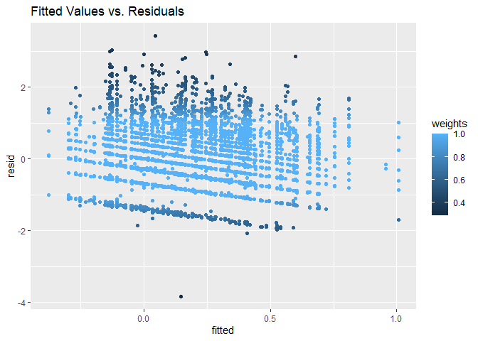
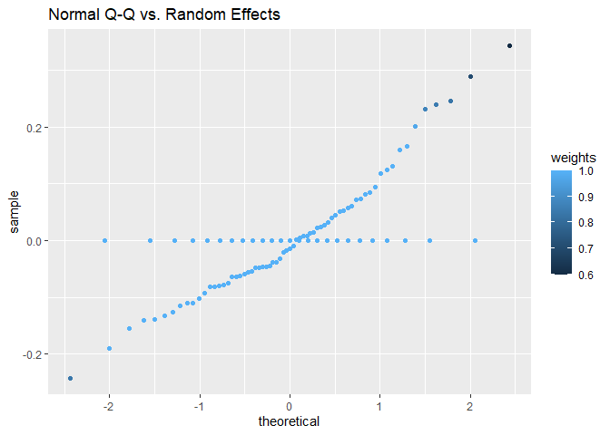
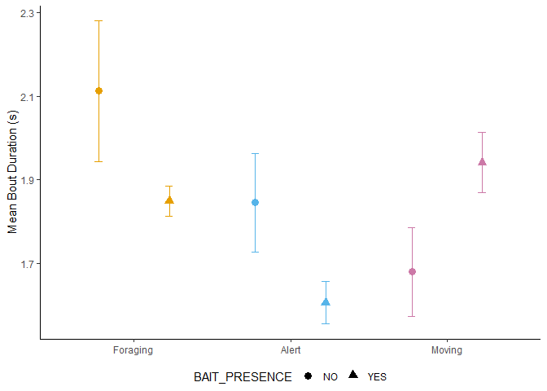

## Preamble

This script will deal with analyzing the relationship of the duration of bouts of behavior - head down, head up, and moving - with the presence of a sentinel, the presence of bait, the foraging environment, the group size and the frequency of disturbances.

As random effects, I've chosen the video and individual ID

This analysis will answer the following question:\
Do individual vary the duration of behavioral bouts in response to their perception of risk and sentinel coverage in their foraging environment?

In other words, if the proportion of time allocated to each behavior does not vary, then does the individual alter the frequency, and therefore the duration of bouts of each behavior in response to, for example, an environment with shorter lines of sight for the sentinel.

To do so, I extracted the bouts of each individual using the following string in the 'advanced event filtering' tool in BORIS v.8.20.3:

"No focal subject\|[Sentinel State]" & "Individual X\|[Behavior]"

I then compiled a dataset and named it "BOUT"


```r
BOUT<-read.csv("BOUT.csv", stringsAsFactors = T)
str(BOUT)
```

```
## 'data.frame':	5091 obs. of  15 variables:
##  $ VIDEO_ID               : Factor w/ 25 levels "037-2","038-2",..: 4 4 4 4 4 4 4 4 4 4 ...
##  $ ID                     : Factor w/ 67 levels "020-01-01","020-01-02",..: 1 1 1 1 1 1 1 1 1 1 ...
##  $ JULIAN_DATE            : int  20227825 20227825 20227825 20227825 20227825 20227825 20227825 20227825 20227825 20227825 ...
##  $ DECIMAL_TIME           : num  6.33 6.33 6.33 6.33 6.33 ...
##  $ LATITUDE               : num  43.2 43.2 43.2 43.2 43.2 ...
##  $ LONGITUDE              : num  -79.2 -79.2 -79.2 -79.2 -79.2 ...
##  $ TEMPERATURE            : int  18 18 18 18 18 18 18 18 18 18 ...
##  $ WEATHER                : Factor w/ 6 levels "Cloudy","Foggy",..: 6 6 6 6 6 6 6 6 6 6 ...
##  $ GROUP_SIZE             : Factor w/ 2 levels "LARGE","SMALL": 2 2 2 2 2 2 2 2 2 2 ...
##  $ BAIT_PRESENCE          : Factor w/ 2 levels "NO","YES": 1 1 1 1 1 1 1 1 1 1 ...
##  $ GENERALIZED_ENVIRONMENT: Factor w/ 2 levels "Commercial","Green Area": 2 2 2 2 2 2 2 2 2 2 ...
##  $ SENTINEL_PRESENCE      : Factor w/ 2 levels "NO","YES": 1 1 1 1 1 1 1 1 1 1 ...
##  $ DISTURBANCE_FREQUENCY  : num  0 0 0 0 0 0 0 0 0 0 ...
##  $ BEHAVIOR               : Factor w/ 3 levels "HD","HU","M": 1 1 1 1 1 1 1 1 1 1 ...
##  $ DURATION               : num  2.38 2.51 3.51 1.75 10.5 ...
```

I will also remove duration values smaller than 0.01, since it is likely an artifact from coding in BORIS. Sometimes things get cut weirdly, resulting in impossibly small values.


```r
BOUT<-BOUT[which(BOUT$DURATION>0.01),]
```

This removed 21 points, leaving me with 5070 bouts.


```r
source("./Calculate Summary Table with SE, SD, CI by grouping variables.R")
BOUT.MEAN <- summarySE(data = BOUT
                      , measurevar = "DURATION"
                      , groupvars = c("GENERALIZED_ENVIRONMENT"
                                      , "BEHAVIOR"
                                      , "SENTINEL_PRESENCE"
                                      )
                      )
BOUT.MEAN
```

```
##    GENERALIZED_ENVIRONMENT BEHAVIOR SENTINEL_PRESENCE   N DURATION       sd
## 1               Commercial       HD                NO 336 1.500423 1.136791
## 2               Commercial       HD               YES 503 1.760944 1.283057
## 3               Commercial       HU                NO 422 1.431455 1.611098
## 4               Commercial       HU               YES 627 1.781003 2.173001
## 5               Commercial        M                NO 294 1.792289 2.043975
## 6               Commercial        M               YES 400 1.975672 2.319469
## 7               Green Area       HD                NO 275 2.272862 1.882358
## 8               Green Area       HD               YES 673 2.010571 1.919007
## 9               Green Area       HU                NO 324 1.993713 2.949379
## 10              Green Area       HU               YES 737 1.484700 2.025277
## 11              Green Area        M                NO 124 1.851500 1.641455
## 12              Green Area        M               YES 355 1.838699 1.942934
##            se        ci
## 1  0.06201706 0.1219919
## 2  0.05720870 0.1123980
## 3  0.07842704 0.1541574
## 4  0.08678130 0.1704177
## 5  0.11920706 0.2346106
## 6  0.11597345 0.2279954
## 7  0.11351045 0.2234634
## 8  0.07397229 0.1452446
## 9  0.16385436 0.3223565
## 10 0.07460204 0.1464582
## 11 0.14740700 0.2917831
## 12 0.10312023 0.2028053
```

This has given me the mean duration of bouts, grouped into each combination of "main" factors of interest.

Onto the analysis

## To transform or not

That is the question.

Due to the nature of the data, the best type of transformation is a log transformation.


<!-- -->

We can clearly see that the untransformed data is right-skewed, and always positive. This is perfect for log-transformations. We see in the histogram of the transformed data, the data is now roughly normally distributed.

Therefore, for the statistical analyses, we will use **LOG-Transformed** durations.


```r
BOUT$LDURATION<-log(BOUT$DURATION)
```

Here is the histogram of the log-transformed data separated by behavior.

<!-- -->

There is a gap in the distribution. That is unfortunate.

## The Dot Plot

Here's where things get beautiful.


```r
BOUT.DOT<-ggplot(data = BOUT.MEAN
               , aes(x = BEHAVIOR
                     , y = DURATION
                     , color = BEHAVIOR
                     , shape = SENTINEL_PRESENCE))+
  geom_point(position = position_dodge(width = 0.9)
             , size = 3) +
  geom_errorbar(aes(ymin=(DURATION-se)
                    , ymax=(DURATION+se))
                , width = 0.2
                , position = position_dodge(width=0.9))+
  theme_classic() +
  ylab("Mean Bout Duration (s)") +
  scale_colour_manual(values = cbPalette
                      , guide="none") +
  scale_shape_manual(values = c(16,17)
                     , labels = c("Sentinel Absent"
                                  , "Sentinel Present")
                     , name = "") +
  scale_x_discrete(labels = c("Foraging", "Alert", "Moving"))+
  theme(axis.title.x = element_blank()
        , legend.position = "bottom"
        , legend.box="vertical"
        , legend.margin=margin()) +
  facet_grid(~GENERALIZED_ENVIRONMENT)

BOUT.DOT
```

<!-- -->

> The error bars represent the standard error, while the symbols are the mean duration of bouts.

Beautiful! It looks like the duration of bouts of alertness and foraging increase increases when sentinels are present in commercial areas. In green areas, this effect is reversed, with bouts of alertness and foraging having decreased duration in the presence of a sentinel. Meanwhile, bouts of movement seem affected by neither the environment nor the presence of a sentinel.

Let's fit the models.

## The Models

Let's fit a model. We are testing principally for the effects of the presence of a sentinel and the generalized environment. However, group size and the presence of bait could also affect the duration of bouts.

I originally had temperature, time and data as random effects, but the model was singular. Running rePCA showed that the random effects explained the same variance.

The first model fitted will be a simple model with no interactions.


```r
BOUT.MOD1<-lmer(LDURATION~BEHAVIOR+SENTINEL_PRESENCE+GENERALIZED_ENVIRONMENT+BAIT_PRESENCE+GROUP_SIZE+DISTURBANCE_FREQUENCY+(1|VIDEO_ID/ID), data = BOUT)

sjPlot::tab_model(BOUT.MOD1
                  , show.re.var = T
                  , title = "Bout Model 1 Output"
                  , dv.labels = " Effects of on duration of bouts of behaviors")
```

<table style="border-collapse:collapse; border:none;">
<caption style="font-weight: bold; text-align:left;">Bout Model 1 Output</caption>
<tr>
<th style="border-top: double; text-align:center; font-style:normal; font-weight:bold; padding:0.2cm;  text-align:left; ">&nbsp;</th>
<th colspan="3" style="border-top: double; text-align:center; font-style:normal; font-weight:bold; padding:0.2cm; "> Effects of on duration of bouts of behaviors</th>
</tr>
<tr>
<td style=" text-align:center; border-bottom:1px solid; font-style:italic; font-weight:normal;  text-align:left; ">Predictors</td>
<td style=" text-align:center; border-bottom:1px solid; font-style:italic; font-weight:normal;  ">Estimates</td>
<td style=" text-align:center; border-bottom:1px solid; font-style:italic; font-weight:normal;  ">CI</td>
<td style=" text-align:center; border-bottom:1px solid; font-style:italic; font-weight:normal;  ">p</td>
</tr>
<tr>
<td style=" padding:0.2cm; text-align:left; vertical-align:top; text-align:left; ">(Intercept)</td>
<td style=" padding:0.2cm; text-align:left; vertical-align:top; text-align:center;  ">0.43</td>
<td style=" padding:0.2cm; text-align:left; vertical-align:top; text-align:center;  ">0.21&nbsp;&ndash;&nbsp;0.65</td>
<td style=" padding:0.2cm; text-align:left; vertical-align:top; text-align:center;  "><strong>&lt;0.001</strong></td>
</tr>
<tr>
<td style=" padding:0.2cm; text-align:left; vertical-align:top; text-align:left; ">BEHAVIOR [HU]</td>
<td style=" padding:0.2cm; text-align:left; vertical-align:top; text-align:center;  ">&#45;0.37</td>
<td style=" padding:0.2cm; text-align:left; vertical-align:top; text-align:center;  ">&#45;0.42&nbsp;&ndash;&nbsp;-0.32</td>
<td style=" padding:0.2cm; text-align:left; vertical-align:top; text-align:center;  "><strong>&lt;0.001</strong></td>
</tr>
<tr>
<td style=" padding:0.2cm; text-align:left; vertical-align:top; text-align:left; ">BEHAVIOR [M]</td>
<td style=" padding:0.2cm; text-align:left; vertical-align:top; text-align:center;  ">&#45;0.15</td>
<td style=" padding:0.2cm; text-align:left; vertical-align:top; text-align:center;  ">&#45;0.21&nbsp;&ndash;&nbsp;-0.09</td>
<td style=" padding:0.2cm; text-align:left; vertical-align:top; text-align:center;  "><strong>&lt;0.001</strong></td>
</tr>
<tr>
<td style=" padding:0.2cm; text-align:left; vertical-align:top; text-align:left; ">SENTINEL PRESENCE [YES]</td>
<td style=" padding:0.2cm; text-align:left; vertical-align:top; text-align:center;  ">0.05</td>
<td style=" padding:0.2cm; text-align:left; vertical-align:top; text-align:center;  ">&#45;0.04&nbsp;&ndash;&nbsp;0.13</td>
<td style=" padding:0.2cm; text-align:left; vertical-align:top; text-align:center;  ">0.321</td>
</tr>
<tr>
<td style=" padding:0.2cm; text-align:left; vertical-align:top; text-align:left; ">GENERALIZED ENVIRONMENT<br>[Green Area]</td>
<td style=" padding:0.2cm; text-align:left; vertical-align:top; text-align:center;  ">0.11</td>
<td style=" padding:0.2cm; text-align:left; vertical-align:top; text-align:center;  ">&#45;0.04&nbsp;&ndash;&nbsp;0.26</td>
<td style=" padding:0.2cm; text-align:left; vertical-align:top; text-align:center;  ">0.144</td>
</tr>
<tr>
<td style=" padding:0.2cm; text-align:left; vertical-align:top; text-align:left; ">BAIT PRESENCE [YES]</td>
<td style=" padding:0.2cm; text-align:left; vertical-align:top; text-align:center;  ">&#45;0.09</td>
<td style=" padding:0.2cm; text-align:left; vertical-align:top; text-align:center;  ">&#45;0.24&nbsp;&ndash;&nbsp;0.07</td>
<td style=" padding:0.2cm; text-align:left; vertical-align:top; text-align:center;  ">0.279</td>
</tr>
<tr>
<td style=" padding:0.2cm; text-align:left; vertical-align:top; text-align:left; ">GROUP SIZE [SMALL]</td>
<td style=" padding:0.2cm; text-align:left; vertical-align:top; text-align:center;  ">0.00</td>
<td style=" padding:0.2cm; text-align:left; vertical-align:top; text-align:center;  ">&#45;0.17&nbsp;&ndash;&nbsp;0.17</td>
<td style=" padding:0.2cm; text-align:left; vertical-align:top; text-align:center;  ">0.982</td>
</tr>
<tr>
<td style=" padding:0.2cm; text-align:left; vertical-align:top; text-align:left; ">DISTURBANCE FREQUENCY</td>
<td style=" padding:0.2cm; text-align:left; vertical-align:top; text-align:center;  ">&#45;0.08</td>
<td style=" padding:0.2cm; text-align:left; vertical-align:top; text-align:center;  ">&#45;0.14&nbsp;&ndash;&nbsp;-0.02</td>
<td style=" padding:0.2cm; text-align:left; vertical-align:top; text-align:center;  "><strong>0.008</strong></td>
</tr>
<tr>
<td colspan="4" style="font-weight:bold; text-align:left; padding-top:.8em;">Random Effects</td>
</tr>

<tr>
<td style=" padding:0.2cm; text-align:left; vertical-align:top; text-align:left; padding-top:0.1cm; padding-bottom:0.1cm;">&sigma;<sup>2</sup></td>
<td style=" padding:0.2cm; text-align:left; vertical-align:top; padding-top:0.1cm; padding-bottom:0.1cm; text-align:left;" colspan="3">0.67</td>
</tr>

<tr>
<td style=" padding:0.2cm; text-align:left; vertical-align:top; text-align:left; padding-top:0.1cm; padding-bottom:0.1cm;">&tau;<sub>00</sub> <sub>ID:VIDEO_ID</sub></td>
<td style=" padding:0.2cm; text-align:left; vertical-align:top; padding-top:0.1cm; padding-bottom:0.1cm; text-align:left;" colspan="3">0.03</td>

<tr>
<td style=" padding:0.2cm; text-align:left; vertical-align:top; text-align:left; padding-top:0.1cm; padding-bottom:0.1cm;">&tau;<sub>00</sub> <sub>VIDEO_ID</sub></td>
<td style=" padding:0.2cm; text-align:left; vertical-align:top; padding-top:0.1cm; padding-bottom:0.1cm; text-align:left;" colspan="3">0.01</td>

<tr>
<td style=" padding:0.2cm; text-align:left; vertical-align:top; text-align:left; padding-top:0.1cm; padding-bottom:0.1cm;">ICC</td>
<td style=" padding:0.2cm; text-align:left; vertical-align:top; padding-top:0.1cm; padding-bottom:0.1cm; text-align:left;" colspan="3">0.05</td>

<tr>
<td style=" padding:0.2cm; text-align:left; vertical-align:top; text-align:left; padding-top:0.1cm; padding-bottom:0.1cm;">N <sub>ID</sub></td>
<td style=" padding:0.2cm; text-align:left; vertical-align:top; padding-top:0.1cm; padding-bottom:0.1cm; text-align:left;" colspan="3">67</td>

<tr>
<td style=" padding:0.2cm; text-align:left; vertical-align:top; text-align:left; padding-top:0.1cm; padding-bottom:0.1cm;">N <sub>VIDEO_ID</sub></td>
<td style=" padding:0.2cm; text-align:left; vertical-align:top; padding-top:0.1cm; padding-bottom:0.1cm; text-align:left;" colspan="3">25</td>
<tr>
<td style=" padding:0.2cm; text-align:left; vertical-align:top; text-align:left; padding-top:0.1cm; padding-bottom:0.1cm; border-top:1px solid;">Observations</td>
<td style=" padding:0.2cm; text-align:left; vertical-align:top; padding-top:0.1cm; padding-bottom:0.1cm; text-align:left; border-top:1px solid;" colspan="3">5070</td>
</tr>
<tr>
<td style=" padding:0.2cm; text-align:left; vertical-align:top; text-align:left; padding-top:0.1cm; padding-bottom:0.1cm;">Marginal R<sup>2</sup> / Conditional R<sup>2</sup></td>
<td style=" padding:0.2cm; text-align:left; vertical-align:top; padding-top:0.1cm; padding-bottom:0.1cm; text-align:left;" colspan="3">0.047 / 0.091</td>
</tr>

</table>

The simple model without interactions shows behavior and the generalized environment having significant effects on the duration of bouts.

Now, we would expect to see bouts of different behaviors being different. It takes longer to manipulate food than it does to look out for sources of threat.\
However, the presence of a sentinel and the environment could modify this effect. If a sentinel is present, then I would expect the duration of bouts of alertness to decrease, while a riskier environment should cause the duration of these bouts to increase.\
As such, in the next model, I will include an interaction between behavior and the presence of a sentinel, as well as behavior and the generalized environment.

The generalized environment has a significant effect, and this supports, at least in part, my predictions.

However, the presence of a sentinel did not affect the duration of bouts. It may be that the effects of the presence of a sentinel is interactive with the type of environment. I will therefore include an interaction between the type of environment and the presence of a sentinel in the next model.

Interestingly, the presence of bait and the group size did not have an effect. I would have expected the bait, a concentrated patch of food, to have an effect on the duration of behavior. It may be the case that the presence of bait only affects the duration of bouts of foraging. As a result, I will also include an interaction between the presence of bait and the behavior in the subsequent model.

Group size provides antipredator benefits to the entire group. If there are many individuals, then either the individual risk of predation decreases (dilution effect) or there are more foragers capable of detecting threats (many-eyes).\
As such, it is possible that, once again, the group size's effects occur on certain behaviors rather than others. I will include this interaction in the next model.

Finally, the frequency of disturbances had a significant effect. I will include an interaction between this factor and generalized environment, as well as with sentinel presence, and behavior.


```r
BOUT.MOD2<-lmer(LDURATION~BEHAVIOR*SENTINEL_PRESENCE+BEHAVIOR*GENERALIZED_ENVIRONMENT+SENTINEL_PRESENCE*GENERALIZED_ENVIRONMENT+GROUP_SIZE+BAIT_PRESENCE+DISTURBANCE_FREQUENCY+(1|VIDEO_ID/ID), data = BOUT)

sjPlot::tab_model(BOUT.MOD2
                  , show.re.var = T
                  , title = "Bout Model 2 Output"
                  , dv.labels = " Effects of on duration of bouts of behaviors")
```

<table style="border-collapse:collapse; border:none;">
<caption style="font-weight: bold; text-align:left;">Bout Model 2 Output</caption>
<tr>
<th style="border-top: double; text-align:center; font-style:normal; font-weight:bold; padding:0.2cm;  text-align:left; ">&nbsp;</th>
<th colspan="3" style="border-top: double; text-align:center; font-style:normal; font-weight:bold; padding:0.2cm; "> Effects of on duration of bouts of behaviors</th>
</tr>
<tr>
<td style=" text-align:center; border-bottom:1px solid; font-style:italic; font-weight:normal;  text-align:left; ">Predictors</td>
<td style=" text-align:center; border-bottom:1px solid; font-style:italic; font-weight:normal;  ">Estimates</td>
<td style=" text-align:center; border-bottom:1px solid; font-style:italic; font-weight:normal;  ">CI</td>
<td style=" text-align:center; border-bottom:1px solid; font-style:italic; font-weight:normal;  ">p</td>
</tr>
<tr>
<td style=" padding:0.2cm; text-align:left; vertical-align:top; text-align:left; ">(Intercept)</td>
<td style=" padding:0.2cm; text-align:left; vertical-align:top; text-align:center;  ">0.29</td>
<td style=" padding:0.2cm; text-align:left; vertical-align:top; text-align:center;  ">0.09&nbsp;&ndash;&nbsp;0.50</td>
<td style=" padding:0.2cm; text-align:left; vertical-align:top; text-align:center;  "><strong>0.005</strong></td>
</tr>
<tr>
<td style=" padding:0.2cm; text-align:left; vertical-align:top; text-align:left; ">BEHAVIOR [HU]</td>
<td style=" padding:0.2cm; text-align:left; vertical-align:top; text-align:center;  ">&#45;0.22</td>
<td style=" padding:0.2cm; text-align:left; vertical-align:top; text-align:center;  ">&#45;0.32&nbsp;&ndash;&nbsp;-0.12</td>
<td style=" padding:0.2cm; text-align:left; vertical-align:top; text-align:center;  "><strong>&lt;0.001</strong></td>
</tr>
<tr>
<td style=" padding:0.2cm; text-align:left; vertical-align:top; text-align:left; ">BEHAVIOR [M]</td>
<td style=" padding:0.2cm; text-align:left; vertical-align:top; text-align:center;  ">&#45;0.04</td>
<td style=" padding:0.2cm; text-align:left; vertical-align:top; text-align:center;  ">&#45;0.16&nbsp;&ndash;&nbsp;0.07</td>
<td style=" padding:0.2cm; text-align:left; vertical-align:top; text-align:center;  ">0.488</td>
</tr>
<tr>
<td style=" padding:0.2cm; text-align:left; vertical-align:top; text-align:left; ">SENTINEL PRESENCE [YES]</td>
<td style=" padding:0.2cm; text-align:left; vertical-align:top; text-align:center;  ">0.18</td>
<td style=" padding:0.2cm; text-align:left; vertical-align:top; text-align:center;  ">0.05&nbsp;&ndash;&nbsp;0.32</td>
<td style=" padding:0.2cm; text-align:left; vertical-align:top; text-align:center;  "><strong>0.007</strong></td>
</tr>
<tr>
<td style=" padding:0.2cm; text-align:left; vertical-align:top; text-align:left; ">GENERALIZED ENVIRONMENT<br>[Green Area]</td>
<td style=" padding:0.2cm; text-align:left; vertical-align:top; text-align:center;  ">0.37</td>
<td style=" padding:0.2cm; text-align:left; vertical-align:top; text-align:center;  ">0.20&nbsp;&ndash;&nbsp;0.54</td>
<td style=" padding:0.2cm; text-align:left; vertical-align:top; text-align:center;  "><strong>&lt;0.001</strong></td>
</tr>
<tr>
<td style=" padding:0.2cm; text-align:left; vertical-align:top; text-align:left; ">GROUP SIZE [SMALL]</td>
<td style=" padding:0.2cm; text-align:left; vertical-align:top; text-align:center;  ">0.02</td>
<td style=" padding:0.2cm; text-align:left; vertical-align:top; text-align:center;  ">&#45;0.13&nbsp;&ndash;&nbsp;0.17</td>
<td style=" padding:0.2cm; text-align:left; vertical-align:top; text-align:center;  ">0.828</td>
</tr>
<tr>
<td style=" padding:0.2cm; text-align:left; vertical-align:top; text-align:left; ">BAIT PRESENCE [YES]</td>
<td style=" padding:0.2cm; text-align:left; vertical-align:top; text-align:center;  ">&#45;0.12</td>
<td style=" padding:0.2cm; text-align:left; vertical-align:top; text-align:center;  ">&#45;0.26&nbsp;&ndash;&nbsp;0.03</td>
<td style=" padding:0.2cm; text-align:left; vertical-align:top; text-align:center;  ">0.115</td>
</tr>
<tr>
<td style=" padding:0.2cm; text-align:left; vertical-align:top; text-align:left; ">DISTURBANCE FREQUENCY</td>
<td style=" padding:0.2cm; text-align:left; vertical-align:top; text-align:center;  ">&#45;0.09</td>
<td style=" padding:0.2cm; text-align:left; vertical-align:top; text-align:center;  ">&#45;0.14&nbsp;&ndash;&nbsp;-0.03</td>
<td style=" padding:0.2cm; text-align:left; vertical-align:top; text-align:center;  "><strong>0.001</strong></td>
</tr>
<tr>
<td style=" padding:0.2cm; text-align:left; vertical-align:top; text-align:left; ">BEHAVIOR [HU] × SENTINEL<br>PRESENCE [YES]</td>
<td style=" padding:0.2cm; text-align:left; vertical-align:top; text-align:center;  ">&#45;0.08</td>
<td style=" padding:0.2cm; text-align:left; vertical-align:top; text-align:center;  ">&#45;0.19&nbsp;&ndash;&nbsp;0.03</td>
<td style=" padding:0.2cm; text-align:left; vertical-align:top; text-align:center;  ">0.151</td>
</tr>
<tr>
<td style=" padding:0.2cm; text-align:left; vertical-align:top; text-align:left; ">BEHAVIOR [M] × SENTINEL<br>PRESENCE [YES]</td>
<td style=" padding:0.2cm; text-align:left; vertical-align:top; text-align:center;  ">0.01</td>
<td style=" padding:0.2cm; text-align:left; vertical-align:top; text-align:center;  ">&#45;0.12&nbsp;&ndash;&nbsp;0.15</td>
<td style=" padding:0.2cm; text-align:left; vertical-align:top; text-align:center;  ">0.841</td>
</tr>
<tr>
<td style=" padding:0.2cm; text-align:left; vertical-align:top; text-align:left; ">BEHAVIOR [HU] ×<br>GENERALIZED ENVIRONMENT<br>[Green Area]</td>
<td style=" padding:0.2cm; text-align:left; vertical-align:top; text-align:center;  ">&#45;0.19</td>
<td style=" padding:0.2cm; text-align:left; vertical-align:top; text-align:center;  ">&#45;0.29&nbsp;&ndash;&nbsp;-0.09</td>
<td style=" padding:0.2cm; text-align:left; vertical-align:top; text-align:center;  "><strong>&lt;0.001</strong></td>
</tr>
<tr>
<td style=" padding:0.2cm; text-align:left; vertical-align:top; text-align:left; ">BEHAVIOR [M] ×<br>GENERALIZED ENVIRONMENT<br>[Green Area]</td>
<td style=" padding:0.2cm; text-align:left; vertical-align:top; text-align:center;  ">&#45;0.24</td>
<td style=" padding:0.2cm; text-align:left; vertical-align:top; text-align:center;  ">&#45;0.37&nbsp;&ndash;&nbsp;-0.11</td>
<td style=" padding:0.2cm; text-align:left; vertical-align:top; text-align:center;  "><strong>&lt;0.001</strong></td>
</tr>
<tr>
<td style=" padding:0.2cm; text-align:left; vertical-align:top; text-align:left; ">SENTINEL PRESENCE [YES] ×<br>GENERALIZED ENVIRONMENT<br>[Green Area]</td>
<td style=" padding:0.2cm; text-align:left; vertical-align:top; text-align:center;  ">&#45;0.23</td>
<td style=" padding:0.2cm; text-align:left; vertical-align:top; text-align:center;  ">&#45;0.39&nbsp;&ndash;&nbsp;-0.07</td>
<td style=" padding:0.2cm; text-align:left; vertical-align:top; text-align:center;  "><strong>0.005</strong></td>
</tr>
<tr>
<td colspan="4" style="font-weight:bold; text-align:left; padding-top:.8em;">Random Effects</td>
</tr>

<tr>
<td style=" padding:0.2cm; text-align:left; vertical-align:top; text-align:left; padding-top:0.1cm; padding-bottom:0.1cm;">&sigma;<sup>2</sup></td>
<td style=" padding:0.2cm; text-align:left; vertical-align:top; padding-top:0.1cm; padding-bottom:0.1cm; text-align:left;" colspan="3">0.67</td>
</tr>

<tr>
<td style=" padding:0.2cm; text-align:left; vertical-align:top; text-align:left; padding-top:0.1cm; padding-bottom:0.1cm;">&tau;<sub>00</sub> <sub>ID:VIDEO_ID</sub></td>
<td style=" padding:0.2cm; text-align:left; vertical-align:top; padding-top:0.1cm; padding-bottom:0.1cm; text-align:left;" colspan="3">0.02</td>

<tr>
<td style=" padding:0.2cm; text-align:left; vertical-align:top; text-align:left; padding-top:0.1cm; padding-bottom:0.1cm;">&tau;<sub>00</sub> <sub>VIDEO_ID</sub></td>
<td style=" padding:0.2cm; text-align:left; vertical-align:top; padding-top:0.1cm; padding-bottom:0.1cm; text-align:left;" colspan="3">0.00</td>

<tr>
<td style=" padding:0.2cm; text-align:left; vertical-align:top; text-align:left; padding-top:0.1cm; padding-bottom:0.1cm;">ICC</td>
<td style=" padding:0.2cm; text-align:left; vertical-align:top; padding-top:0.1cm; padding-bottom:0.1cm; text-align:left;" colspan="3">0.04</td>

<tr>
<td style=" padding:0.2cm; text-align:left; vertical-align:top; text-align:left; padding-top:0.1cm; padding-bottom:0.1cm;">N <sub>ID</sub></td>
<td style=" padding:0.2cm; text-align:left; vertical-align:top; padding-top:0.1cm; padding-bottom:0.1cm; text-align:left;" colspan="3">67</td>

<tr>
<td style=" padding:0.2cm; text-align:left; vertical-align:top; text-align:left; padding-top:0.1cm; padding-bottom:0.1cm;">N <sub>VIDEO_ID</sub></td>
<td style=" padding:0.2cm; text-align:left; vertical-align:top; padding-top:0.1cm; padding-bottom:0.1cm; text-align:left;" colspan="3">25</td>
<tr>
<td style=" padding:0.2cm; text-align:left; vertical-align:top; text-align:left; padding-top:0.1cm; padding-bottom:0.1cm; border-top:1px solid;">Observations</td>
<td style=" padding:0.2cm; text-align:left; vertical-align:top; padding-top:0.1cm; padding-bottom:0.1cm; text-align:left; border-top:1px solid;" colspan="3">5070</td>
</tr>
<tr>
<td style=" padding:0.2cm; text-align:left; vertical-align:top; text-align:left; padding-top:0.1cm; padding-bottom:0.1cm;">Marginal R<sup>2</sup> / Conditional R<sup>2</sup></td>
<td style=" padding:0.2cm; text-align:left; vertical-align:top; padding-top:0.1cm; padding-bottom:0.1cm; text-align:left;" colspan="3">0.054 / 0.091</td>
</tr>

</table>

In the second model with the added interactions, the behavior, generalized environment and a number of interactions are significant. The interaction between behavior and generalized environment is significant, as well as the interaction between the presence of a sentinel and generalized environment. The interaction between behavior and group size is significant. Lastly, moving and bait presence were significant.

The interaction between the behavior type and the environment are significant. This would imply that individuals change the duration of bouts of behaviors in response to different environments, with the effect differing between behaviors.\

The interaction between the presence of a sentinel and the generalized environment is also significant. As before, it could be worthwhile to also look at the three-way interaction between behavior, the presence of a sentinel and the generalized environment. This could reveal different effects caused by the presence of a sentinel and the environment on different behaviors.

The interaction between behavior and group size is significant. Again, this is unexpected. I will include a three way interaction between behavior, group size and the presence of a sentinel in the next model, if the interactive effects of group size and behavior are in some way affected by sentinel behavior.

Lastly, the interaction between behavior "Moving" and the presence of bait is significant. This is curious, especially since the effect size appears to be positive when bait is present. My interpretation of this is moving bout duration increase when bait is present.

By adding the interactions, the frequency of disturbances, whether alone or interacting with another factor, becomes insignificant, so I've removed the interactions.

Let's run the final and most complex model.


```r
BOUT.MOD3<-lmer(LDURATION~BEHAVIOR*SENTINEL_PRESENCE*GENERALIZED_ENVIRONMENT+BAIT_PRESENCE+GROUP_SIZE+(1|VIDEO_ID/ID), data = BOUT)

sjPlot::tab_model(BOUT.MOD3
                  , show.re.var = T
                  , title = "Bout Model 3 Output"
                  , dv.labels = " Effects of on duration of bouts of behaviors")
```

<table style="border-collapse:collapse; border:none;">
<caption style="font-weight: bold; text-align:left;">Bout Model 3 Output</caption>
<tr>
<th style="border-top: double; text-align:center; font-style:normal; font-weight:bold; padding:0.2cm;  text-align:left; ">&nbsp;</th>
<th colspan="3" style="border-top: double; text-align:center; font-style:normal; font-weight:bold; padding:0.2cm; "> Effects of on duration of bouts of behaviors</th>
</tr>
<tr>
<td style=" text-align:center; border-bottom:1px solid; font-style:italic; font-weight:normal;  text-align:left; ">Predictors</td>
<td style=" text-align:center; border-bottom:1px solid; font-style:italic; font-weight:normal;  ">Estimates</td>
<td style=" text-align:center; border-bottom:1px solid; font-style:italic; font-weight:normal;  ">CI</td>
<td style=" text-align:center; border-bottom:1px solid; font-style:italic; font-weight:normal;  ">p</td>
</tr>
<tr>
<td style=" padding:0.2cm; text-align:left; vertical-align:top; text-align:left; ">(Intercept)</td>
<td style=" padding:0.2cm; text-align:left; vertical-align:top; text-align:center;  ">0.26</td>
<td style=" padding:0.2cm; text-align:left; vertical-align:top; text-align:center;  ">0.00&nbsp;&ndash;&nbsp;0.51</td>
<td style=" padding:0.2cm; text-align:left; vertical-align:top; text-align:center;  "><strong>0.046</strong></td>
</tr>
<tr>
<td style=" padding:0.2cm; text-align:left; vertical-align:top; text-align:left; ">BEHAVIOR [HU]</td>
<td style=" padding:0.2cm; text-align:left; vertical-align:top; text-align:center;  ">&#45;0.23</td>
<td style=" padding:0.2cm; text-align:left; vertical-align:top; text-align:center;  ">&#45;0.35&nbsp;&ndash;&nbsp;-0.12</td>
<td style=" padding:0.2cm; text-align:left; vertical-align:top; text-align:center;  "><strong>&lt;0.001</strong></td>
</tr>
<tr>
<td style=" padding:0.2cm; text-align:left; vertical-align:top; text-align:left; ">BEHAVIOR [M]</td>
<td style=" padding:0.2cm; text-align:left; vertical-align:top; text-align:center;  ">&#45;0.01</td>
<td style=" padding:0.2cm; text-align:left; vertical-align:top; text-align:center;  ">&#45;0.15&nbsp;&ndash;&nbsp;0.12</td>
<td style=" padding:0.2cm; text-align:left; vertical-align:top; text-align:center;  ">0.831</td>
</tr>
<tr>
<td style=" padding:0.2cm; text-align:left; vertical-align:top; text-align:left; ">SENTINEL PRESENCE [YES]</td>
<td style=" padding:0.2cm; text-align:left; vertical-align:top; text-align:center;  ">0.15</td>
<td style=" padding:0.2cm; text-align:left; vertical-align:top; text-align:center;  ">0.00&nbsp;&ndash;&nbsp;0.30</td>
<td style=" padding:0.2cm; text-align:left; vertical-align:top; text-align:center;  "><strong>0.045</strong></td>
</tr>
<tr>
<td style=" padding:0.2cm; text-align:left; vertical-align:top; text-align:left; ">GENERALIZED ENVIRONMENT<br>[Green Area]</td>
<td style=" padding:0.2cm; text-align:left; vertical-align:top; text-align:center;  ">0.43</td>
<td style=" padding:0.2cm; text-align:left; vertical-align:top; text-align:center;  ">0.22&nbsp;&ndash;&nbsp;0.64</td>
<td style=" padding:0.2cm; text-align:left; vertical-align:top; text-align:center;  "><strong>&lt;0.001</strong></td>
</tr>
<tr>
<td style=" padding:0.2cm; text-align:left; vertical-align:top; text-align:left; ">BAIT PRESENCE [YES]</td>
<td style=" padding:0.2cm; text-align:left; vertical-align:top; text-align:center;  ">&#45;0.12</td>
<td style=" padding:0.2cm; text-align:left; vertical-align:top; text-align:center;  ">&#45;0.30&nbsp;&ndash;&nbsp;0.05</td>
<td style=" padding:0.2cm; text-align:left; vertical-align:top; text-align:center;  ">0.169</td>
</tr>
<tr>
<td style=" padding:0.2cm; text-align:left; vertical-align:top; text-align:left; ">GROUP SIZE [SMALL]</td>
<td style=" padding:0.2cm; text-align:left; vertical-align:top; text-align:center;  ">&#45;0.03</td>
<td style=" padding:0.2cm; text-align:left; vertical-align:top; text-align:center;  ">&#45;0.22&nbsp;&ndash;&nbsp;0.16</td>
<td style=" padding:0.2cm; text-align:left; vertical-align:top; text-align:center;  ">0.750</td>
</tr>
<tr>
<td style=" padding:0.2cm; text-align:left; vertical-align:top; text-align:left; ">BEHAVIOR [HU] × SENTINEL<br>PRESENCE [YES]</td>
<td style=" padding:0.2cm; text-align:left; vertical-align:top; text-align:center;  ">&#45;0.06</td>
<td style=" padding:0.2cm; text-align:left; vertical-align:top; text-align:center;  ">&#45;0.21&nbsp;&ndash;&nbsp;0.10</td>
<td style=" padding:0.2cm; text-align:left; vertical-align:top; text-align:center;  ">0.476</td>
</tr>
<tr>
<td style=" padding:0.2cm; text-align:left; vertical-align:top; text-align:left; ">BEHAVIOR [M] × SENTINEL<br>PRESENCE [YES]</td>
<td style=" padding:0.2cm; text-align:left; vertical-align:top; text-align:center;  ">&#45;0.03</td>
<td style=" padding:0.2cm; text-align:left; vertical-align:top; text-align:center;  ">&#45;0.20&nbsp;&ndash;&nbsp;0.14</td>
<td style=" padding:0.2cm; text-align:left; vertical-align:top; text-align:center;  ">0.709</td>
</tr>
<tr>
<td style=" padding:0.2cm; text-align:left; vertical-align:top; text-align:left; ">BEHAVIOR [HU] ×<br>GENERALIZED ENVIRONMENT<br>[Green Area]</td>
<td style=" padding:0.2cm; text-align:left; vertical-align:top; text-align:center;  ">&#45;0.16</td>
<td style=" padding:0.2cm; text-align:left; vertical-align:top; text-align:center;  ">&#45;0.33&nbsp;&ndash;&nbsp;0.02</td>
<td style=" padding:0.2cm; text-align:left; vertical-align:top; text-align:center;  ">0.083</td>
</tr>
<tr>
<td style=" padding:0.2cm; text-align:left; vertical-align:top; text-align:left; ">BEHAVIOR [M] ×<br>GENERALIZED ENVIRONMENT<br>[Green Area]</td>
<td style=" padding:0.2cm; text-align:left; vertical-align:top; text-align:center;  ">&#45;0.32</td>
<td style=" padding:0.2cm; text-align:left; vertical-align:top; text-align:center;  ">&#45;0.54&nbsp;&ndash;&nbsp;-0.09</td>
<td style=" padding:0.2cm; text-align:left; vertical-align:top; text-align:center;  "><strong>0.005</strong></td>
</tr>
<tr>
<td style=" padding:0.2cm; text-align:left; vertical-align:top; text-align:left; ">SENTINEL PRESENCE [YES] ×<br>GENERALIZED ENVIRONMENT<br>[Green Area]</td>
<td style=" padding:0.2cm; text-align:left; vertical-align:top; text-align:center;  ">&#45;0.20</td>
<td style=" padding:0.2cm; text-align:left; vertical-align:top; text-align:center;  ">&#45;0.42&nbsp;&ndash;&nbsp;0.01</td>
<td style=" padding:0.2cm; text-align:left; vertical-align:top; text-align:center;  ">0.065</td>
</tr>
<tr>
<td style=" padding:0.2cm; text-align:left; vertical-align:top; text-align:left; ">(BEHAVIOR [HU] × SENTINEL<br>PRESENCE [YES]) ×<br>GENERALIZED ENVIRONMENT<br>[Green Area]</td>
<td style=" padding:0.2cm; text-align:left; vertical-align:top; text-align:center;  ">&#45;0.05</td>
<td style=" padding:0.2cm; text-align:left; vertical-align:top; text-align:center;  ">&#45;0.27&nbsp;&ndash;&nbsp;0.16</td>
<td style=" padding:0.2cm; text-align:left; vertical-align:top; text-align:center;  ">0.625</td>
</tr>
<tr>
<td style=" padding:0.2cm; text-align:left; vertical-align:top; text-align:left; ">(BEHAVIOR [M] × SENTINEL<br>PRESENCE [YES]) ×<br>GENERALIZED ENVIRONMENT<br>[Green Area]</td>
<td style=" padding:0.2cm; text-align:left; vertical-align:top; text-align:center;  ">0.11</td>
<td style=" padding:0.2cm; text-align:left; vertical-align:top; text-align:center;  ">&#45;0.16&nbsp;&ndash;&nbsp;0.38</td>
<td style=" padding:0.2cm; text-align:left; vertical-align:top; text-align:center;  ">0.417</td>
</tr>
<tr>
<td colspan="4" style="font-weight:bold; text-align:left; padding-top:.8em;">Random Effects</td>
</tr>

<tr>
<td style=" padding:0.2cm; text-align:left; vertical-align:top; text-align:left; padding-top:0.1cm; padding-bottom:0.1cm;">&sigma;<sup>2</sup></td>
<td style=" padding:0.2cm; text-align:left; vertical-align:top; padding-top:0.1cm; padding-bottom:0.1cm; text-align:left;" colspan="3">0.67</td>
</tr>

<tr>
<td style=" padding:0.2cm; text-align:left; vertical-align:top; text-align:left; padding-top:0.1cm; padding-bottom:0.1cm;">&tau;<sub>00</sub> <sub>ID:VIDEO_ID</sub></td>
<td style=" padding:0.2cm; text-align:left; vertical-align:top; padding-top:0.1cm; padding-bottom:0.1cm; text-align:left;" colspan="3">0.02</td>

<tr>
<td style=" padding:0.2cm; text-align:left; vertical-align:top; text-align:left; padding-top:0.1cm; padding-bottom:0.1cm;">&tau;<sub>00</sub> <sub>VIDEO_ID</sub></td>
<td style=" padding:0.2cm; text-align:left; vertical-align:top; padding-top:0.1cm; padding-bottom:0.1cm; text-align:left;" colspan="3">0.01</td>

<tr>
<td style=" padding:0.2cm; text-align:left; vertical-align:top; text-align:left; padding-top:0.1cm; padding-bottom:0.1cm;">ICC</td>
<td style=" padding:0.2cm; text-align:left; vertical-align:top; padding-top:0.1cm; padding-bottom:0.1cm; text-align:left;" colspan="3">0.05</td>

<tr>
<td style=" padding:0.2cm; text-align:left; vertical-align:top; text-align:left; padding-top:0.1cm; padding-bottom:0.1cm;">N <sub>ID</sub></td>
<td style=" padding:0.2cm; text-align:left; vertical-align:top; padding-top:0.1cm; padding-bottom:0.1cm; text-align:left;" colspan="3">67</td>

<tr>
<td style=" padding:0.2cm; text-align:left; vertical-align:top; text-align:left; padding-top:0.1cm; padding-bottom:0.1cm;">N <sub>VIDEO_ID</sub></td>
<td style=" padding:0.2cm; text-align:left; vertical-align:top; padding-top:0.1cm; padding-bottom:0.1cm; text-align:left;" colspan="3">25</td>
<tr>
<td style=" padding:0.2cm; text-align:left; vertical-align:top; text-align:left; padding-top:0.1cm; padding-bottom:0.1cm; border-top:1px solid;">Observations</td>
<td style=" padding:0.2cm; text-align:left; vertical-align:top; padding-top:0.1cm; padding-bottom:0.1cm; text-align:left; border-top:1px solid;" colspan="3">5070</td>
</tr>
<tr>
<td style=" padding:0.2cm; text-align:left; vertical-align:top; text-align:left; padding-top:0.1cm; padding-bottom:0.1cm;">Marginal R<sup>2</sup> / Conditional R<sup>2</sup></td>
<td style=" padding:0.2cm; text-align:left; vertical-align:top; padding-top:0.1cm; padding-bottom:0.1cm; text-align:left;" colspan="3">0.053 / 0.102</td>
</tr>

</table>

Ok, so there are a number of differences. The only significant effects detected are the generalized environment, the interaction between "moving" and green areas, and the interaction between "moving" and bait presence.

This is weird. Let's see what the AICs are.


```r
anova(BOUT.MOD1,BOUT.MOD2,BOUT.MOD3)
```

```
## refitting model(s) with ML (instead of REML)
```

```
## Data: BOUT
## Models:
## BOUT.MOD1: LDURATION ~ BEHAVIOR + SENTINEL_PRESENCE + GENERALIZED_ENVIRONMENT + BAIT_PRESENCE + GROUP_SIZE + DISTURBANCE_FREQUENCY + (1 | VIDEO_ID/ID)
## BOUT.MOD2: LDURATION ~ BEHAVIOR * SENTINEL_PRESENCE + BEHAVIOR * GENERALIZED_ENVIRONMENT + SENTINEL_PRESENCE * GENERALIZED_ENVIRONMENT + GROUP_SIZE + BAIT_PRESENCE + DISTURBANCE_FREQUENCY + (1 | VIDEO_ID/ID)
## BOUT.MOD3: LDURATION ~ BEHAVIOR * SENTINEL_PRESENCE * GENERALIZED_ENVIRONMENT + BAIT_PRESENCE + GROUP_SIZE + (1 | VIDEO_ID/ID)
##           npar   AIC   BIC  logLik deviance  Chisq Df Pr(>Chisq)    
## BOUT.MOD1   11 12477 12549 -6227.5    12455                         
## BOUT.MOD2   16 12456 12560 -6211.9    12424 31.283  5  8.236e-06 ***
## BOUT.MOD3   17 12467 12578 -6216.3    12433  0.000  1          1    
## ---
## Signif. codes:  0 '***' 0.001 '**' 0.01 '*' 0.05 '.' 0.1 ' ' 1
```

Nice! The second model has the lowest AIC value and is therefore preferred.

In case there are any violations in the assumptions of the linear mixed model, I will run the robust linear mixed model, using model 2's formula.


```r
BOUT.RMOD2<-rlmer(LDURATION~BEHAVIOR*SENTINEL_PRESENCE+BEHAVIOR*GENERALIZED_ENVIRONMENT+SENTINEL_PRESENCE*GENERALIZED_ENVIRONMENT+GROUP_SIZE+BAIT_PRESENCE+DISTURBANCE_FREQUENCY+(1|VIDEO_ID/ID), data = BOUT)

sjPlot::tab_model(BOUT.RMOD2
                  , show.re.var = T
                  , title = "Bout Robust Model 2 Output"
                  , dv.labels = " Effects on duration of bouts of behaviors")
```

<table style="border-collapse:collapse; border:none;">
<caption style="font-weight: bold; text-align:left;">Bout Robust Model 2 Output</caption>
<tr>
<th style="border-top: double; text-align:center; font-style:normal; font-weight:bold; padding:0.2cm;  text-align:left; ">&nbsp;</th>
<th colspan="3" style="border-top: double; text-align:center; font-style:normal; font-weight:bold; padding:0.2cm; "> Effects on duration of bouts of behaviors</th>
</tr>
<tr>
<td style=" text-align:center; border-bottom:1px solid; font-style:italic; font-weight:normal;  text-align:left; ">Predictors</td>
<td style=" text-align:center; border-bottom:1px solid; font-style:italic; font-weight:normal;  ">Estimates</td>
<td style=" text-align:center; border-bottom:1px solid; font-style:italic; font-weight:normal;  ">CI</td>
<td style=" text-align:center; border-bottom:1px solid; font-style:italic; font-weight:normal;  ">p</td>
</tr>
<tr>
<td style=" padding:0.2cm; text-align:left; vertical-align:top; text-align:left; ">(Intercept)</td>
<td style=" padding:0.2cm; text-align:left; vertical-align:top; text-align:center;  ">0.28</td>
<td style=" padding:0.2cm; text-align:left; vertical-align:top; text-align:center;  ">0.09&nbsp;&ndash;&nbsp;0.46</td>
<td style=" padding:0.2cm; text-align:left; vertical-align:top; text-align:center;  "><strong>0.004</strong></td>
</tr>
<tr>
<td style=" padding:0.2cm; text-align:left; vertical-align:top; text-align:left; ">BEHAVIOR [HU]</td>
<td style=" padding:0.2cm; text-align:left; vertical-align:top; text-align:center;  ">&#45;0.25</td>
<td style=" padding:0.2cm; text-align:left; vertical-align:top; text-align:center;  ">&#45;0.35&nbsp;&ndash;&nbsp;-0.15</td>
<td style=" padding:0.2cm; text-align:left; vertical-align:top; text-align:center;  "><strong>&lt;0.001</strong></td>
</tr>
<tr>
<td style=" padding:0.2cm; text-align:left; vertical-align:top; text-align:left; ">BEHAVIOR [M]</td>
<td style=" padding:0.2cm; text-align:left; vertical-align:top; text-align:center;  ">&#45;0.09</td>
<td style=" padding:0.2cm; text-align:left; vertical-align:top; text-align:center;  ">&#45;0.21&nbsp;&ndash;&nbsp;0.03</td>
<td style=" padding:0.2cm; text-align:left; vertical-align:top; text-align:center;  ">0.138</td>
</tr>
<tr>
<td style=" padding:0.2cm; text-align:left; vertical-align:top; text-align:left; ">SENTINEL PRESENCE [YES]</td>
<td style=" padding:0.2cm; text-align:left; vertical-align:top; text-align:center;  ">0.19</td>
<td style=" padding:0.2cm; text-align:left; vertical-align:top; text-align:center;  ">0.06&nbsp;&ndash;&nbsp;0.32</td>
<td style=" padding:0.2cm; text-align:left; vertical-align:top; text-align:center;  "><strong>0.005</strong></td>
</tr>
<tr>
<td style=" padding:0.2cm; text-align:left; vertical-align:top; text-align:left; ">GENERALIZED ENVIRONMENT<br>[Green Area]</td>
<td style=" padding:0.2cm; text-align:left; vertical-align:top; text-align:center;  ">0.36</td>
<td style=" padding:0.2cm; text-align:left; vertical-align:top; text-align:center;  ">0.20&nbsp;&ndash;&nbsp;0.52</td>
<td style=" padding:0.2cm; text-align:left; vertical-align:top; text-align:center;  "><strong>&lt;0.001</strong></td>
</tr>
<tr>
<td style=" padding:0.2cm; text-align:left; vertical-align:top; text-align:left; ">GROUP SIZE [SMALL]</td>
<td style=" padding:0.2cm; text-align:left; vertical-align:top; text-align:center;  ">0.03</td>
<td style=" padding:0.2cm; text-align:left; vertical-align:top; text-align:center;  ">&#45;0.11&nbsp;&ndash;&nbsp;0.16</td>
<td style=" padding:0.2cm; text-align:left; vertical-align:top; text-align:center;  ">0.711</td>
</tr>
<tr>
<td style=" padding:0.2cm; text-align:left; vertical-align:top; text-align:left; ">BAIT PRESENCE [YES]</td>
<td style=" padding:0.2cm; text-align:left; vertical-align:top; text-align:center;  ">&#45;0.10</td>
<td style=" padding:0.2cm; text-align:left; vertical-align:top; text-align:center;  ">&#45;0.23&nbsp;&ndash;&nbsp;0.03</td>
<td style=" padding:0.2cm; text-align:left; vertical-align:top; text-align:center;  ">0.141</td>
</tr>
<tr>
<td style=" padding:0.2cm; text-align:left; vertical-align:top; text-align:left; ">DISTURBANCE FREQUENCY</td>
<td style=" padding:0.2cm; text-align:left; vertical-align:top; text-align:center;  ">&#45;0.08</td>
<td style=" padding:0.2cm; text-align:left; vertical-align:top; text-align:center;  ">&#45;0.13&nbsp;&ndash;&nbsp;-0.04</td>
<td style=" padding:0.2cm; text-align:left; vertical-align:top; text-align:center;  "><strong>0.001</strong></td>
</tr>
<tr>
<td style=" padding:0.2cm; text-align:left; vertical-align:top; text-align:left; ">BEHAVIOR [HU] × SENTINEL<br>PRESENCE [YES]</td>
<td style=" padding:0.2cm; text-align:left; vertical-align:top; text-align:center;  ">&#45;0.09</td>
<td style=" padding:0.2cm; text-align:left; vertical-align:top; text-align:center;  ">&#45;0.20&nbsp;&ndash;&nbsp;0.03</td>
<td style=" padding:0.2cm; text-align:left; vertical-align:top; text-align:center;  ">0.128</td>
</tr>
<tr>
<td style=" padding:0.2cm; text-align:left; vertical-align:top; text-align:left; ">BEHAVIOR [M] × SENTINEL<br>PRESENCE [YES]</td>
<td style=" padding:0.2cm; text-align:left; vertical-align:top; text-align:center;  ">0.02</td>
<td style=" padding:0.2cm; text-align:left; vertical-align:top; text-align:center;  ">&#45;0.11&nbsp;&ndash;&nbsp;0.16</td>
<td style=" padding:0.2cm; text-align:left; vertical-align:top; text-align:center;  ">0.724</td>
</tr>
<tr>
<td style=" padding:0.2cm; text-align:left; vertical-align:top; text-align:left; ">BEHAVIOR [HU] ×<br>GENERALIZED ENVIRONMENT<br>[Green Area]</td>
<td style=" padding:0.2cm; text-align:left; vertical-align:top; text-align:center;  ">&#45;0.20</td>
<td style=" padding:0.2cm; text-align:left; vertical-align:top; text-align:center;  ">&#45;0.31&nbsp;&ndash;&nbsp;-0.09</td>
<td style=" padding:0.2cm; text-align:left; vertical-align:top; text-align:center;  "><strong>&lt;0.001</strong></td>
</tr>
<tr>
<td style=" padding:0.2cm; text-align:left; vertical-align:top; text-align:left; ">BEHAVIOR [M] ×<br>GENERALIZED ENVIRONMENT<br>[Green Area]</td>
<td style=" padding:0.2cm; text-align:left; vertical-align:top; text-align:center;  ">&#45;0.20</td>
<td style=" padding:0.2cm; text-align:left; vertical-align:top; text-align:center;  ">&#45;0.33&nbsp;&ndash;&nbsp;-0.07</td>
<td style=" padding:0.2cm; text-align:left; vertical-align:top; text-align:center;  "><strong>0.002</strong></td>
</tr>
<tr>
<td style=" padding:0.2cm; text-align:left; vertical-align:top; text-align:left; ">SENTINEL PRESENCE [YES] ×<br>GENERALIZED ENVIRONMENT<br>[Green Area]</td>
<td style=" padding:0.2cm; text-align:left; vertical-align:top; text-align:center;  ">&#45;0.24</td>
<td style=" padding:0.2cm; text-align:left; vertical-align:top; text-align:center;  ">&#45;0.40&nbsp;&ndash;&nbsp;-0.08</td>
<td style=" padding:0.2cm; text-align:left; vertical-align:top; text-align:center;  "><strong>0.003</strong></td>
</tr>
<tr>
<td colspan="4" style="font-weight:bold; text-align:left; padding-top:.8em;">Random Effects</td>
</tr>

<tr>
<td style=" padding:0.2cm; text-align:left; vertical-align:top; text-align:left; padding-top:0.1cm; padding-bottom:0.1cm;">&sigma;<sup>2</sup></td>
<td style=" padding:0.2cm; text-align:left; vertical-align:top; padding-top:0.1cm; padding-bottom:0.1cm; text-align:left;" colspan="3">0.67</td>
</tr>

<tr>
<td style=" padding:0.2cm; text-align:left; vertical-align:top; text-align:left; padding-top:0.1cm; padding-bottom:0.1cm;">&tau;<sub>00</sub> <sub>ID:VIDEO_ID</sub></td>
<td style=" padding:0.2cm; text-align:left; vertical-align:top; padding-top:0.1cm; padding-bottom:0.1cm; text-align:left;" colspan="3">0.02</td>

<tr>
<td style=" padding:0.2cm; text-align:left; vertical-align:top; text-align:left; padding-top:0.1cm; padding-bottom:0.1cm;">&tau;<sub>00</sub> <sub>VIDEO_ID</sub></td>
<td style=" padding:0.2cm; text-align:left; vertical-align:top; padding-top:0.1cm; padding-bottom:0.1cm; text-align:left;" colspan="3">0.00</td>

<tr>
<td style=" padding:0.2cm; text-align:left; vertical-align:top; text-align:left; padding-top:0.1cm; padding-bottom:0.1cm;">ICC</td>
<td style=" padding:0.2cm; text-align:left; vertical-align:top; padding-top:0.1cm; padding-bottom:0.1cm; text-align:left;" colspan="3">0.03</td>

<tr>
<td style=" padding:0.2cm; text-align:left; vertical-align:top; text-align:left; padding-top:0.1cm; padding-bottom:0.1cm;">N <sub>ID</sub></td>
<td style=" padding:0.2cm; text-align:left; vertical-align:top; padding-top:0.1cm; padding-bottom:0.1cm; text-align:left;" colspan="3">67</td>

<tr>
<td style=" padding:0.2cm; text-align:left; vertical-align:top; text-align:left; padding-top:0.1cm; padding-bottom:0.1cm;">N <sub>VIDEO_ID</sub></td>
<td style=" padding:0.2cm; text-align:left; vertical-align:top; padding-top:0.1cm; padding-bottom:0.1cm; text-align:left;" colspan="3">25</td>
<tr>
<td style=" padding:0.2cm; text-align:left; vertical-align:top; text-align:left; padding-top:0.1cm; padding-bottom:0.1cm; border-top:1px solid;">Observations</td>
<td style=" padding:0.2cm; text-align:left; vertical-align:top; padding-top:0.1cm; padding-bottom:0.1cm; text-align:left; border-top:1px solid;" colspan="3">5070</td>
</tr>
<tr>
<td style=" padding:0.2cm; text-align:left; vertical-align:top; text-align:left; padding-top:0.1cm; padding-bottom:0.1cm;">Marginal R<sup>2</sup> / Conditional R<sup>2</sup></td>
<td style=" padding:0.2cm; text-align:left; vertical-align:top; padding-top:0.1cm; padding-bottom:0.1cm; text-align:left;" colspan="3">0.060 / 0.091</td>
</tr>

</table>

Same results as MOD2, but different p-values.


```r
plot(BOUT.RMOD2)
```

<!-- --><!-- --><!-- -->

There's a horizontal line on the Q-Q vs. random effects. In the outputs of the models, the videoID alone does not account for any variation.

#### Post Hoc testing


```r
BOUT.DIFF<-emmeans(BOUT.MOD2, ~BEHAVIOR*SENTINEL_PRESENCE*GENERALIZED_ENVIRONMENT, pbkrtest.limit = 5070)
test(pairs(BOUT.DIFF, by= "BEHAVIOR"), adjust="fdr")
```

```
## BEHAVIOR = HD:
##  contrast                        estimate     SE    df t.ratio p.value
##  NO Commercial - YES Commercial   -0.1832 0.0698 564.9  -2.625  0.0178
##  NO Commercial - NO Green Area    -0.3732 0.0875  32.8  -4.264  0.0010
##  NO Commercial - YES Green Area   -0.3270 0.0853  31.7  -3.836  0.0017
##  YES Commercial - NO Green Area   -0.1900 0.1016  46.5  -1.871  0.1015
##  YES Commercial - YES Green Area  -0.1438 0.0858  19.5  -1.675  0.1319
##  NO Green Area - YES Green Area    0.0462 0.0707 277.4   0.654  0.5138
## 
## BEHAVIOR = HU:
##  contrast                        estimate     SE    df t.ratio p.value
##  NO Commercial - YES Commercial   -0.1032 0.0680 480.3  -1.518  0.2592
##  NO Commercial - NO Green Area    -0.1825 0.0859  30.1  -2.125  0.2033
##  NO Commercial - YES Green Area   -0.0562 0.0823  27.8  -0.683  0.5824
##  YES Commercial - NO Green Area   -0.0793 0.0983  40.0  -0.806  0.5824
##  YES Commercial - YES Green Area   0.0470 0.0839  17.8   0.560  0.5824
##  NO Green Area - YES Green Area    0.1263 0.0688 253.7   1.834  0.2033
## 
## BEHAVIOR = M:
##  contrast                        estimate     SE    df t.ratio p.value
##  NO Commercial - YES Commercial   -0.1967 0.0775 563.8  -2.539  0.0684
##  NO Commercial - NO Green Area    -0.1340 0.0927  41.1  -1.445  0.4431
##  NO Commercial - YES Green Area   -0.1012 0.0920  43.4  -1.099  0.4431
##  YES Commercial - NO Green Area    0.0628 0.1148  73.6   0.546  0.6828
##  YES Commercial - YES Green Area   0.0955 0.0893  24.0   1.070  0.4431
##  NO Green Area - YES Green Area    0.0328 0.0801 423.5   0.409  0.6828
## 
## Results are averaged over the levels of: GROUP_SIZE, BAIT_PRESENCE 
## Degrees-of-freedom method: kenward-roger 
## P value adjustment: fdr method for 6 tests
```
Very cool! These are the results of pairwise comparisons averaged over the levels of group size and bait presence (**Not disturbance frequency**).

These pairwise comparisons show there are no significant differences in the bout duration of 'moving' or 'head up' between each combination of 'sentinel_presence' and 'generalized_environment'.

However, there are differences in the bout duration of 'head down' behavior. There are differences caused by the presence of a sentinel in commercial areas. There are significant differences between bout durations in commercial areas without a sentinel and bout durations in green areas, in both the presence and absence of a sentinel.

Let's quickly have a look at that:


```r
BOUT.DOT
```

<!-- -->

Huh... I would have expected that there would be significant differences in bouts of 'head up' behavior. 

### Model Conclusions

Using model 2, here are the conclusions I draw:

-   Behavior, generalized environment and group size have significant effects. The former is to be expected, while the latter two are interesting, but not very informative (alone).
-   The interaction between behavior and generalized environment are significant. The effect size appears negative for both "head up" and "moving" behavior in green areas.
-   There is a significant interaction of sentinel presence and generalized environment.
-   There is a significant interaction of behavior and group size
-   There is a significant interaction of "moving" and bait presence.

To better visualize these results, I will plot them.

### Behavior X Generalized Environment


```r
BxG.ENV.DOT<-BOUT %>%
  summarySE(measurevar = "DURATION"
            , groupvars = c("BEHAVIOR", "GENERALIZED_ENVIRONMENT")) %>%
    ggplot(aes(x = BEHAVIOR
                     , y = DURATION
                     , color = BEHAVIOR))+
  geom_point(position = position_dodge(width=0.9)
             , size = 3) +
  geom_errorbar(aes(ymin=(DURATION-se)
                    , ymax=(DURATION+se))
                , width = 0.1
                , position = position_dodge(width=0.9))+
  theme_classic() +
  ylab("Mean Bout Duration (s)") +
  scale_colour_manual(values = cbPalette
                      , guide="none")+
  scale_x_discrete(labels = c("Foraging", "Alert", "Moving"))+
  theme(axis.title.x = element_blank()
        , legend.position = "bottom"
        , legend.box="vertical"
        , legend.margin=margin()) +
  facet_grid(~GENERALIZED_ENVIRONMENT)

BxG.ENV.DOT
```

<!-- -->

Very interesting! Duration of bouts of alertness and moving remain largely the same, while the duration of foraging bout in green areas increases dramatically.\

This could be explained by needing more time to locate and handle food in green areas, especially if the food is not on concrete or in a dense patch.

### Sentinel Presence X Generalized Environment


```r
SPxG.ENV.DOT<-BOUT %>%
  summarySE(measurevar = "DURATION"
            , groupvars = c("SENTINEL_PRESENCE", "GENERALIZED_ENVIRONMENT")) %>%
    ggplot(aes(x = SENTINEL_PRESENCE
                     , y = DURATION
                     , color = SENTINEL_PRESENCE))+
  geom_point(position = position_dodge(width = 0.9)
             , size = 3) +
  geom_errorbar(aes(ymin=(DURATION-se)
                    , ymax=(DURATION+se))
                , width = 0.1
                , position = position_dodge(width=0.9))+
  theme_classic() +
  ylab("Mean Bout Duration (s)") +
  scale_colour_manual(values = cbPalette
                      , guide="none")+
  scale_x_discrete(labels = c("Sentinel Absent", "Sentinel Present"))+
  theme(axis.title.x = element_blank()
        , legend.position = "bottom"
        , legend.box="vertical"
        , legend.margin=margin()) +
  facet_grid(~GENERALIZED_ENVIRONMENT)

SPxG.ENV.DOT
```

<!-- -->

In the presence of a sentinel, bout durations of all behaviors remain relatively similar across environments. However, when no sentinels are present the bout duration of all behaviors increases dramatically in green areas.

I will need to find a way to explain this result, especially since the duration of behaviors when no sentinel is present is much shorter in commercial areas and much longer in green areas than in the presence of a sentinel, regardless of the environment.

It could be that sentinels have a stabilizing effect on the duration of bouts


```r
BxGS.DOT<-BOUT %>%
  summarySE(measurevar = "DURATION"
            , groupvars = c("BEHAVIOR", "GROUP_SIZE")) %>%
    ggplot(aes(x = BEHAVIOR
               , y = DURATION
               , color = BEHAVIOR
               , shape = GROUP_SIZE))+
  geom_point(stat="identity"
             , position = position_dodge(width = 0.9)
             , size = 3) +
  geom_errorbar(aes(ymin=(DURATION-se)
                    , ymax=(DURATION+se))
                , width = 0.1
                , position = position_dodge(width=0.9))+
  theme_classic() +
  ylab("Mean Bout Duration (s)") +
  scale_colour_manual(values = cbPalette
                      , guide="none")+
  scale_x_discrete(labels = c("Foraging", "Alert", "Moving"))+
  theme(axis.title.x = element_blank()
        , legend.position = "bottom"
        , legend.box="vertical"
        , legend.margin=margin())

BxGS.DOT
```

<!-- -->

Ok, we see that smaller group sizes lead to shorter bout durations.

### Behavior x Bait Presence


```r
BxBP.DOT<-BOUT %>%
  summarySE(measurevar = "DURATION"
            , groupvars = c("BEHAVIOR", "BAIT_PRESENCE")) %>%
    ggplot(aes(x = BEHAVIOR
               , y = DURATION
               , color = BEHAVIOR
               , shape = BAIT_PRESENCE))+
  geom_point(position = position_dodge(width = 0.9)
             , size = 3) +
  geom_errorbar(aes(ymin=(DURATION-se)
                    , ymax=(DURATION+se))
                , width = 0.1
                , position = position_dodge(width=0.9))+
  theme_classic() +
  ylab("Mean Bout Duration (s)") +
  scale_colour_manual(values = cbPalette
                      , guide="none")+
  scale_x_discrete(labels = c("Foraging", "Alert", "Moving"))+
  theme(axis.title.x = element_blank()
        , legend.position = "bottom"
        , legend.box="vertical"
        , legend.margin=margin())

BxBP.DOT
```

<!-- -->

The presence of bait has the effect of decreasing the duration of 'head down' and 'head up' behavior, yet increased the duration of bouts of movement.

#### Disturbance Frequency


```r
DF.DOT<-BOUT %>%
    ggplot(aes(x = DISTURBANCE_FREQUENCY
               , y = DURATION
               , color = BEHAVIOR))+
  geom_point(size = 3) +
  theme_classic() +
  labs(y="Mean Bout Duration (s)", x="Disturbances per Minute", color= "Behavior")+
  scale_colour_manual(values = cbPalette, labels = c("Foraging", "Alert", "Moving"))+
  scale_x_continuous(n.breaks=14)+
  theme(legend.position = "bottom")
  

DF.DOT
```

<!-- -->

Finally, it seems like as the frequency of disturbances increases, the duration of bouts decreases.
