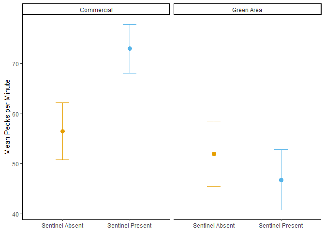
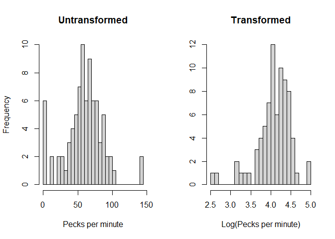
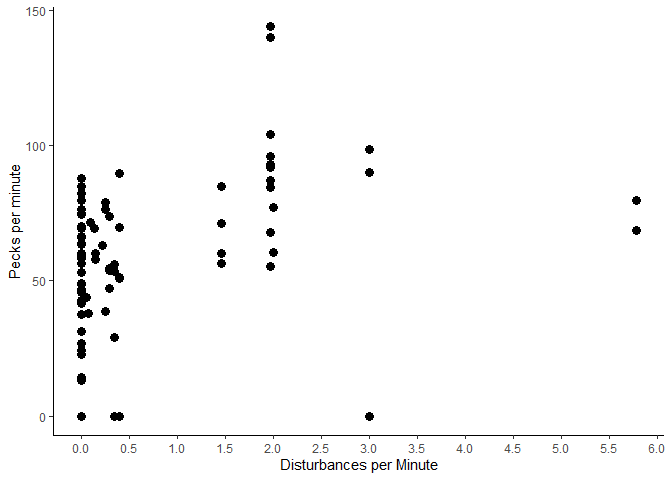
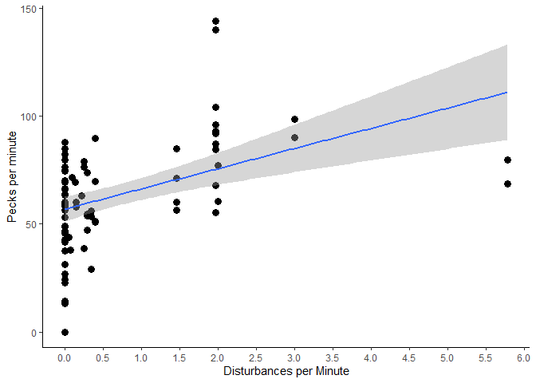
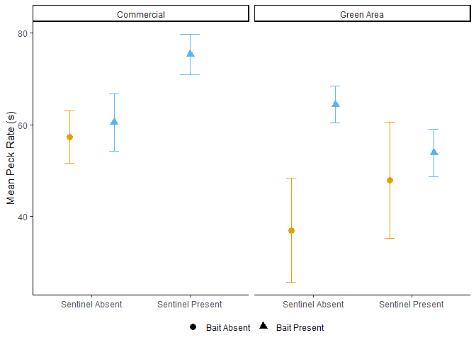

## Preamble

This script will deal with analyzing the relationship between the peck rate of foragers and the presence of a sentinel, the presence of bait, the foraging environment, the group size and the frequency of disturbances.

As random effects, I've chosen the video and individual ID

This analysis will answer the following question:\
Is the foraging efficiency of foraging individuals affected by the presence of a sentinel and the environment in which they forage in?

To answer this question, I extracted the number of pecks at bait performed by each individual, then divided it by the total duration of time of behavior 'head down'. The reasoning for this is that individuals can't peck while having their heads up or while moving, therefore the duration of time spent foraging would better describe the foraging efficiency of the individual.

I do expect that bait will have a significant effect on the foraging efficiency of individuals.

I compiled these results in the dataset called 'DATA'.


```r
DATA<-read.csv("DATA.csv", stringsAsFactors = T)
str(DATA)
```

```
## 'data.frame':	252 obs. of  33 variables:
##  $ VIDEO_ID                         : Factor w/ 25 levels "037-2","038-2",..: 4 4 4 4 4 4 5 5 5 5 ...
##  $ ID                               : Factor w/ 67 levels "020-01-01","020-01-02",..: 1 1 1 2 2 2 3 3 3 3 ...
##  $ JULIAN_DATE                      : int  20227825 20227825 20227825 20227825 20227825 20227825 20227837 20227837 20227837 20227837 ...
##  $ DECIMAL_TIME                     : num  6.33 6.33 6.33 6.33 6.33 6.33 6.22 6.22 6.22 6.22 ...
##  $ LATITUDE                         : num  43.2 43.2 43.2 43.2 43.2 ...
##  $ LONGITUDE                        : num  -79.2 -79.2 -79.2 -79.2 -79.2 ...
##  $ TEMPERATURE                      : int  18 18 18 18 18 18 16 16 16 16 ...
##  $ WEATHER                          : Factor w/ 6 levels "Cloudy","Foggy",..: 6 6 6 6 6 6 6 6 6 6 ...
##  $ TOTAL_VIDEO_DURATION             : num  87.7 87.7 87.7 87.7 87.7 ...
##  $ RECORDED_DURATION                : num  76.2 76.2 76.2 50 50 ...
##  $ CODED_ENV                        : int  0 0 0 0 0 0 0 0 0 0 ...
##  $ GENERALIZED_ENVIRONMENT          : Factor w/ 2 levels "Commercial","Green Area": 2 2 2 2 2 2 2 2 2 2 ...
##  $ CODED_SENTINEL_PRESENCE          : int  0 0 0 0 0 0 0 0 0 1 ...
##  $ SENTINEL_PRESENCE                : Factor w/ 2 levels "NO","YES": 1 1 1 1 1 1 1 1 1 2 ...
##  $ BAIT_PRESENCE                    : Factor w/ 2 levels "NO","YES": 1 1 1 1 1 1 1 1 1 1 ...
##  $ NUMBER_OF_CROWS_RECORDED         : int  2 2 2 2 2 2 2 2 2 2 ...
##  $ GROUP_SIZE                       : Factor w/ 2 levels "LARGE","SMALL": 2 2 2 2 2 2 2 2 2 2 ...
##  $ BEHAVIOR                         : Factor w/ 3 levels "HD","HU","M": 2 1 3 2 1 3 2 1 3 2 ...
##  $ NUMBER_OF_BOUTS                  : int  13 14 6 13 9 8 13 8 9 7 ...
##  $ BEHAVIOR_DURATION                : num  22.9 39.8 13.5 17.7 18.8 ...
##  $ MEAN_BOUT_DURATION               : num  1.76 2.84 2.25 1.36 2.09 ...
##  $ SD_BOUT_DURATION                 : num  2.74 2.44 2.2 1.3 1.17 ...
##  $ BEHAVIOR_PROPORTION              : num  0.301 0.522 0.177 0.354 0.375 0.27 0.68 0.209 0.111 0.779 ...
##  $ NUMBER_OF_PECKS                  : int  NA 31 NA NA 20 NA NA 9 NA NA ...
##  $ PECK_RATE                        : num  NA 46.8 NA NA 63.9 ...
##  $ TOTAL_NUMBER_OF_DISTURBANCES     : int  0 0 0 0 0 0 0 0 0 0 ...
##  $ NUMBER_HUMAN_DISTURBANCE         : int  0 0 0 0 0 0 0 0 0 0 ...
##  $ NUMBER_DOM_ANIMAL_DISTURBANCE    : int  0 0 0 0 0 0 0 0 0 0 ...
##  $ NUMBER_HETEROSPECIFIC_DISTURBANCE: int  0 0 0 0 0 0 0 0 0 0 ...
##  $ NUMBER_VEHICLE_DISTURBANCE       : int  0 0 0 0 0 0 0 0 0 0 ...
##  $ TOTAL_AGGRESSION                 : int  0 0 0 0 0 0 0 0 0 0 ...
##  $ CONSPECIFIC_AGGRESSION           : int  0 0 0 0 0 0 0 0 0 0 ...
##  $ DISTURBANCE_FREQUENCY            : num  0 0 0 0 0 0 0 0 0 0 ...
```
Next, we'll compile the means of the peck rate by sentinel presence and generalized environment.


```
##   GENERALIZED_ENVIRONMENT SENTINEL_PRESENCE  N PECK_RATE       sd       se
## 1              Commercial                NO 18  56.48511 24.21051 5.706472
## 2              Commercial               YES 31  72.94547 27.22061 4.888965
## 3              Green Area                NO 14  51.99745 24.32497 6.501122
## 4              Green Area               YES 21  46.76497 27.63062 6.029495
##          ci
## 1 12.039604
## 2  9.984599
## 3 14.044820
## 4 12.577307
```

At first glance, it seems like the peck rate when a sentinel is absent in commercial and green areas are similar (56 pecks per minute - 52 pecks per minute, respectively). The peck rate in green areas with a sentinel is somewhat lesser than in the absence of sentinels (47 pecks per minute), yet in the presence of a sentinel and in commercial areas the peck rate increases substantially (73 pecks per minute).

Let's visualize this.

## The Dot Plot


```r
PECK.DOT<-ggplot(data = PECK.MEAN
               , aes(x = SENTINEL_PRESENCE
                     , y = PECK_RATE
                     , color = SENTINEL_PRESENCE))+
  geom_point(position = position_dodge(width = 0.9)
             , size = 3) +
  geom_errorbar(aes(ymin=(PECK_RATE-se)
                    , ymax=(PECK_RATE+se))
                , width = 0.2
                , position = position_dodge(width=0.9))+
  theme_classic() +
  ylab("Mean Pecks per Minute") +
  scale_colour_manual(values = cbPalette
                      , guide="none") +
  scale_x_discrete(labels = c("Sentinel Absent"
                                  , "Sentinel Present")) +
  theme(axis.title.x = element_blank()
        , legend.position = "bottom"
        , legend.box="vertical"
        , legend.margin=margin()) +
  facet_grid(~GENERALIZED_ENVIRONMENT)

PECK.DOT
```

<!-- -->

Very nice! Basically shows the results of the summary.

So, it seems like the peck rate in commercial areas and in the presence of a sentinel is higher than in green areas (with or without a sentinel) and in commmercial areas without a sentinel.

Onto the transformations!


<!-- -->

It looks like the untransformed data is more normal than the log-transformed data. For the subsequent analyses, I will use the **untransformed** data.

Let's fit the models

## The Models

We are testing principally for the effects of the presence of a sentinel and the generalized environment. However, group size and the presence of bait could also affect the peck rate of foragers.

The first model fitted will be a simple model with no interactions.


```r
PECK.MOD1<-lmer(PECK_RATE~SENTINEL_PRESENCE+GENERALIZED_ENVIRONMENT+BAIT_PRESENCE+GROUP_SIZE+DISTURBANCE_FREQUENCY+(1|VIDEO_ID/ID), data = DATA)

sjPlot::tab_model(PECK.MOD1
                  , show.re.var = T
                  , title = "Peck Rate Model 1 Output"
                  , dv.labels = " Effects on peck rate")
```

<table style="border-collapse:collapse; border:none;">
<caption style="font-weight: bold; text-align:left;">Peck Rate Model 1 Output</caption>
<tr>
<th style="border-top: double; text-align:center; font-style:normal; font-weight:bold; padding:0.2cm;  text-align:left; ">&nbsp;</th>
<th colspan="3" style="border-top: double; text-align:center; font-style:normal; font-weight:bold; padding:0.2cm; "> Effects on peck rate</th>
</tr>
<tr>
<td style=" text-align:center; border-bottom:1px solid; font-style:italic; font-weight:normal;  text-align:left; ">Predictors</td>
<td style=" text-align:center; border-bottom:1px solid; font-style:italic; font-weight:normal;  ">Estimates</td>
<td style=" text-align:center; border-bottom:1px solid; font-style:italic; font-weight:normal;  ">CI</td>
<td style=" text-align:center; border-bottom:1px solid; font-style:italic; font-weight:normal;  ">p</td>
</tr>
<tr>
<td style=" padding:0.2cm; text-align:left; vertical-align:top; text-align:left; ">(Intercept)</td>
<td style=" padding:0.2cm; text-align:left; vertical-align:top; text-align:center;  ">49.53</td>
<td style=" padding:0.2cm; text-align:left; vertical-align:top; text-align:center;  ">25.50&nbsp;&ndash;&nbsp;73.56</td>
<td style=" padding:0.2cm; text-align:left; vertical-align:top; text-align:center;  "><strong>&lt;0.001</strong></td>
</tr>
<tr>
<td style=" padding:0.2cm; text-align:left; vertical-align:top; text-align:left; ">SENTINEL PRESENCE [YES]</td>
<td style=" padding:0.2cm; text-align:left; vertical-align:top; text-align:center;  ">1.43</td>
<td style=" padding:0.2cm; text-align:left; vertical-align:top; text-align:center;  ">&#45;9.95&nbsp;&ndash;&nbsp;12.82</td>
<td style=" padding:0.2cm; text-align:left; vertical-align:top; text-align:center;  ">0.803</td>
</tr>
<tr>
<td style=" padding:0.2cm; text-align:left; vertical-align:top; text-align:left; ">GENERALIZED ENVIRONMENT<br>[Green Area]</td>
<td style=" padding:0.2cm; text-align:left; vertical-align:top; text-align:center;  ">&#45;10.30</td>
<td style=" padding:0.2cm; text-align:left; vertical-align:top; text-align:center;  ">&#45;27.33&nbsp;&ndash;&nbsp;6.73</td>
<td style=" padding:0.2cm; text-align:left; vertical-align:top; text-align:center;  ">0.232</td>
</tr>
<tr>
<td style=" padding:0.2cm; text-align:left; vertical-align:top; text-align:left; ">BAIT PRESENCE [YES]</td>
<td style=" padding:0.2cm; text-align:left; vertical-align:top; text-align:center;  ">12.87</td>
<td style=" padding:0.2cm; text-align:left; vertical-align:top; text-align:center;  ">&#45;5.18&nbsp;&ndash;&nbsp;30.92</td>
<td style=" padding:0.2cm; text-align:left; vertical-align:top; text-align:center;  ">0.160</td>
</tr>
<tr>
<td style=" padding:0.2cm; text-align:left; vertical-align:top; text-align:left; ">GROUP SIZE [SMALL]</td>
<td style=" padding:0.2cm; text-align:left; vertical-align:top; text-align:center;  ">&#45;1.28</td>
<td style=" padding:0.2cm; text-align:left; vertical-align:top; text-align:center;  ">&#45;19.98&nbsp;&ndash;&nbsp;17.43</td>
<td style=" padding:0.2cm; text-align:left; vertical-align:top; text-align:center;  ">0.892</td>
</tr>
<tr>
<td style=" padding:0.2cm; text-align:left; vertical-align:top; text-align:left; ">DISTURBANCE FREQUENCY</td>
<td style=" padding:0.2cm; text-align:left; vertical-align:top; text-align:center;  ">5.70</td>
<td style=" padding:0.2cm; text-align:left; vertical-align:top; text-align:center;  ">&#45;0.49&nbsp;&ndash;&nbsp;11.89</td>
<td style=" padding:0.2cm; text-align:left; vertical-align:top; text-align:center;  ">0.070</td>
</tr>
<tr>
<td colspan="4" style="font-weight:bold; text-align:left; padding-top:.8em;">Random Effects</td>
</tr>

<tr>
<td style=" padding:0.2cm; text-align:left; vertical-align:top; text-align:left; padding-top:0.1cm; padding-bottom:0.1cm;">&sigma;<sup>2</sup></td>
<td style=" padding:0.2cm; text-align:left; vertical-align:top; padding-top:0.1cm; padding-bottom:0.1cm; text-align:left;" colspan="3">389.73</td>
</tr>

<tr>
<td style=" padding:0.2cm; text-align:left; vertical-align:top; text-align:left; padding-top:0.1cm; padding-bottom:0.1cm;">&tau;<sub>00</sub> <sub>ID:VIDEO_ID</sub></td>
<td style=" padding:0.2cm; text-align:left; vertical-align:top; padding-top:0.1cm; padding-bottom:0.1cm; text-align:left;" colspan="3">192.95</td>

<tr>
<td style=" padding:0.2cm; text-align:left; vertical-align:top; text-align:left; padding-top:0.1cm; padding-bottom:0.1cm;">&tau;<sub>00</sub> <sub>VIDEO_ID</sub></td>
<td style=" padding:0.2cm; text-align:left; vertical-align:top; padding-top:0.1cm; padding-bottom:0.1cm; text-align:left;" colspan="3">82.72</td>

<tr>
<td style=" padding:0.2cm; text-align:left; vertical-align:top; text-align:left; padding-top:0.1cm; padding-bottom:0.1cm;">ICC</td>
<td style=" padding:0.2cm; text-align:left; vertical-align:top; padding-top:0.1cm; padding-bottom:0.1cm; text-align:left;" colspan="3">0.41</td>

<tr>
<td style=" padding:0.2cm; text-align:left; vertical-align:top; text-align:left; padding-top:0.1cm; padding-bottom:0.1cm;">N <sub>ID</sub></td>
<td style=" padding:0.2cm; text-align:left; vertical-align:top; padding-top:0.1cm; padding-bottom:0.1cm; text-align:left;" colspan="3">67</td>

<tr>
<td style=" padding:0.2cm; text-align:left; vertical-align:top; text-align:left; padding-top:0.1cm; padding-bottom:0.1cm;">N <sub>VIDEO_ID</sub></td>
<td style=" padding:0.2cm; text-align:left; vertical-align:top; padding-top:0.1cm; padding-bottom:0.1cm; text-align:left;" colspan="3">25</td>
<tr>
<td style=" padding:0.2cm; text-align:left; vertical-align:top; text-align:left; padding-top:0.1cm; padding-bottom:0.1cm; border-top:1px solid;">Observations</td>
<td style=" padding:0.2cm; text-align:left; vertical-align:top; padding-top:0.1cm; padding-bottom:0.1cm; text-align:left; border-top:1px solid;" colspan="3">84</td>
</tr>
<tr>
<td style=" padding:0.2cm; text-align:left; vertical-align:top; text-align:left; padding-top:0.1cm; padding-bottom:0.1cm;">Marginal R<sup>2</sup> / Conditional R<sup>2</sup></td>
<td style=" padding:0.2cm; text-align:left; vertical-align:top; padding-top:0.1cm; padding-bottom:0.1cm; text-align:left;" colspan="3">0.172 / 0.515</td>
</tr>

</table>

The intercept is significant, but none of the factors are. The disturbance frequency is marginally significant.

Surprisingly, the random effects account for much more variance than in the proportion data. For the next model, I'll use the same formula as Model 2 for the bout duration and proportion datasets.


```r
PECK.MOD2<-lmer(PECK_RATE~SENTINEL_PRESENCE*GENERALIZED_ENVIRONMENT+GROUP_SIZE+BAIT_PRESENCE+DISTURBANCE_FREQUENCY+(1|VIDEO_ID/ID), data = DATA)

sjPlot::tab_model(PECK.MOD2
                  , show.re.var = T
                  , title = "Peck Rate Model 2 Output"
                  , dv.labels = " Effects on peck rate")
```

<table style="border-collapse:collapse; border:none;">
<caption style="font-weight: bold; text-align:left;">Peck Rate Model 2 Output</caption>
<tr>
<th style="border-top: double; text-align:center; font-style:normal; font-weight:bold; padding:0.2cm;  text-align:left; ">&nbsp;</th>
<th colspan="3" style="border-top: double; text-align:center; font-style:normal; font-weight:bold; padding:0.2cm; "> Effects on peck rate</th>
</tr>
<tr>
<td style=" text-align:center; border-bottom:1px solid; font-style:italic; font-weight:normal;  text-align:left; ">Predictors</td>
<td style=" text-align:center; border-bottom:1px solid; font-style:italic; font-weight:normal;  ">Estimates</td>
<td style=" text-align:center; border-bottom:1px solid; font-style:italic; font-weight:normal;  ">CI</td>
<td style=" text-align:center; border-bottom:1px solid; font-style:italic; font-weight:normal;  ">p</td>
</tr>
<tr>
<td style=" padding:0.2cm; text-align:left; vertical-align:top; text-align:left; ">(Intercept)</td>
<td style=" padding:0.2cm; text-align:left; vertical-align:top; text-align:center;  ">48.11</td>
<td style=" padding:0.2cm; text-align:left; vertical-align:top; text-align:center;  ">24.23&nbsp;&ndash;&nbsp;71.99</td>
<td style=" padding:0.2cm; text-align:left; vertical-align:top; text-align:center;  "><strong>&lt;0.001</strong></td>
</tr>
<tr>
<td style=" padding:0.2cm; text-align:left; vertical-align:top; text-align:left; ">SENTINEL PRESENCE [YES]</td>
<td style=" padding:0.2cm; text-align:left; vertical-align:top; text-align:center;  ">7.40</td>
<td style=" padding:0.2cm; text-align:left; vertical-align:top; text-align:center;  ">&#45;6.73&nbsp;&ndash;&nbsp;21.54</td>
<td style=" padding:0.2cm; text-align:left; vertical-align:top; text-align:center;  ">0.300</td>
</tr>
<tr>
<td style=" padding:0.2cm; text-align:left; vertical-align:top; text-align:left; ">GENERALIZED ENVIRONMENT<br>[Green Area]</td>
<td style=" padding:0.2cm; text-align:left; vertical-align:top; text-align:center;  ">&#45;2.13</td>
<td style=" padding:0.2cm; text-align:left; vertical-align:top; text-align:center;  ">&#45;23.02&nbsp;&ndash;&nbsp;18.76</td>
<td style=" padding:0.2cm; text-align:left; vertical-align:top; text-align:center;  ">0.839</td>
</tr>
<tr>
<td style=" padding:0.2cm; text-align:left; vertical-align:top; text-align:left; ">GROUP SIZE [SMALL]</td>
<td style=" padding:0.2cm; text-align:left; vertical-align:top; text-align:center;  ">&#45;1.70</td>
<td style=" padding:0.2cm; text-align:left; vertical-align:top; text-align:center;  ">&#45;20.24&nbsp;&ndash;&nbsp;16.85</td>
<td style=" padding:0.2cm; text-align:left; vertical-align:top; text-align:center;  ">0.856</td>
</tr>
<tr>
<td style=" padding:0.2cm; text-align:left; vertical-align:top; text-align:left; ">BAIT PRESENCE [YES]</td>
<td style=" padding:0.2cm; text-align:left; vertical-align:top; text-align:center;  ">10.78</td>
<td style=" padding:0.2cm; text-align:left; vertical-align:top; text-align:center;  ">&#45;7.44&nbsp;&ndash;&nbsp;28.99</td>
<td style=" padding:0.2cm; text-align:left; vertical-align:top; text-align:center;  ">0.242</td>
</tr>
<tr>
<td style=" padding:0.2cm; text-align:left; vertical-align:top; text-align:left; ">DISTURBANCE FREQUENCY</td>
<td style=" padding:0.2cm; text-align:left; vertical-align:top; text-align:center;  ">5.50</td>
<td style=" padding:0.2cm; text-align:left; vertical-align:top; text-align:center;  ">&#45;0.64&nbsp;&ndash;&nbsp;11.64</td>
<td style=" padding:0.2cm; text-align:left; vertical-align:top; text-align:center;  ">0.079</td>
</tr>
<tr>
<td style=" padding:0.2cm; text-align:left; vertical-align:top; text-align:left; ">SENTINEL PRESENCE [YES] ×<br>GENERALIZED ENVIRONMENT<br>[Green Area]</td>
<td style=" padding:0.2cm; text-align:left; vertical-align:top; text-align:center;  ">&#45;14.25</td>
<td style=" padding:0.2cm; text-align:left; vertical-align:top; text-align:center;  ">&#45;35.70&nbsp;&ndash;&nbsp;7.21</td>
<td style=" padding:0.2cm; text-align:left; vertical-align:top; text-align:center;  ">0.190</td>
</tr>
<tr>
<td colspan="4" style="font-weight:bold; text-align:left; padding-top:.8em;">Random Effects</td>
</tr>

<tr>
<td style=" padding:0.2cm; text-align:left; vertical-align:top; text-align:left; padding-top:0.1cm; padding-bottom:0.1cm;">&sigma;<sup>2</sup></td>
<td style=" padding:0.2cm; text-align:left; vertical-align:top; padding-top:0.1cm; padding-bottom:0.1cm; text-align:left;" colspan="3">367.92</td>
</tr>

<tr>
<td style=" padding:0.2cm; text-align:left; vertical-align:top; text-align:left; padding-top:0.1cm; padding-bottom:0.1cm;">&tau;<sub>00</sub> <sub>ID:VIDEO_ID</sub></td>
<td style=" padding:0.2cm; text-align:left; vertical-align:top; padding-top:0.1cm; padding-bottom:0.1cm; text-align:left;" colspan="3">216.15</td>

<tr>
<td style=" padding:0.2cm; text-align:left; vertical-align:top; text-align:left; padding-top:0.1cm; padding-bottom:0.1cm;">&tau;<sub>00</sub> <sub>VIDEO_ID</sub></td>
<td style=" padding:0.2cm; text-align:left; vertical-align:top; padding-top:0.1cm; padding-bottom:0.1cm; text-align:left;" colspan="3">77.30</td>

<tr>
<td style=" padding:0.2cm; text-align:left; vertical-align:top; text-align:left; padding-top:0.1cm; padding-bottom:0.1cm;">ICC</td>
<td style=" padding:0.2cm; text-align:left; vertical-align:top; padding-top:0.1cm; padding-bottom:0.1cm; text-align:left;" colspan="3">0.44</td>

<tr>
<td style=" padding:0.2cm; text-align:left; vertical-align:top; text-align:left; padding-top:0.1cm; padding-bottom:0.1cm;">N <sub>ID</sub></td>
<td style=" padding:0.2cm; text-align:left; vertical-align:top; padding-top:0.1cm; padding-bottom:0.1cm; text-align:left;" colspan="3">67</td>

<tr>
<td style=" padding:0.2cm; text-align:left; vertical-align:top; text-align:left; padding-top:0.1cm; padding-bottom:0.1cm;">N <sub>VIDEO_ID</sub></td>
<td style=" padding:0.2cm; text-align:left; vertical-align:top; padding-top:0.1cm; padding-bottom:0.1cm; text-align:left;" colspan="3">25</td>
<tr>
<td style=" padding:0.2cm; text-align:left; vertical-align:top; text-align:left; padding-top:0.1cm; padding-bottom:0.1cm; border-top:1px solid;">Observations</td>
<td style=" padding:0.2cm; text-align:left; vertical-align:top; padding-top:0.1cm; padding-bottom:0.1cm; text-align:left; border-top:1px solid;" colspan="3">84</td>
</tr>
<tr>
<td style=" padding:0.2cm; text-align:left; vertical-align:top; text-align:left; padding-top:0.1cm; padding-bottom:0.1cm;">Marginal R<sup>2</sup> / Conditional R<sup>2</sup></td>
<td style=" padding:0.2cm; text-align:left; vertical-align:top; padding-top:0.1cm; padding-bottom:0.1cm; text-align:left;" colspan="3">0.188 / 0.548</td>
</tr>

</table>

As in the simple model, none of the factors are significant, yet the disturbance frequency has a marginally significant effect on the peck rate.

Let's try running the robust lmm.


```r
PECK.RMOD2<-rlmer(PECK_RATE~SENTINEL_PRESENCE*GENERALIZED_ENVIRONMENT+GROUP_SIZE+BAIT_PRESENCE+DISTURBANCE_FREQUENCY+(1|VIDEO_ID/ID), data = DATA)

sjPlot::tab_model(PECK.MOD2
                  , show.re.var = T
                  , title = "Robust Peck Rate Model 2 Output"
                  , dv.labels = " Effects on peck rate")
```

<table style="border-collapse:collapse; border:none;">
<caption style="font-weight: bold; text-align:left;">Robust Peck Rate Model 2 Output</caption>
<tr>
<th style="border-top: double; text-align:center; font-style:normal; font-weight:bold; padding:0.2cm;  text-align:left; ">&nbsp;</th>
<th colspan="3" style="border-top: double; text-align:center; font-style:normal; font-weight:bold; padding:0.2cm; "> Effects on peck rate</th>
</tr>
<tr>
<td style=" text-align:center; border-bottom:1px solid; font-style:italic; font-weight:normal;  text-align:left; ">Predictors</td>
<td style=" text-align:center; border-bottom:1px solid; font-style:italic; font-weight:normal;  ">Estimates</td>
<td style=" text-align:center; border-bottom:1px solid; font-style:italic; font-weight:normal;  ">CI</td>
<td style=" text-align:center; border-bottom:1px solid; font-style:italic; font-weight:normal;  ">p</td>
</tr>
<tr>
<td style=" padding:0.2cm; text-align:left; vertical-align:top; text-align:left; ">(Intercept)</td>
<td style=" padding:0.2cm; text-align:left; vertical-align:top; text-align:center;  ">48.11</td>
<td style=" padding:0.2cm; text-align:left; vertical-align:top; text-align:center;  ">24.23&nbsp;&ndash;&nbsp;71.99</td>
<td style=" padding:0.2cm; text-align:left; vertical-align:top; text-align:center;  "><strong>&lt;0.001</strong></td>
</tr>
<tr>
<td style=" padding:0.2cm; text-align:left; vertical-align:top; text-align:left; ">SENTINEL PRESENCE [YES]</td>
<td style=" padding:0.2cm; text-align:left; vertical-align:top; text-align:center;  ">7.40</td>
<td style=" padding:0.2cm; text-align:left; vertical-align:top; text-align:center;  ">&#45;6.73&nbsp;&ndash;&nbsp;21.54</td>
<td style=" padding:0.2cm; text-align:left; vertical-align:top; text-align:center;  ">0.300</td>
</tr>
<tr>
<td style=" padding:0.2cm; text-align:left; vertical-align:top; text-align:left; ">GENERALIZED ENVIRONMENT<br>[Green Area]</td>
<td style=" padding:0.2cm; text-align:left; vertical-align:top; text-align:center;  ">&#45;2.13</td>
<td style=" padding:0.2cm; text-align:left; vertical-align:top; text-align:center;  ">&#45;23.02&nbsp;&ndash;&nbsp;18.76</td>
<td style=" padding:0.2cm; text-align:left; vertical-align:top; text-align:center;  ">0.839</td>
</tr>
<tr>
<td style=" padding:0.2cm; text-align:left; vertical-align:top; text-align:left; ">GROUP SIZE [SMALL]</td>
<td style=" padding:0.2cm; text-align:left; vertical-align:top; text-align:center;  ">&#45;1.70</td>
<td style=" padding:0.2cm; text-align:left; vertical-align:top; text-align:center;  ">&#45;20.24&nbsp;&ndash;&nbsp;16.85</td>
<td style=" padding:0.2cm; text-align:left; vertical-align:top; text-align:center;  ">0.856</td>
</tr>
<tr>
<td style=" padding:0.2cm; text-align:left; vertical-align:top; text-align:left; ">BAIT PRESENCE [YES]</td>
<td style=" padding:0.2cm; text-align:left; vertical-align:top; text-align:center;  ">10.78</td>
<td style=" padding:0.2cm; text-align:left; vertical-align:top; text-align:center;  ">&#45;7.44&nbsp;&ndash;&nbsp;28.99</td>
<td style=" padding:0.2cm; text-align:left; vertical-align:top; text-align:center;  ">0.242</td>
</tr>
<tr>
<td style=" padding:0.2cm; text-align:left; vertical-align:top; text-align:left; ">DISTURBANCE FREQUENCY</td>
<td style=" padding:0.2cm; text-align:left; vertical-align:top; text-align:center;  ">5.50</td>
<td style=" padding:0.2cm; text-align:left; vertical-align:top; text-align:center;  ">&#45;0.64&nbsp;&ndash;&nbsp;11.64</td>
<td style=" padding:0.2cm; text-align:left; vertical-align:top; text-align:center;  ">0.079</td>
</tr>
<tr>
<td style=" padding:0.2cm; text-align:left; vertical-align:top; text-align:left; ">SENTINEL PRESENCE [YES] ×<br>GENERALIZED ENVIRONMENT<br>[Green Area]</td>
<td style=" padding:0.2cm; text-align:left; vertical-align:top; text-align:center;  ">&#45;14.25</td>
<td style=" padding:0.2cm; text-align:left; vertical-align:top; text-align:center;  ">&#45;35.70&nbsp;&ndash;&nbsp;7.21</td>
<td style=" padding:0.2cm; text-align:left; vertical-align:top; text-align:center;  ">0.190</td>
</tr>
<tr>
<td colspan="4" style="font-weight:bold; text-align:left; padding-top:.8em;">Random Effects</td>
</tr>

<tr>
<td style=" padding:0.2cm; text-align:left; vertical-align:top; text-align:left; padding-top:0.1cm; padding-bottom:0.1cm;">&sigma;<sup>2</sup></td>
<td style=" padding:0.2cm; text-align:left; vertical-align:top; padding-top:0.1cm; padding-bottom:0.1cm; text-align:left;" colspan="3">367.92</td>
</tr>

<tr>
<td style=" padding:0.2cm; text-align:left; vertical-align:top; text-align:left; padding-top:0.1cm; padding-bottom:0.1cm;">&tau;<sub>00</sub> <sub>ID:VIDEO_ID</sub></td>
<td style=" padding:0.2cm; text-align:left; vertical-align:top; padding-top:0.1cm; padding-bottom:0.1cm; text-align:left;" colspan="3">216.15</td>

<tr>
<td style=" padding:0.2cm; text-align:left; vertical-align:top; text-align:left; padding-top:0.1cm; padding-bottom:0.1cm;">&tau;<sub>00</sub> <sub>VIDEO_ID</sub></td>
<td style=" padding:0.2cm; text-align:left; vertical-align:top; padding-top:0.1cm; padding-bottom:0.1cm; text-align:left;" colspan="3">77.30</td>

<tr>
<td style=" padding:0.2cm; text-align:left; vertical-align:top; text-align:left; padding-top:0.1cm; padding-bottom:0.1cm;">ICC</td>
<td style=" padding:0.2cm; text-align:left; vertical-align:top; padding-top:0.1cm; padding-bottom:0.1cm; text-align:left;" colspan="3">0.44</td>

<tr>
<td style=" padding:0.2cm; text-align:left; vertical-align:top; text-align:left; padding-top:0.1cm; padding-bottom:0.1cm;">N <sub>ID</sub></td>
<td style=" padding:0.2cm; text-align:left; vertical-align:top; padding-top:0.1cm; padding-bottom:0.1cm; text-align:left;" colspan="3">67</td>

<tr>
<td style=" padding:0.2cm; text-align:left; vertical-align:top; text-align:left; padding-top:0.1cm; padding-bottom:0.1cm;">N <sub>VIDEO_ID</sub></td>
<td style=" padding:0.2cm; text-align:left; vertical-align:top; padding-top:0.1cm; padding-bottom:0.1cm; text-align:left;" colspan="3">25</td>
<tr>
<td style=" padding:0.2cm; text-align:left; vertical-align:top; text-align:left; padding-top:0.1cm; padding-bottom:0.1cm; border-top:1px solid;">Observations</td>
<td style=" padding:0.2cm; text-align:left; vertical-align:top; padding-top:0.1cm; padding-bottom:0.1cm; text-align:left; border-top:1px solid;" colspan="3">84</td>
</tr>
<tr>
<td style=" padding:0.2cm; text-align:left; vertical-align:top; text-align:left; padding-top:0.1cm; padding-bottom:0.1cm;">Marginal R<sup>2</sup> / Conditional R<sup>2</sup></td>
<td style=" padding:0.2cm; text-align:left; vertical-align:top; padding-top:0.1cm; padding-bottom:0.1cm; text-align:left;" colspan="3">0.188 / 0.548</td>
</tr>

</table>

Still insignificant, with disturbance frequency being marginally significant. Let's try testing the AICs between the two non-robust models, and a simple lmm (no random effects).


```r
PECK.MOD0<-lm(PECK_RATE~SENTINEL_PRESENCE*GENERALIZED_ENVIRONMENT+GROUP_SIZE+BAIT_PRESENCE+DISTURBANCE_FREQUENCY, data = DATA)
anova(PECK.MOD1,PECK.MOD2,PECK.MOD0)
```

```
## refitting model(s) with ML (instead of REML)
```

```
## Data: DATA
## Models:
## PECK.MOD0: PECK_RATE ~ SENTINEL_PRESENCE * GENERALIZED_ENVIRONMENT + GROUP_SIZE + BAIT_PRESENCE + DISTURBANCE_FREQUENCY
## PECK.MOD1: PECK_RATE ~ SENTINEL_PRESENCE + GENERALIZED_ENVIRONMENT + BAIT_PRESENCE + GROUP_SIZE + DISTURBANCE_FREQUENCY + (1 | VIDEO_ID/ID)
## PECK.MOD2: PECK_RATE ~ SENTINEL_PRESENCE * GENERALIZED_ENVIRONMENT + GROUP_SIZE + BAIT_PRESENCE + DISTURBANCE_FREQUENCY + (1 | VIDEO_ID/ID)
##           npar    AIC    BIC  logLik deviance  Chisq Df Pr(>Chisq)
## PECK.MOD0    8 789.96 809.41 -386.98   773.96                     
## PECK.MOD1    9 790.98 812.85 -386.49   772.98 0.9837  1     0.3213
## PECK.MOD2   10 791.03 815.34 -385.52   771.03 1.9467  1     0.1629
```

VERY WEIRD. Model 1 without the interactions is preferred over Model 2. However, the simple MOD0 is preferred. Let's see the outputs of that model.


```r
sjPlot::tab_model(PECK.MOD0
                  , show.re.var = T
                  , title = "Robust Peck Rate Model 0 Output"
                  , dv.labels = " Effects on peck rate")
```

<table style="border-collapse:collapse; border:none;">
<caption style="font-weight: bold; text-align:left;">Robust Peck Rate Model 0 Output</caption>
<tr>
<th style="border-top: double; text-align:center; font-style:normal; font-weight:bold; padding:0.2cm;  text-align:left; ">&nbsp;</th>
<th colspan="3" style="border-top: double; text-align:center; font-style:normal; font-weight:bold; padding:0.2cm; "> Effects on peck rate</th>
</tr>
<tr>
<td style=" text-align:center; border-bottom:1px solid; font-style:italic; font-weight:normal;  text-align:left; ">Predictors</td>
<td style=" text-align:center; border-bottom:1px solid; font-style:italic; font-weight:normal;  ">Estimates</td>
<td style=" text-align:center; border-bottom:1px solid; font-style:italic; font-weight:normal;  ">CI</td>
<td style=" text-align:center; border-bottom:1px solid; font-style:italic; font-weight:normal;  ">p</td>
</tr>
<tr>
<td style=" padding:0.2cm; text-align:left; vertical-align:top; text-align:left; ">(Intercept)</td>
<td style=" padding:0.2cm; text-align:left; vertical-align:top; text-align:center;  ">48.42</td>
<td style=" padding:0.2cm; text-align:left; vertical-align:top; text-align:center;  ">28.22&nbsp;&ndash;&nbsp;68.62</td>
<td style=" padding:0.2cm; text-align:left; vertical-align:top; text-align:center;  "><strong>&lt;0.001</strong></td>
</tr>
<tr>
<td style=" padding:0.2cm; text-align:left; vertical-align:top; text-align:left; ">SENTINEL PRESENCE [YES]</td>
<td style=" padding:0.2cm; text-align:left; vertical-align:top; text-align:center;  ">5.62</td>
<td style=" padding:0.2cm; text-align:left; vertical-align:top; text-align:center;  ">&#45;11.44&nbsp;&ndash;&nbsp;22.69</td>
<td style=" padding:0.2cm; text-align:left; vertical-align:top; text-align:center;  ">0.514</td>
</tr>
<tr>
<td style=" padding:0.2cm; text-align:left; vertical-align:top; text-align:left; ">GENERALIZED ENVIRONMENT<br>[Green Area]</td>
<td style=" padding:0.2cm; text-align:left; vertical-align:top; text-align:center;  ">&#45;1.35</td>
<td style=" padding:0.2cm; text-align:left; vertical-align:top; text-align:center;  ">&#45;20.86&nbsp;&ndash;&nbsp;18.16</td>
<td style=" padding:0.2cm; text-align:left; vertical-align:top; text-align:center;  ">0.891</td>
</tr>
<tr>
<td style=" padding:0.2cm; text-align:left; vertical-align:top; text-align:left; ">GROUP SIZE [SMALL]</td>
<td style=" padding:0.2cm; text-align:left; vertical-align:top; text-align:center;  ">&#45;3.36</td>
<td style=" padding:0.2cm; text-align:left; vertical-align:top; text-align:center;  ">&#45;18.60&nbsp;&ndash;&nbsp;11.88</td>
<td style=" padding:0.2cm; text-align:left; vertical-align:top; text-align:center;  ">0.662</td>
</tr>
<tr>
<td style=" padding:0.2cm; text-align:left; vertical-align:top; text-align:left; ">BAIT PRESENCE [YES]</td>
<td style=" padding:0.2cm; text-align:left; vertical-align:top; text-align:center;  ">10.32</td>
<td style=" padding:0.2cm; text-align:left; vertical-align:top; text-align:center;  ">&#45;5.78&nbsp;&ndash;&nbsp;26.42</td>
<td style=" padding:0.2cm; text-align:left; vertical-align:top; text-align:center;  ">0.206</td>
</tr>
<tr>
<td style=" padding:0.2cm; text-align:left; vertical-align:top; text-align:left; ">DISTURBANCE FREQUENCY</td>
<td style=" padding:0.2cm; text-align:left; vertical-align:top; text-align:center;  ">7.58</td>
<td style=" padding:0.2cm; text-align:left; vertical-align:top; text-align:center;  ">2.06&nbsp;&ndash;&nbsp;13.09</td>
<td style=" padding:0.2cm; text-align:left; vertical-align:top; text-align:center;  "><strong>0.008</strong></td>
</tr>
<tr>
<td style=" padding:0.2cm; text-align:left; vertical-align:top; text-align:left; ">SENTINEL PRESENCE [YES] ×<br>GENERALIZED ENVIRONMENT<br>[Green Area]</td>
<td style=" padding:0.2cm; text-align:left; vertical-align:top; text-align:center;  ">&#45;14.27</td>
<td style=" padding:0.2cm; text-align:left; vertical-align:top; text-align:center;  ">&#45;37.94&nbsp;&ndash;&nbsp;9.41</td>
<td style=" padding:0.2cm; text-align:left; vertical-align:top; text-align:center;  ">0.234</td>
</tr>
<tr>
<td style=" padding:0.2cm; text-align:left; vertical-align:top; text-align:left; padding-top:0.1cm; padding-bottom:0.1cm; border-top:1px solid;">Observations</td>
<td style=" padding:0.2cm; text-align:left; vertical-align:top; padding-top:0.1cm; padding-bottom:0.1cm; text-align:left; border-top:1px solid;" colspan="3">84</td>
</tr>
<tr>
<td style=" padding:0.2cm; text-align:left; vertical-align:top; text-align:left; padding-top:0.1cm; padding-bottom:0.1cm;">R<sup>2</sup> / R<sup>2</sup> adjusted</td>
<td style=" padding:0.2cm; text-align:left; vertical-align:top; padding-top:0.1cm; padding-bottom:0.1cm; text-align:left;" colspan="3">0.242 / 0.183</td>
</tr>

</table>

Disturbance frequency is now significant! From this, I can infer that the marginally significant effect of disturbance frequency in the LMMs would probably become significant were we to have an increased sample size.

Let's plot these results

## The plot(s) (thicken)

### Disturbance Frequency


```r
PK.DF.DOT1<-DATA %>%
    ggplot(aes(x = DISTURBANCE_FREQUENCY
               , y = PECK_RATE))+
  geom_point(size = 3) +
  theme_classic() +
  labs(y="Pecks per minute", x="Disturbances per Minute")+
  scale_x_continuous(n.breaks=14)+
  theme(legend.position = "bottom")
  

PK.DF.DOT1
```

```
## Warning: Removed 168 rows containing missing values (`geom_point()`).
```

<!-- -->

Ok, I see where some issues may be. There are a number of points at 0. In other words, they did not forage. I'll quickly fit another model, this time using individuals with time spent with head down > 0s.


```r
PECK.RMOD4<-rlmer(PECK_RATE~SENTINEL_PRESENCE*GENERALIZED_ENVIRONMENT+GROUP_SIZE+BAIT_PRESENCE+DISTURBANCE_FREQUENCY+(1|VIDEO_ID/ID), data = DATA[which(DATA$BEHAVIOR == "HD" & DATA$BEHAVIOR_DURATION > 0),])

sjPlot::tab_model(PECK.RMOD4
                  , show.re.var = T
                  , title = "Robust Peck Rate Model 4 Output"
                  , dv.labels = " Effects on peck rate")
```

<table style="border-collapse:collapse; border:none;">
<caption style="font-weight: bold; text-align:left;">Robust Peck Rate Model 4 Output</caption>
<tr>
<th style="border-top: double; text-align:center; font-style:normal; font-weight:bold; padding:0.2cm;  text-align:left; ">&nbsp;</th>
<th colspan="3" style="border-top: double; text-align:center; font-style:normal; font-weight:bold; padding:0.2cm; "> Effects on peck rate</th>
</tr>
<tr>
<td style=" text-align:center; border-bottom:1px solid; font-style:italic; font-weight:normal;  text-align:left; ">Predictors</td>
<td style=" text-align:center; border-bottom:1px solid; font-style:italic; font-weight:normal;  ">Estimates</td>
<td style=" text-align:center; border-bottom:1px solid; font-style:italic; font-weight:normal;  ">CI</td>
<td style=" text-align:center; border-bottom:1px solid; font-style:italic; font-weight:normal;  ">p</td>
</tr>
<tr>
<td style=" padding:0.2cm; text-align:left; vertical-align:top; text-align:left; ">(Intercept)</td>
<td style=" padding:0.2cm; text-align:left; vertical-align:top; text-align:center;  ">57.75</td>
<td style=" padding:0.2cm; text-align:left; vertical-align:top; text-align:center;  ">42.25&nbsp;&ndash;&nbsp;73.25</td>
<td style=" padding:0.2cm; text-align:left; vertical-align:top; text-align:center;  "><strong>&lt;0.001</strong></td>
</tr>
<tr>
<td style=" padding:0.2cm; text-align:left; vertical-align:top; text-align:left; ">SENTINEL PRESENCE [YES]</td>
<td style=" padding:0.2cm; text-align:left; vertical-align:top; text-align:center;  ">&#45;3.74</td>
<td style=" padding:0.2cm; text-align:left; vertical-align:top; text-align:center;  ">&#45;16.98&nbsp;&ndash;&nbsp;9.50</td>
<td style=" padding:0.2cm; text-align:left; vertical-align:top; text-align:center;  ">0.580</td>
</tr>
<tr>
<td style=" padding:0.2cm; text-align:left; vertical-align:top; text-align:left; ">GENERALIZED ENVIRONMENT<br>[Green Area]</td>
<td style=" padding:0.2cm; text-align:left; vertical-align:top; text-align:center;  ">1.15</td>
<td style=" padding:0.2cm; text-align:left; vertical-align:top; text-align:center;  ">&#45;13.81&nbsp;&ndash;&nbsp;16.11</td>
<td style=" padding:0.2cm; text-align:left; vertical-align:top; text-align:center;  ">0.880</td>
</tr>
<tr>
<td style=" padding:0.2cm; text-align:left; vertical-align:top; text-align:left; ">GROUP SIZE [SMALL]</td>
<td style=" padding:0.2cm; text-align:left; vertical-align:top; text-align:center;  ">&#45;10.31</td>
<td style=" padding:0.2cm; text-align:left; vertical-align:top; text-align:center;  ">&#45;22.07&nbsp;&ndash;&nbsp;1.44</td>
<td style=" padding:0.2cm; text-align:left; vertical-align:top; text-align:center;  ">0.086</td>
</tr>
<tr>
<td style=" padding:0.2cm; text-align:left; vertical-align:top; text-align:left; ">BAIT PRESENCE [YES]</td>
<td style=" padding:0.2cm; text-align:left; vertical-align:top; text-align:center;  ">10.56</td>
<td style=" padding:0.2cm; text-align:left; vertical-align:top; text-align:center;  ">&#45;1.75&nbsp;&ndash;&nbsp;22.88</td>
<td style=" padding:0.2cm; text-align:left; vertical-align:top; text-align:center;  ">0.093</td>
</tr>
<tr>
<td style=" padding:0.2cm; text-align:left; vertical-align:top; text-align:left; ">DISTURBANCE FREQUENCY</td>
<td style=" padding:0.2cm; text-align:left; vertical-align:top; text-align:center;  ">9.00</td>
<td style=" padding:0.2cm; text-align:left; vertical-align:top; text-align:center;  ">4.70&nbsp;&ndash;&nbsp;13.29</td>
<td style=" padding:0.2cm; text-align:left; vertical-align:top; text-align:center;  "><strong>&lt;0.001</strong></td>
</tr>
<tr>
<td style=" padding:0.2cm; text-align:left; vertical-align:top; text-align:left; ">SENTINEL PRESENCE [YES] ×<br>GENERALIZED ENVIRONMENT<br>[Green Area]</td>
<td style=" padding:0.2cm; text-align:left; vertical-align:top; text-align:center;  ">&#45;6.93</td>
<td style=" padding:0.2cm; text-align:left; vertical-align:top; text-align:center;  ">&#45;25.26&nbsp;&ndash;&nbsp;11.41</td>
<td style=" padding:0.2cm; text-align:left; vertical-align:top; text-align:center;  ">0.459</td>
</tr>
<tr>
<td colspan="4" style="font-weight:bold; text-align:left; padding-top:.8em;">Random Effects</td>
</tr>

<tr>
<td style=" padding:0.2cm; text-align:left; vertical-align:top; text-align:left; padding-top:0.1cm; padding-bottom:0.1cm;">&sigma;<sup>2</sup></td>
<td style=" padding:0.2cm; text-align:left; vertical-align:top; padding-top:0.1cm; padding-bottom:0.1cm; text-align:left;" colspan="3">351.17</td>
</tr>

<tr>
<td style=" padding:0.2cm; text-align:left; vertical-align:top; text-align:left; padding-top:0.1cm; padding-bottom:0.1cm;">&tau;<sub>00</sub> <sub>ID:VIDEO_ID</sub></td>
<td style=" padding:0.2cm; text-align:left; vertical-align:top; padding-top:0.1cm; padding-bottom:0.1cm; text-align:left;" colspan="3">0.00</td>

<tr>
<td style=" padding:0.2cm; text-align:left; vertical-align:top; text-align:left; padding-top:0.1cm; padding-bottom:0.1cm;">&tau;<sub>00</sub> <sub>VIDEO_ID</sub></td>
<td style=" padding:0.2cm; text-align:left; vertical-align:top; padding-top:0.1cm; padding-bottom:0.1cm; text-align:left;" colspan="3">0.00</td>

<tr>
<td style=" padding:0.2cm; text-align:left; vertical-align:top; text-align:left; padding-top:0.1cm; padding-bottom:0.1cm;">ICC</td>
<td style=" padding:0.2cm; text-align:left; vertical-align:top; padding-top:0.1cm; padding-bottom:0.1cm; text-align:left;" colspan="3">0.00</td>

<tr>
<td style=" padding:0.2cm; text-align:left; vertical-align:top; text-align:left; padding-top:0.1cm; padding-bottom:0.1cm;">N <sub>ID</sub></td>
<td style=" padding:0.2cm; text-align:left; vertical-align:top; padding-top:0.1cm; padding-bottom:0.1cm; text-align:left;" colspan="3">64</td>

<tr>
<td style=" padding:0.2cm; text-align:left; vertical-align:top; text-align:left; padding-top:0.1cm; padding-bottom:0.1cm;">N <sub>VIDEO_ID</sub></td>
<td style=" padding:0.2cm; text-align:left; vertical-align:top; padding-top:0.1cm; padding-bottom:0.1cm; text-align:left;" colspan="3">25</td>
<tr>
<td style=" padding:0.2cm; text-align:left; vertical-align:top; text-align:left; padding-top:0.1cm; padding-bottom:0.1cm; border-top:1px solid;">Observations</td>
<td style=" padding:0.2cm; text-align:left; vertical-align:top; padding-top:0.1cm; padding-bottom:0.1cm; text-align:left; border-top:1px solid;" colspan="3">79</td>
</tr>
<tr>
<td style=" padding:0.2cm; text-align:left; vertical-align:top; text-align:left; padding-top:0.1cm; padding-bottom:0.1cm;">Marginal R<sup>2</sup> / Conditional R<sup>2</sup></td>
<td style=" padding:0.2cm; text-align:left; vertical-align:top; padding-top:0.1cm; padding-bottom:0.1cm; text-align:left;" colspan="3">0.343 / 0.343</td>
</tr>

</table>

Won't you look at that! When I remove points with time spent foraging is greater than 0, the disturbance frequency becomes significant. However, the variance explained by the random factor is 0.

Let's plot this again.


```r
PK.DF.DOT2<-DATA[which(DATA$BEHAVIOR == "HD" & DATA$BEHAVIOR_DURATION > 0),] %>%
    ggplot(aes(x = DISTURBANCE_FREQUENCY
               , y = PECK_RATE)) +
  geom_point(size = 3) +
  geom_smooth(method="lm") +
  theme_classic() +
  labs(y="Pecks per minute", x="Disturbances per Minute")+
  scale_x_continuous(n.breaks=14)+
  theme(legend.position = "bottom")


PK.DF.DOT2
```

```
## `geom_smooth()` using formula = 'y ~ x'
```

<!-- -->

Very nice! While it is not the prettiest of results, it roughly appears that as the disturbance frequency increases, so does the peck rate. I believe this can be explained by a sense of 'urgency' in higher-risk environments. Greater sample sizes would be required to make conclusive statements.

### Bait Presence

I would have expected there to have been an increase in peck rate in baited sites. To better visualize this, I'll make a dot plot including sentinel presence and environment, as well as peck rate.


```r
PECK.ALL.DOT<-DATA[which(DATA$BEHAVIOR == "HD" & DATA$BEHAVIOR_DURATION > 0),] %>%
  summarySE(measurevar = "PECK_RATE"
            , groupvars = c("SENTINEL_PRESENCE", "GENERALIZED_ENVIRONMENT", "BAIT_PRESENCE")) %>%
  ggplot(aes(x = SENTINEL_PRESENCE
                     , y = PECK_RATE
                     , color = BAIT_PRESENCE
                     , shape = BAIT_PRESENCE))+
  geom_point(position = position_dodge(width = 0.9)
             , size = 3) +
  geom_errorbar(aes(ymin=(PECK_RATE-se)
                    , ymax=(PECK_RATE+se))
                , width = 0.2
                , position = position_dodge(width=0.9))+
  theme_classic() +
  ylab("Mean Peck Rate (s)") +
  scale_colour_manual(values = cbPalette
                      , guide="none"
                      , labels = c("Bait Absent"
                                   , "Bait Present")) +
  scale_shape_manual(values = c(16,17)
                     , labels = c("Bait Absent"
                                  , "Bait Present")
                     , name = "") +
  scale_x_discrete(labels = c("Sentinel Absent"
                                  , "Sentinel Present"))+
  theme(axis.title.x = element_blank()
        , legend.position = "bottom"
        , legend.box="vertical"
        , legend.margin=margin()) +
  facet_grid(~GENERALIZED_ENVIRONMENT)

PECK.ALL.DOT
```

<!-- -->

So I have no data for non-baited sites in commercial areas with a sentinel being present. This is unfortunate.
It does seem like there are differences caused by the presence of bait, yet more sampling would have been required.

As for the other factors, there only seems to be a difference in green areas when a sentinel is absent. When bait is present, the peck rate increases. This could be explained as crows needing more time to find food in non-baited sites, yet the difference caused by bait is non-existent in the presence of a sentinel.
