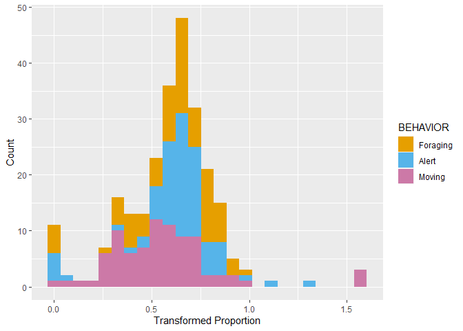

## Preamble

This script will deal with analyzing the relationship of the proportion of time allocated to each behavior - head down, head up, and moving - with the presence of a sentinel, the presence of bait, the foraging environment, group size and the frequency of disturbances.

As random effects, I've chosen the video and individual ID

This analysis will answer the following question:\
Do individual vary the proportion of time allocated to each behavioral in response to their perception of risk and sentinel coverage in their foraging environment?

To accomplish this, I extracted the summaries from the videos is BORIS and compiled a data table named "DATA".


```r
DATA<-read.csv("DATA.csv", stringsAsFactors = T)

str(DATA)
```

```
## 'data.frame':	252 obs. of  33 variables:
##  $ VIDEO_ID                         : Factor w/ 25 levels "037-2","038-2",..: 4 4 4 4 4 4 5 5 5 5 ...
##  $ ID                               : Factor w/ 67 levels "020-01-01","020-01-02",..: 1 1 1 2 2 2 3 3 3 3 ...
##  $ JULIAN_DATE                      : int  20227825 20227825 20227825 20227825 20227825 20227825 20227837 20227837 20227837 20227837 ...
##  $ DECIMAL_TIME                     : num  6.33 6.33 6.33 6.33 6.33 6.33 6.22 6.22 6.22 6.22 ...
##  $ LATITUDE                         : num  43.2 43.2 43.2 43.2 43.2 ...
##  $ LONGITUDE                        : num  -79.2 -79.2 -79.2 -79.2 -79.2 ...
##  $ TEMPERATURE                      : int  18 18 18 18 18 18 16 16 16 16 ...
##  $ WEATHER                          : Factor w/ 6 levels "Cloudy","Foggy",..: 6 6 6 6 6 6 6 6 6 6 ...
##  $ TOTAL_VIDEO_DURATION             : num  87.7 87.7 87.7 87.7 87.7 ...
##  $ RECORDED_DURATION                : num  76.2 76.2 76.2 50 50 ...
##  $ CODED_ENV                        : int  0 0 0 0 0 0 0 0 0 0 ...
##  $ GENERALIZED_ENVIRONMENT          : Factor w/ 2 levels "Commercial","Green Area": 2 2 2 2 2 2 2 2 2 2 ...
##  $ CODED_SENTINEL_PRESENCE          : int  0 0 0 0 0 0 0 0 0 1 ...
##  $ SENTINEL_PRESENCE                : Factor w/ 2 levels "NO","YES": 1 1 1 1 1 1 1 1 1 2 ...
##  $ BAIT_PRESENCE                    : Factor w/ 2 levels "NO","YES": 1 1 1 1 1 1 1 1 1 1 ...
##  $ NUMBER_OF_CROWS_RECORDED         : int  2 2 2 2 2 2 2 2 2 2 ...
##  $ GROUP_SIZE                       : Factor w/ 2 levels "LARGE","SMALL": 2 2 2 2 2 2 2 2 2 2 ...
##  $ BEHAVIOR                         : Factor w/ 3 levels "HD","HU","M": 2 1 3 2 1 3 2 1 3 2 ...
##  $ NUMBER_OF_BOUTS                  : int  13 14 6 13 9 8 13 8 9 7 ...
##  $ BEHAVIOR_DURATION                : num  22.9 39.8 13.5 17.7 18.8 ...
##  $ MEAN_BOUT_DURATION               : num  1.76 2.84 2.25 1.36 2.09 ...
##  $ SD_BOUT_DURATION                 : num  2.74 2.44 2.2 1.3 1.17 ...
##  $ BEHAVIOR_PROPORTION              : num  0.301 0.522 0.177 0.354 0.375 0.27 0.68 0.209 0.111 0.779 ...
##  $ NUMBER_OF_PECKS                  : int  NA 31 NA NA 20 NA NA 9 NA NA ...
##  $ PECK_RATE                        : num  NA 46.8 NA NA 63.9 ...
##  $ TOTAL_NUMBER_OF_DISTURBANCES     : int  0 0 0 0 0 0 0 0 0 0 ...
##  $ NUMBER_HUMAN_DISTURBANCE         : int  0 0 0 0 0 0 0 0 0 0 ...
##  $ NUMBER_DOM_ANIMAL_DISTURBANCE    : int  0 0 0 0 0 0 0 0 0 0 ...
##  $ NUMBER_HETEROSPECIFIC_DISTURBANCE: int  0 0 0 0 0 0 0 0 0 0 ...
##  $ NUMBER_VEHICLE_DISTURBANCE       : int  0 0 0 0 0 0 0 0 0 0 ...
##  $ TOTAL_AGGRESSION                 : int  0 0 0 0 0 0 0 0 0 0 ...
##  $ CONSPECIFIC_AGGRESSION           : int  0 0 0 0 0 0 0 0 0 0 ...
##  $ DISTURBANCE_FREQUENCY            : num  0 0 0 0 0 0 0 0 0 0 ...
```

```r
source("./Calculate Summary Table with SE, SD, CI by grouping variables.R")
PROP.MEAN <- summarySE(data = DATA
                      , measurevar = "BEHAVIOR_PROPORTION"
                      , groupvars = c("GENERALIZED_ENVIRONMENT"
                                      , "BEHAVIOR"
                                      , "SENTINEL_PRESENCE"
                                      )
                      )
PROP.MEAN
```

```
##    GENERALIZED_ENVIRONMENT BEHAVIOR SENTINEL_PRESENCE  N BEHAVIOR_PROPORTION
## 1               Commercial       HD                NO 18           0.3391111
## 2               Commercial       HD               YES 31           0.3273548
## 3               Commercial       HU                NO 18           0.3870000
## 4               Commercial       HU               YES 31           0.3419355
## 5               Commercial        M                NO 18           0.2738889
## 6               Commercial        M               YES 31           0.3307097
## 7               Green Area       HD                NO 14           0.3827143
## 8               Green Area       HD               YES 21           0.3467619
## 9               Green Area       HU                NO 14           0.4247857
## 10              Green Area       HU               YES 21           0.3324286
## 11              Green Area        M                NO 14           0.1922857
## 12              Green Area        M               YES 21           0.3207143
##           sd         se         ci
## 1  0.2016388 0.04752673 0.10027264
## 2  0.1632008 0.02931173 0.05986254
## 3  0.1946321 0.04587522 0.09678826
## 4  0.1458862 0.02620194 0.05351151
## 5  0.1898621 0.04475094 0.09441622
## 6  0.2016228 0.03621252 0.07395583
## 7  0.1706122 0.04559803 0.09850856
## 8  0.1569611 0.03425172 0.07144784
## 9  0.1003549 0.02682097 0.05794319
## 10 0.1765697 0.03853067 0.08037356
## 11 0.1488424 0.03977981 0.08593905
## 12 0.2462048 0.05372630 0.11207109
```

We now have a summary of the proportion data. 

Onto the analysis.

## To transform or not

In order to determine whether our fixed effects have significant effects on the allocation of time to each behavior, I decided to first arcsin square root transform the proportions.


<!-- -->

Transformed data seems more normal than untransformed data. Will continue to use transformed data.


```r
DATA$ASIN_PROPORTION<-asin(sqrt(DATA$BEHAVIOR_PROPORTION))
```

Here is the histogram of the log-transformed data separated by behavior.

<!-- -->

There are some gaps in the distribution.

## Stacked barplot

GGPlot time


```r
PROP.BAR<-ggplot(PROP.MEAN
                 , aes(x = SENTINEL_PRESENCE
                       , y = BEHAVIOR_PROPORTION
                       , fill = BEHAVIOR))+
  geom_bar(stat = 'identity'
           , position = 'stack')+
  geom_text(aes(label = paste0(formattable::digits(BEHAVIOR_PROPORTION*100, dig=2)
                               , "%"))
            , position = position_stack(vjust = 0.5)
            , size = 3) +
  scale_y_continuous(labels = scales::percent) +
  theme_classic()+
  theme(text=element_text(size = 10)
        , axis.title.x = element_blank())+
  ylab("Proportion of time")+
  scale_x_discrete(labels=c("Sentinel Absent"
                            , "Sentinel Present"))+
  scale_fill_manual(values = cbPalette, labels = c("Foraging"
                                                   , "Alert"
                                                   , "Moving")
                    , name="Behavior")+
  theme(legend.position = "bottom")+
  facet_grid(~GENERALIZED_ENVIRONMENT)
PROP.BAR
```

<!-- -->

Ok, so we can see that there are a couple of differences between the proportions.

It seems that the presence of a sentinel increases the proportion of 'moving' behavior. \
It seems like 'Alert' behavior remains relatively consistent across environments, with the presence of a sentinel decreasing the proportion of time allocated to that behavior.
Lastly, it seems like 'foraging' behavior remains consistent throughout environments and the presence of a sentinel.

Let's fit some models.

## The Models

Let's fit the models. We are principally testing for the effects of the presence of a sentinel and the generalized environment. In addition to those, we will include the presence of bait, group size and the frequency of disturbances as fixed effects.

As for the random effects, I will use VIDEO_ID/ID. The ID is nested within the VIDEO ID, explaining the structure.

Let's fit the simplest model.


```r
PROP.MOD1<-lmer(ASIN_PROPORTION~BEHAVIOR+SENTINEL_PRESENCE+GENERALIZED_ENVIRONMENT+BAIT_PRESENCE+GROUP_SIZE+DISTURBANCE_FREQUENCY+(1|VIDEO_ID/ID), data = DATA)
```

```
## boundary (singular) fit: see help('isSingular')
```

```r
sjPlot::tab_model(PROP.MOD1
                  , show.re.var = T
                  , title = "Proportion Model 1 Output"
                  , dv.labels = " Effects of on the proportion of behaviors")
```

<table style="border-collapse:collapse; border:none;">
<caption style="font-weight: bold; text-align:left;">Proportion Model 1 Output</caption>
<tr>
<th style="border-top: double; text-align:center; font-style:normal; font-weight:bold; padding:0.2cm;  text-align:left; ">&nbsp;</th>
<th colspan="3" style="border-top: double; text-align:center; font-style:normal; font-weight:bold; padding:0.2cm; "> Effects of on the proportion of behaviors</th>
</tr>
<tr>
<td style=" text-align:center; border-bottom:1px solid; font-style:italic; font-weight:normal;  text-align:left; ">Predictors</td>
<td style=" text-align:center; border-bottom:1px solid; font-style:italic; font-weight:normal;  ">Estimates</td>
<td style=" text-align:center; border-bottom:1px solid; font-style:italic; font-weight:normal;  ">CI</td>
<td style=" text-align:center; border-bottom:1px solid; font-style:italic; font-weight:normal;  ">p</td>
</tr>
<tr>
<td style=" padding:0.2cm; text-align:left; vertical-align:top; text-align:left; ">(Intercept)</td>
<td style=" padding:0.2cm; text-align:left; vertical-align:top; text-align:center;  ">0.59</td>
<td style=" padding:0.2cm; text-align:left; vertical-align:top; text-align:center;  ">0.48&nbsp;&ndash;&nbsp;0.71</td>
<td style=" padding:0.2cm; text-align:left; vertical-align:top; text-align:center;  "><strong>&lt;0.001</strong></td>
</tr>
<tr>
<td style=" padding:0.2cm; text-align:left; vertical-align:top; text-align:left; ">BEHAVIOR [HU]</td>
<td style=" padding:0.2cm; text-align:left; vertical-align:top; text-align:center;  ">0.02</td>
<td style=" padding:0.2cm; text-align:left; vertical-align:top; text-align:center;  ">&#45;0.05&nbsp;&ndash;&nbsp;0.10</td>
<td style=" padding:0.2cm; text-align:left; vertical-align:top; text-align:center;  ">0.517</td>
</tr>
<tr>
<td style=" padding:0.2cm; text-align:left; vertical-align:top; text-align:left; ">BEHAVIOR [M]</td>
<td style=" padding:0.2cm; text-align:left; vertical-align:top; text-align:center;  ">&#45;0.04</td>
<td style=" padding:0.2cm; text-align:left; vertical-align:top; text-align:center;  ">&#45;0.12&nbsp;&ndash;&nbsp;0.03</td>
<td style=" padding:0.2cm; text-align:left; vertical-align:top; text-align:center;  ">0.244</td>
</tr>
<tr>
<td style=" padding:0.2cm; text-align:left; vertical-align:top; text-align:left; ">SENTINEL PRESENCE [YES]</td>
<td style=" padding:0.2cm; text-align:left; vertical-align:top; text-align:center;  ">0.02</td>
<td style=" padding:0.2cm; text-align:left; vertical-align:top; text-align:center;  ">&#45;0.06&nbsp;&ndash;&nbsp;0.09</td>
<td style=" padding:0.2cm; text-align:left; vertical-align:top; text-align:center;  ">0.662</td>
</tr>
<tr>
<td style=" padding:0.2cm; text-align:left; vertical-align:top; text-align:left; ">GENERALIZED ENVIRONMENT<br>[Green Area]</td>
<td style=" padding:0.2cm; text-align:left; vertical-align:top; text-align:center;  ">&#45;0.01</td>
<td style=" padding:0.2cm; text-align:left; vertical-align:top; text-align:center;  ">&#45;0.09&nbsp;&ndash;&nbsp;0.07</td>
<td style=" padding:0.2cm; text-align:left; vertical-align:top; text-align:center;  ">0.790</td>
</tr>
<tr>
<td style=" padding:0.2cm; text-align:left; vertical-align:top; text-align:left; ">BAIT PRESENCE [YES]</td>
<td style=" padding:0.2cm; text-align:left; vertical-align:top; text-align:center;  ">&#45;0.01</td>
<td style=" padding:0.2cm; text-align:left; vertical-align:top; text-align:center;  ">&#45;0.09&nbsp;&ndash;&nbsp;0.08</td>
<td style=" padding:0.2cm; text-align:left; vertical-align:top; text-align:center;  ">0.906</td>
</tr>
<tr>
<td style=" padding:0.2cm; text-align:left; vertical-align:top; text-align:left; ">GROUP SIZE [SMALL]</td>
<td style=" padding:0.2cm; text-align:left; vertical-align:top; text-align:center;  ">0.02</td>
<td style=" padding:0.2cm; text-align:left; vertical-align:top; text-align:center;  ">&#45;0.07&nbsp;&ndash;&nbsp;0.10</td>
<td style=" padding:0.2cm; text-align:left; vertical-align:top; text-align:center;  ">0.682</td>
</tr>
<tr>
<td style=" padding:0.2cm; text-align:left; vertical-align:top; text-align:left; ">DISTURBANCE FREQUENCY</td>
<td style=" padding:0.2cm; text-align:left; vertical-align:top; text-align:center;  ">&#45;0.00</td>
<td style=" padding:0.2cm; text-align:left; vertical-align:top; text-align:center;  ">&#45;0.03&nbsp;&ndash;&nbsp;0.03</td>
<td style=" padding:0.2cm; text-align:left; vertical-align:top; text-align:center;  ">0.759</td>
</tr>
<tr>
<td colspan="4" style="font-weight:bold; text-align:left; padding-top:.8em;">Random Effects</td>
</tr>

<tr>
<td style=" padding:0.2cm; text-align:left; vertical-align:top; text-align:left; padding-top:0.1cm; padding-bottom:0.1cm;">&sigma;<sup>2</sup></td>
<td style=" padding:0.2cm; text-align:left; vertical-align:top; padding-top:0.1cm; padding-bottom:0.1cm; text-align:left;" colspan="3">0.06</td>
</tr>

<tr>
<td style=" padding:0.2cm; text-align:left; vertical-align:top; text-align:left; padding-top:0.1cm; padding-bottom:0.1cm;">&tau;<sub>00</sub> <sub>ID:VIDEO_ID</sub></td>
<td style=" padding:0.2cm; text-align:left; vertical-align:top; padding-top:0.1cm; padding-bottom:0.1cm; text-align:left;" colspan="3">0.00</td>

<tr>
<td style=" padding:0.2cm; text-align:left; vertical-align:top; text-align:left; padding-top:0.1cm; padding-bottom:0.1cm;">&tau;<sub>00</sub> <sub>VIDEO_ID</sub></td>
<td style=" padding:0.2cm; text-align:left; vertical-align:top; padding-top:0.1cm; padding-bottom:0.1cm; text-align:left;" colspan="3">0.00</td>

<tr>
<td style=" padding:0.2cm; text-align:left; vertical-align:top; text-align:left; padding-top:0.1cm; padding-bottom:0.1cm;">N <sub>ID</sub></td>
<td style=" padding:0.2cm; text-align:left; vertical-align:top; padding-top:0.1cm; padding-bottom:0.1cm; text-align:left;" colspan="3">67</td>

<tr>
<td style=" padding:0.2cm; text-align:left; vertical-align:top; text-align:left; padding-top:0.1cm; padding-bottom:0.1cm;">N <sub>VIDEO_ID</sub></td>
<td style=" padding:0.2cm; text-align:left; vertical-align:top; padding-top:0.1cm; padding-bottom:0.1cm; text-align:left;" colspan="3">25</td>
<tr>
<td style=" padding:0.2cm; text-align:left; vertical-align:top; text-align:left; padding-top:0.1cm; padding-bottom:0.1cm; border-top:1px solid;">Observations</td>
<td style=" padding:0.2cm; text-align:left; vertical-align:top; padding-top:0.1cm; padding-bottom:0.1cm; text-align:left; border-top:1px solid;" colspan="3">252</td>
</tr>
<tr>
<td style=" padding:0.2cm; text-align:left; vertical-align:top; text-align:left; padding-top:0.1cm; padding-bottom:0.1cm;">Marginal R<sup>2</sup> / Conditional R<sup>2</sup></td>
<td style=" padding:0.2cm; text-align:left; vertical-align:top; padding-top:0.1cm; padding-bottom:0.1cm; text-align:left;" colspan="3">0.015 / NA</td>
</tr>

</table>

huh, seems like the model is singular. This could mean that the model is over fitted.

Let's look at the results.


```
## Analysis of Deviance Table (Type II Wald chisquare tests)
## 
## Response: ASIN_PROPORTION
##                          Chisq Df Pr(>Chisq)
## BEHAVIOR                3.3906  2     0.1835
## SENTINEL_PRESENCE       0.1914  1     0.6617
## GENERALIZED_ENVIRONMENT 0.0710  1     0.7898
## BAIT_PRESENCE           0.0139  1     0.9062
## GROUP_SIZE              0.1681  1     0.6818
## DISTURBANCE_FREQUENCY   0.0945  1     0.7585
```

```
## boundary (singular) fit: see help('isSingular')
## boundary (singular) fit: see help('isSingular')
```

```
## ANOVA-like table for random-effects: Single term deletions
## 
## Model:
## ASIN_PROPORTION ~ BEHAVIOR + SENTINEL_PRESENCE + GENERALIZED_ENVIRONMENT + BAIT_PRESENCE + GROUP_SIZE + DISTURBANCE_FREQUENCY + (1 | ID:VIDEO_ID) + (1 | VIDEO_ID)
##                   npar  logLik    AIC LRT Df Pr(>Chisq)
## <none>              11 -17.093 56.185                  
## (1 | ID:VIDEO_ID)   10 -17.093 54.185   0  1          1
## (1 | VIDEO_ID)      10 -17.093 54.185   0  1          1
```

Ok, so none of the factors are significant, and the results of the ranova suggest that the model without random effects is preferred. Let's improve the model with some interactions. We will use the same formula for MOD2 as the one used in the BOUT data.


```r
PROP.MOD2<-lmer(ASIN_PROPORTION~BEHAVIOR*SENTINEL_PRESENCE+BEHAVIOR*GENERALIZED_ENVIRONMENT+SENTINEL_PRESENCE*GENERALIZED_ENVIRONMENT+GROUP_SIZE+BAIT_PRESENCE+DISTURBANCE_FREQUENCY+(1|VIDEO_ID/ID), data = DATA)
```

```
## boundary (singular) fit: see help('isSingular')
```

```r
sjPlot::tab_model(PROP.MOD2
                  , show.re.var = T
                  , title = "Proportion Model 2 Output"
                  , dv.labels = " Effects on proportion of behaviors")
```

<table style="border-collapse:collapse; border:none;">
<caption style="font-weight: bold; text-align:left;">Proportion Model 2 Output</caption>
<tr>
<th style="border-top: double; text-align:center; font-style:normal; font-weight:bold; padding:0.2cm;  text-align:left; ">&nbsp;</th>
<th colspan="3" style="border-top: double; text-align:center; font-style:normal; font-weight:bold; padding:0.2cm; "> Effects on proportion of behaviors</th>
</tr>
<tr>
<td style=" text-align:center; border-bottom:1px solid; font-style:italic; font-weight:normal;  text-align:left; ">Predictors</td>
<td style=" text-align:center; border-bottom:1px solid; font-style:italic; font-weight:normal;  ">Estimates</td>
<td style=" text-align:center; border-bottom:1px solid; font-style:italic; font-weight:normal;  ">CI</td>
<td style=" text-align:center; border-bottom:1px solid; font-style:italic; font-weight:normal;  ">p</td>
</tr>
<tr>
<td style=" padding:0.2cm; text-align:left; vertical-align:top; text-align:left; ">(Intercept)</td>
<td style=" padding:0.2cm; text-align:left; vertical-align:top; text-align:center;  ">0.60</td>
<td style=" padding:0.2cm; text-align:left; vertical-align:top; text-align:center;  ">0.47&nbsp;&ndash;&nbsp;0.74</td>
<td style=" padding:0.2cm; text-align:left; vertical-align:top; text-align:center;  "><strong>&lt;0.001</strong></td>
</tr>
<tr>
<td style=" padding:0.2cm; text-align:left; vertical-align:top; text-align:left; ">BEHAVIOR [HU]</td>
<td style=" padding:0.2cm; text-align:left; vertical-align:top; text-align:center;  ">0.07</td>
<td style=" padding:0.2cm; text-align:left; vertical-align:top; text-align:center;  ">&#45;0.06&nbsp;&ndash;&nbsp;0.21</td>
<td style=" padding:0.2cm; text-align:left; vertical-align:top; text-align:center;  ">0.299</td>
</tr>
<tr>
<td style=" padding:0.2cm; text-align:left; vertical-align:top; text-align:left; ">BEHAVIOR [M]</td>
<td style=" padding:0.2cm; text-align:left; vertical-align:top; text-align:center;  ">&#45;0.11</td>
<td style=" padding:0.2cm; text-align:left; vertical-align:top; text-align:center;  ">&#45;0.25&nbsp;&ndash;&nbsp;0.02</td>
<td style=" padding:0.2cm; text-align:left; vertical-align:top; text-align:center;  ">0.099</td>
</tr>
<tr>
<td style=" padding:0.2cm; text-align:left; vertical-align:top; text-align:left; ">SENTINEL PRESENCE [YES]</td>
<td style=" padding:0.2cm; text-align:left; vertical-align:top; text-align:center;  ">&#45;0.01</td>
<td style=" padding:0.2cm; text-align:left; vertical-align:top; text-align:center;  ">&#45;0.14&nbsp;&ndash;&nbsp;0.12</td>
<td style=" padding:0.2cm; text-align:left; vertical-align:top; text-align:center;  ">0.878</td>
</tr>
<tr>
<td style=" padding:0.2cm; text-align:left; vertical-align:top; text-align:left; ">GENERALIZED ENVIRONMENT<br>[Green Area]</td>
<td style=" padding:0.2cm; text-align:left; vertical-align:top; text-align:center;  ">0.02</td>
<td style=" padding:0.2cm; text-align:left; vertical-align:top; text-align:center;  ">&#45;0.12&nbsp;&ndash;&nbsp;0.15</td>
<td style=" padding:0.2cm; text-align:left; vertical-align:top; text-align:center;  ">0.824</td>
</tr>
<tr>
<td style=" padding:0.2cm; text-align:left; vertical-align:top; text-align:left; ">GROUP SIZE [SMALL]</td>
<td style=" padding:0.2cm; text-align:left; vertical-align:top; text-align:center;  ">0.02</td>
<td style=" padding:0.2cm; text-align:left; vertical-align:top; text-align:center;  ">&#45;0.07&nbsp;&ndash;&nbsp;0.10</td>
<td style=" padding:0.2cm; text-align:left; vertical-align:top; text-align:center;  ">0.680</td>
</tr>
<tr>
<td style=" padding:0.2cm; text-align:left; vertical-align:top; text-align:left; ">BAIT PRESENCE [YES]</td>
<td style=" padding:0.2cm; text-align:left; vertical-align:top; text-align:center;  ">&#45;0.01</td>
<td style=" padding:0.2cm; text-align:left; vertical-align:top; text-align:center;  ">&#45;0.09&nbsp;&ndash;&nbsp;0.08</td>
<td style=" padding:0.2cm; text-align:left; vertical-align:top; text-align:center;  ">0.896</td>
</tr>
<tr>
<td style=" padding:0.2cm; text-align:left; vertical-align:top; text-align:left; ">DISTURBANCE FREQUENCY</td>
<td style=" padding:0.2cm; text-align:left; vertical-align:top; text-align:center;  ">&#45;0.00</td>
<td style=" padding:0.2cm; text-align:left; vertical-align:top; text-align:center;  ">&#45;0.03&nbsp;&ndash;&nbsp;0.03</td>
<td style=" padding:0.2cm; text-align:left; vertical-align:top; text-align:center;  ">0.752</td>
</tr>
<tr>
<td style=" padding:0.2cm; text-align:left; vertical-align:top; text-align:left; ">BEHAVIOR [HU] × SENTINEL<br>PRESENCE [YES]</td>
<td style=" padding:0.2cm; text-align:left; vertical-align:top; text-align:center;  ">&#45;0.07</td>
<td style=" padding:0.2cm; text-align:left; vertical-align:top; text-align:center;  ">&#45;0.22&nbsp;&ndash;&nbsp;0.08</td>
<td style=" padding:0.2cm; text-align:left; vertical-align:top; text-align:center;  ">0.386</td>
</tr>
<tr>
<td style=" padding:0.2cm; text-align:left; vertical-align:top; text-align:left; ">BEHAVIOR [M] × SENTINEL<br>PRESENCE [YES]</td>
<td style=" padding:0.2cm; text-align:left; vertical-align:top; text-align:center;  ">0.15</td>
<td style=" padding:0.2cm; text-align:left; vertical-align:top; text-align:center;  ">&#45;0.00&nbsp;&ndash;&nbsp;0.30</td>
<td style=" padding:0.2cm; text-align:left; vertical-align:top; text-align:center;  ">0.050</td>
</tr>
<tr>
<td style=" padding:0.2cm; text-align:left; vertical-align:top; text-align:left; ">BEHAVIOR [HU] ×<br>GENERALIZED ENVIRONMENT<br>[Green Area]</td>
<td style=" padding:0.2cm; text-align:left; vertical-align:top; text-align:center;  ">&#45;0.01</td>
<td style=" padding:0.2cm; text-align:left; vertical-align:top; text-align:center;  ">&#45;0.16&nbsp;&ndash;&nbsp;0.13</td>
<td style=" padding:0.2cm; text-align:left; vertical-align:top; text-align:center;  ">0.850</td>
</tr>
<tr>
<td style=" padding:0.2cm; text-align:left; vertical-align:top; text-align:left; ">BEHAVIOR [M] ×<br>GENERALIZED ENVIRONMENT<br>[Green Area]</td>
<td style=" padding:0.2cm; text-align:left; vertical-align:top; text-align:center;  ">&#45;0.06</td>
<td style=" padding:0.2cm; text-align:left; vertical-align:top; text-align:center;  ">&#45;0.20&nbsp;&ndash;&nbsp;0.09</td>
<td style=" padding:0.2cm; text-align:left; vertical-align:top; text-align:center;  ">0.462</td>
</tr>
<tr>
<td style=" padding:0.2cm; text-align:left; vertical-align:top; text-align:left; ">SENTINEL PRESENCE [YES] ×<br>GENERALIZED ENVIRONMENT<br>[Green Area]</td>
<td style=" padding:0.2cm; text-align:left; vertical-align:top; text-align:center;  ">&#45;0.00</td>
<td style=" padding:0.2cm; text-align:left; vertical-align:top; text-align:center;  ">&#45;0.13&nbsp;&ndash;&nbsp;0.12</td>
<td style=" padding:0.2cm; text-align:left; vertical-align:top; text-align:center;  ">0.943</td>
</tr>
<tr>
<td colspan="4" style="font-weight:bold; text-align:left; padding-top:.8em;">Random Effects</td>
</tr>

<tr>
<td style=" padding:0.2cm; text-align:left; vertical-align:top; text-align:left; padding-top:0.1cm; padding-bottom:0.1cm;">&sigma;<sup>2</sup></td>
<td style=" padding:0.2cm; text-align:left; vertical-align:top; padding-top:0.1cm; padding-bottom:0.1cm; text-align:left;" colspan="3">0.06</td>
</tr>

<tr>
<td style=" padding:0.2cm; text-align:left; vertical-align:top; text-align:left; padding-top:0.1cm; padding-bottom:0.1cm;">&tau;<sub>00</sub> <sub>ID:VIDEO_ID</sub></td>
<td style=" padding:0.2cm; text-align:left; vertical-align:top; padding-top:0.1cm; padding-bottom:0.1cm; text-align:left;" colspan="3">0.00</td>

<tr>
<td style=" padding:0.2cm; text-align:left; vertical-align:top; text-align:left; padding-top:0.1cm; padding-bottom:0.1cm;">&tau;<sub>00</sub> <sub>VIDEO_ID</sub></td>
<td style=" padding:0.2cm; text-align:left; vertical-align:top; padding-top:0.1cm; padding-bottom:0.1cm; text-align:left;" colspan="3">0.00</td>

<tr>
<td style=" padding:0.2cm; text-align:left; vertical-align:top; text-align:left; padding-top:0.1cm; padding-bottom:0.1cm;">N <sub>ID</sub></td>
<td style=" padding:0.2cm; text-align:left; vertical-align:top; padding-top:0.1cm; padding-bottom:0.1cm; text-align:left;" colspan="3">67</td>

<tr>
<td style=" padding:0.2cm; text-align:left; vertical-align:top; text-align:left; padding-top:0.1cm; padding-bottom:0.1cm;">N <sub>VIDEO_ID</sub></td>
<td style=" padding:0.2cm; text-align:left; vertical-align:top; padding-top:0.1cm; padding-bottom:0.1cm; text-align:left;" colspan="3">25</td>
<tr>
<td style=" padding:0.2cm; text-align:left; vertical-align:top; text-align:left; padding-top:0.1cm; padding-bottom:0.1cm; border-top:1px solid;">Observations</td>
<td style=" padding:0.2cm; text-align:left; vertical-align:top; padding-top:0.1cm; padding-bottom:0.1cm; text-align:left; border-top:1px solid;" colspan="3">252</td>
</tr>
<tr>
<td style=" padding:0.2cm; text-align:left; vertical-align:top; text-align:left; padding-top:0.1cm; padding-bottom:0.1cm;">Marginal R<sup>2</sup> / Conditional R<sup>2</sup></td>
<td style=" padding:0.2cm; text-align:left; vertical-align:top; padding-top:0.1cm; padding-bottom:0.1cm; text-align:left;" colspan="3">0.049 / NA</td>
</tr>

</table>

Like MOD1, none of the factors have an effect. Still singular.

Maybe I'm not using the correct approach. Instead of performing a LMM on transformed data, I'll instead use a quasibinomial GLM for proportion data. Since the random effects in the previous models explained none of the variance, we can, in this case, omit them.


```r
PROP.MOD3<-glm(BEHAVIOR_PROPORTION~BEHAVIOR*SENTINEL_PRESENCE+BEHAVIOR*GENERALIZED_ENVIRONMENT+SENTINEL_PRESENCE*GENERALIZED_ENVIRONMENT+GROUP_SIZE+BAIT_PRESENCE+DISTURBANCE_FREQUENCY, family=quasibinomial, data = DATA)

sjPlot::tab_model(PROP.MOD3
                  , show.re.var = T
                  , title = "Proportion Model 3 Output"
                  , dv.labels = " Effects on proportion of behaviors")
```

<table style="border-collapse:collapse; border:none;">
<caption style="font-weight: bold; text-align:left;">Proportion Model 3 Output</caption>
<tr>
<th style="border-top: double; text-align:center; font-style:normal; font-weight:bold; padding:0.2cm;  text-align:left; ">&nbsp;</th>
<th colspan="3" style="border-top: double; text-align:center; font-style:normal; font-weight:bold; padding:0.2cm; "> Effects on proportion of behaviors</th>
</tr>
<tr>
<td style=" text-align:center; border-bottom:1px solid; font-style:italic; font-weight:normal;  text-align:left; ">Predictors</td>
<td style=" text-align:center; border-bottom:1px solid; font-style:italic; font-weight:normal;  ">Odds Ratios</td>
<td style=" text-align:center; border-bottom:1px solid; font-style:italic; font-weight:normal;  ">CI</td>
<td style=" text-align:center; border-bottom:1px solid; font-style:italic; font-weight:normal;  ">p</td>
</tr>
<tr>
<td style=" padding:0.2cm; text-align:left; vertical-align:top; text-align:left; ">(Intercept)</td>
<td style=" padding:0.2cm; text-align:left; vertical-align:top; text-align:center;  ">0.53</td>
<td style=" padding:0.2cm; text-align:left; vertical-align:top; text-align:center;  ">0.33&nbsp;&ndash;&nbsp;0.83</td>
<td style=" padding:0.2cm; text-align:left; vertical-align:top; text-align:center;  "><strong>0.006</strong></td>
</tr>
<tr>
<td style=" padding:0.2cm; text-align:left; vertical-align:top; text-align:left; ">BEHAVIOR [HU]</td>
<td style=" padding:0.2cm; text-align:left; vertical-align:top; text-align:center;  ">1.26</td>
<td style=" padding:0.2cm; text-align:left; vertical-align:top; text-align:center;  ">0.81&nbsp;&ndash;&nbsp;1.98</td>
<td style=" padding:0.2cm; text-align:left; vertical-align:top; text-align:center;  ">0.310</td>
</tr>
<tr>
<td style=" padding:0.2cm; text-align:left; vertical-align:top; text-align:left; ">BEHAVIOR [M]</td>
<td style=" padding:0.2cm; text-align:left; vertical-align:top; text-align:center;  ">0.64</td>
<td style=" padding:0.2cm; text-align:left; vertical-align:top; text-align:center;  ">0.40&nbsp;&ndash;&nbsp;1.03</td>
<td style=" padding:0.2cm; text-align:left; vertical-align:top; text-align:center;  ">0.066</td>
</tr>
<tr>
<td style=" padding:0.2cm; text-align:left; vertical-align:top; text-align:left; ">SENTINEL PRESENCE [YES]</td>
<td style=" padding:0.2cm; text-align:left; vertical-align:top; text-align:center;  ">0.90</td>
<td style=" padding:0.2cm; text-align:left; vertical-align:top; text-align:center;  ">0.59&nbsp;&ndash;&nbsp;1.39</td>
<td style=" padding:0.2cm; text-align:left; vertical-align:top; text-align:center;  ">0.638</td>
</tr>
<tr>
<td style=" padding:0.2cm; text-align:left; vertical-align:top; text-align:left; ">GENERALIZED ENVIRONMENT<br>[Green Area]</td>
<td style=" padding:0.2cm; text-align:left; vertical-align:top; text-align:center;  ">1.13</td>
<td style=" padding:0.2cm; text-align:left; vertical-align:top; text-align:center;  ">0.71&nbsp;&ndash;&nbsp;1.78</td>
<td style=" padding:0.2cm; text-align:left; vertical-align:top; text-align:center;  ">0.611</td>
</tr>
<tr>
<td style=" padding:0.2cm; text-align:left; vertical-align:top; text-align:left; ">GROUP SIZE [SMALL]</td>
<td style=" padding:0.2cm; text-align:left; vertical-align:top; text-align:center;  ">1.00</td>
<td style=" padding:0.2cm; text-align:left; vertical-align:top; text-align:center;  ">0.75&nbsp;&ndash;&nbsp;1.32</td>
<td style=" padding:0.2cm; text-align:left; vertical-align:top; text-align:center;  ">1.000</td>
</tr>
<tr>
<td style=" padding:0.2cm; text-align:left; vertical-align:top; text-align:left; ">BAIT PRESENCE [YES]</td>
<td style=" padding:0.2cm; text-align:left; vertical-align:top; text-align:center;  ">1.00</td>
<td style=" padding:0.2cm; text-align:left; vertical-align:top; text-align:center;  ">0.74&nbsp;&ndash;&nbsp;1.35</td>
<td style=" padding:0.2cm; text-align:left; vertical-align:top; text-align:center;  ">0.998</td>
</tr>
<tr>
<td style=" padding:0.2cm; text-align:left; vertical-align:top; text-align:left; ">DISTURBANCE FREQUENCY</td>
<td style=" padding:0.2cm; text-align:left; vertical-align:top; text-align:center;  ">1.00</td>
<td style=" padding:0.2cm; text-align:left; vertical-align:top; text-align:center;  ">0.90&nbsp;&ndash;&nbsp;1.11</td>
<td style=" padding:0.2cm; text-align:left; vertical-align:top; text-align:center;  ">1.000</td>
</tr>
<tr>
<td style=" padding:0.2cm; text-align:left; vertical-align:top; text-align:left; ">BEHAVIOR [HU] × SENTINEL<br>PRESENCE [YES]</td>
<td style=" padding:0.2cm; text-align:left; vertical-align:top; text-align:center;  ">0.83</td>
<td style=" padding:0.2cm; text-align:left; vertical-align:top; text-align:center;  ">0.50&nbsp;&ndash;&nbsp;1.38</td>
<td style=" padding:0.2cm; text-align:left; vertical-align:top; text-align:center;  ">0.476</td>
</tr>
<tr>
<td style=" padding:0.2cm; text-align:left; vertical-align:top; text-align:left; ">BEHAVIOR [M] × SENTINEL<br>PRESENCE [YES]</td>
<td style=" padding:0.2cm; text-align:left; vertical-align:top; text-align:center;  ">1.70</td>
<td style=" padding:0.2cm; text-align:left; vertical-align:top; text-align:center;  ">1.01&nbsp;&ndash;&nbsp;2.89</td>
<td style=" padding:0.2cm; text-align:left; vertical-align:top; text-align:center;  "><strong>0.048</strong></td>
</tr>
<tr>
<td style=" padding:0.2cm; text-align:left; vertical-align:top; text-align:left; ">BEHAVIOR [HU] ×<br>GENERALIZED ENVIRONMENT<br>[Green Area]</td>
<td style=" padding:0.2cm; text-align:left; vertical-align:top; text-align:center;  ">0.91</td>
<td style=" padding:0.2cm; text-align:left; vertical-align:top; text-align:center;  ">0.56&nbsp;&ndash;&nbsp;1.50</td>
<td style=" padding:0.2cm; text-align:left; vertical-align:top; text-align:center;  ">0.725</td>
</tr>
<tr>
<td style=" padding:0.2cm; text-align:left; vertical-align:top; text-align:left; ">BEHAVIOR [M] ×<br>GENERALIZED ENVIRONMENT<br>[Green Area]</td>
<td style=" padding:0.2cm; text-align:left; vertical-align:top; text-align:center;  ">0.73</td>
<td style=" padding:0.2cm; text-align:left; vertical-align:top; text-align:center;  ">0.44&nbsp;&ndash;&nbsp;1.22</td>
<td style=" padding:0.2cm; text-align:left; vertical-align:top; text-align:center;  ">0.232</td>
</tr>
<tr>
<td style=" padding:0.2cm; text-align:left; vertical-align:top; text-align:left; ">SENTINEL PRESENCE [YES] ×<br>GENERALIZED ENVIRONMENT<br>[Green Area]</td>
<td style=" padding:0.2cm; text-align:left; vertical-align:top; text-align:center;  ">1.01</td>
<td style=" padding:0.2cm; text-align:left; vertical-align:top; text-align:center;  ">0.65&nbsp;&ndash;&nbsp;1.57</td>
<td style=" padding:0.2cm; text-align:left; vertical-align:top; text-align:center;  ">0.952</td>
</tr>
<tr>
<td style=" padding:0.2cm; text-align:left; vertical-align:top; text-align:left; padding-top:0.1cm; padding-bottom:0.1cm; border-top:1px solid;">Observations</td>
<td style=" padding:0.2cm; text-align:left; vertical-align:top; padding-top:0.1cm; padding-bottom:0.1cm; text-align:left; border-top:1px solid;" colspan="3">252</td>
</tr>

</table>

All factors are non-significant apart from the interaction between the proportion of 'moving' and the generalized environment.

I believe this may be the best approach since I am unable to use the quasibinomial family in a glmm.

Let's look at the comparisons between groups.


```r
PROP.DIFF<-emmeans(PROP.MOD3, ~BEHAVIOR*SENTINEL_PRESENCE*GENERALIZED_ENVIRONMENT)
test(pairs(PROP.DIFF, by= "BEHAVIOR"), adjust="fdr")
```

```
## BEHAVIOR = HD:
##  contrast                        estimate    SE  df z.ratio p.value
##  NO Commercial - YES Commercial    0.1032 0.219 Inf   0.471  0.8297
##  NO Commercial - NO Green Area    -0.1190 0.234 Inf  -0.509  0.8297
##  NO Commercial - YES Green Area   -0.0292 0.262 Inf  -0.111  0.9113
##  YES Commercial - NO Green Area   -0.2222 0.290 Inf  -0.767  0.8297
##  YES Commercial - YES Green Area  -0.1324 0.221 Inf  -0.598  0.8297
##  NO Green Area - YES Green Area    0.0898 0.226 Inf   0.397  0.8297
## 
## BEHAVIOR = HU:
##  contrast                        estimate    SE  df z.ratio p.value
##  NO Commercial - YES Commercial    0.2855 0.216 Inf   1.320  0.5259
##  NO Commercial - NO Green Area    -0.0301 0.232 Inf  -0.130  0.8967
##  NO Commercial - YES Green Area    0.2420 0.259 Inf   0.933  0.5259
##  YES Commercial - NO Green Area   -0.3155 0.287 Inf  -1.100  0.5259
##  YES Commercial - YES Green Area  -0.0434 0.221 Inf  -0.197  0.8967
##  NO Green Area - YES Green Area    0.2721 0.225 Inf   1.210  0.5259
## 
## BEHAVIOR = M:
##  contrast                        estimate    SE  df z.ratio p.value
##  NO Commercial - YES Commercial   -0.4285 0.229 Inf  -1.869  0.1348
##  NO Commercial - NO Green Area     0.1936 0.249 Inf   0.779  0.4360
##  NO Commercial - YES Green Area   -0.2482 0.280 Inf  -0.887  0.4360
##  YES Commercial - NO Green Area    0.6221 0.309 Inf   2.015  0.1348
##  YES Commercial - YES Green Area   0.1803 0.226 Inf   0.797  0.4360
##  NO Green Area - YES Green Area   -0.4419 0.242 Inf  -1.829  0.1348
## 
## Results are averaged over the levels of: GROUP_SIZE, BAIT_PRESENCE 
## Results are given on the log odds ratio (not the response) scale. 
## P value adjustment: fdr method for 6 tests
```

None of the groups are significantly different from one another when comparing within each behavior. Next, let's look at the differences throughout behaviors.


```r
PROP.DIFF2<-emmeans(PROP.MOD3, ~BEHAVIOR*SENTINEL_PRESENCE*GENERALIZED_ENVIRONMENT)
PROP.PWISE<-test(pairs(PROP.DIFF2), adjust="fdr")
PROP.PWISE
```

```
##  contrast                              estimate    SE  df z.ratio p.value
##  HD NO Commercial - HU NO Commercial   -0.23186 0.228 Inf  -1.015  0.6723
##  HD NO Commercial - M NO Commercial     0.44454 0.242 Inf   1.837  0.2543
##  HD NO Commercial - HD YES Commercial   0.10317 0.219 Inf   0.471  0.8587
##  HD NO Commercial - HU YES Commercial   0.05362 0.244 Inf   0.219  0.9273
##  HD NO Commercial - M YES Commercial    0.01606 0.243 Inf   0.066  0.9768
##  HD NO Commercial - HD NO Green Area   -0.11903 0.234 Inf  -0.509  0.8579
##  HD NO Commercial - HU NO Green Area   -0.26192 0.280 Inf  -0.935  0.7012
##  HD NO Commercial - M NO Green Area     0.63817 0.301 Inf   2.122  0.2543
##  HD NO Commercial - HD YES Green Area  -0.02924 0.262 Inf  -0.111  0.9547
##  HD NO Commercial - HU YES Green Area   0.01018 0.228 Inf   0.045  0.9792
##  HD NO Commercial - M YES Green Area    0.19632 0.234 Inf   0.839  0.7084
##  HU NO Commercial - M NO Commercial     0.67640 0.239 Inf   2.825  0.0781
##  HU NO Commercial - HD YES Commercial   0.33503 0.242 Inf   1.386  0.4969
##  HU NO Commercial - HU YES Commercial   0.28548 0.216 Inf   1.320  0.5141
##  HU NO Commercial - M YES Commercial    0.24792 0.239 Inf   1.035  0.6723
##  HU NO Commercial - HD NO Green Area    0.11283 0.279 Inf   0.405  0.8629
##  HU NO Commercial - HU NO Green Area   -0.03006 0.232 Inf  -0.130  0.9546
##  HU NO Commercial - M NO Green Area     0.87004 0.298 Inf   2.922  0.0781
##  HU NO Commercial - HD YES Green Area   0.20262 0.225 Inf   0.899  0.7022
##  HU NO Commercial - HU YES Green Area   0.24204 0.259 Inf   0.933  0.7012
##  HU NO Commercial - M YES Green Area    0.42818 0.231 Inf   1.851  0.2543
##  M NO Commercial - HD YES Commercial   -0.34137 0.255 Inf  -1.337  0.5141
##  M NO Commercial - HU YES Commercial   -0.39092 0.255 Inf  -1.534  0.4125
##  M NO Commercial - M YES Commercial    -0.42848 0.229 Inf  -1.869  0.2543
##  M NO Commercial - HD NO Green Area    -0.56357 0.291 Inf  -1.937  0.2543
##  M NO Commercial - HU NO Green Area    -0.70646 0.289 Inf  -2.442  0.1928
##  M NO Commercial - M NO Green Area      0.19363 0.249 Inf   0.779  0.7129
##  M NO Commercial - HD YES Green Area   -0.47378 0.239 Inf  -1.981  0.2543
##  M NO Commercial - HU YES Green Area   -0.43436 0.239 Inf  -1.816  0.2543
##  M NO Commercial - M YES Green Area    -0.24822 0.280 Inf  -0.887  0.7022
##  HD YES Commercial - HU YES Commercial -0.04955 0.191 Inf  -0.259  0.9273
##  HD YES Commercial - M YES Commercial  -0.08711 0.192 Inf  -0.453  0.8587
##  HD YES Commercial - HD NO Green Area  -0.22220 0.290 Inf  -0.767  0.7129
##  HD YES Commercial - HU NO Green Area  -0.36509 0.261 Inf  -1.398  0.4969
##  HD YES Commercial - M NO Green Area    0.53500 0.279 Inf   1.915  0.2543
##  HD YES Commercial - HD YES Green Area -0.13241 0.221 Inf  -0.598  0.8249
##  HD YES Commercial - HU YES Green Area -0.09299 0.244 Inf  -0.381  0.8629
##  HD YES Commercial - M YES Green Area   0.09315 0.247 Inf   0.377  0.8629
##  HU YES Commercial - M YES Commercial  -0.03756 0.191 Inf  -0.196  0.9273
##  HU YES Commercial - HD NO Green Area  -0.17265 0.262 Inf  -0.659  0.8015
##  HU YES Commercial - HU NO Green Area  -0.31554 0.287 Inf  -1.100  0.6632
##  HU YES Commercial - M NO Green Area    0.58456 0.279 Inf   2.098  0.2543
##  HU YES Commercial - HD YES Green Area -0.08286 0.242 Inf  -0.342  0.8791
##  HU YES Commercial - HU YES Green Area -0.04344 0.221 Inf  -0.197  0.9273
##  HU YES Commercial - M YES Green Area   0.14270 0.246 Inf   0.579  0.8249
##  M YES Commercial - HD NO Green Area   -0.13509 0.264 Inf  -0.512  0.8579
##  M YES Commercial - HU NO Green Area   -0.27798 0.262 Inf  -1.060  0.6723
##  M YES Commercial - M NO Green Area     0.62211 0.309 Inf   2.015  0.2543
##  M YES Commercial - HD YES Green Area  -0.04531 0.241 Inf  -0.188  0.9273
##  M YES Commercial - HU YES Green Area  -0.00588 0.242 Inf  -0.024  0.9806
##  M YES Commercial - M YES Green Area    0.18025 0.226 Inf   0.797  0.7129
##  HD NO Green Area - HU NO Green Area   -0.14289 0.244 Inf  -0.586  0.8249
##  HD NO Green Area - M NO Green Area     0.75721 0.262 Inf   2.893  0.0781
##  HD NO Green Area - HD YES Green Area   0.08979 0.226 Inf   0.397  0.8629
##  HD NO Green Area - HU YES Green Area   0.12921 0.269 Inf   0.480  0.8587
##  HD NO Green Area - M YES Green Area    0.31535 0.271 Inf   1.162  0.6223
##  HU NO Green Area - M NO Green Area     0.90009 0.260 Inf   3.460  0.0356
##  HU NO Green Area - HD YES Green Area   0.23268 0.267 Inf   0.872  0.7022
##  HU NO Green Area - HU YES Green Area   0.27210 0.225 Inf   1.210  0.5972
##  HU NO Green Area - M YES Green Area    0.45824 0.270 Inf   1.700  0.3098
##  M NO Green Area - HD YES Green Area   -0.66742 0.288 Inf  -2.318  0.2252
##  M NO Green Area - HU YES Green Area   -0.62799 0.289 Inf  -2.174  0.2543
##  M NO Green Area - M YES Green Area    -0.44186 0.242 Inf  -1.829  0.2543
##  HD YES Green Area - HU YES Green Area  0.03942 0.219 Inf   0.180  0.9273
##  HD YES Green Area - M YES Green Area   0.22556 0.225 Inf   1.003  0.6723
##  HU YES Green Area - M YES Green Area   0.18614 0.225 Inf   0.828  0.7084
## 
## Results are averaged over the levels of: GROUP_SIZE, BAIT_PRESENCE 
## Results are given on the log odds ratio (not the response) scale. 
## P value adjustment: fdr method for 66 tests
```

Ok! Across behaviors we have few significant and marginally significant results.


```r
PROP.PWISE[which(PROP.PWISE$p.value<0.1),]
```

```
##  contrast                           estimate    SE  df z.ratio p.value
##  HU NO Commercial - M NO Commercial    0.676 0.239 Inf   2.825  0.0781
##  HU NO Commercial - M NO Green Area    0.870 0.298 Inf   2.922  0.0781
##  HD NO Green Area - M NO Green Area    0.757 0.262 Inf   2.893  0.0781
##  HU NO Green Area - M NO Green Area    0.900 0.260 Inf   3.460  0.0356
## 
## Results are averaged over the levels of: GROUP_SIZE, BAIT_PRESENCE 
## Results are given on the log odds ratio (not the response) scale. 
## P value adjustment: fdr method for 66 tests
```
Very cool! These are the results of pairwise comparisons averaged over the levels of group size and bait presence (**not disturbance frequency**).

There do not appear to be any differences across environments or the presence of a sentinel, but between proportions of behaviors.

Let's have another look at it.


```r
PROP.BAR
```

<!-- -->

Indeed, there is a difference between Moving and Alert proportions in commercial areas in the absence of a sentinel.
Likewise, there are differences in the proportion of time allocated to head up/down and moving behaviors in green spaces in the absence of a sentinel.
Possibly the most interesting comparison is the difference between the proportion of time allocated to 'alert' behavior and 'moving' in the absence of a sentinel and across the two environments.

Yet, these differences are marginally significant, apart from 'HU NO Green Area - M NO Green Area'

## Conclusions

It seems that the proportion of time allocated to each behavior remains relatively consistent, and not affected by the presence of a sentinel, nor the environment in which the individual forages in. \
However, the differences appear between the proportion of behaviors, suggesting that the allocation of time to each behavior is relatively dependent on the type of behavior. \

This would suggest that if the presence of a sentinel and the environment were to affect the behavior of foragers, the effects would be seen in the frequency of behaviors. In other words, instead of changing the overall proportion of time allocated to each behavior, they instead change the duration of bouts of their behaviors to provide better coverage over time (more, but shorter gaps between instances of vigilance).


