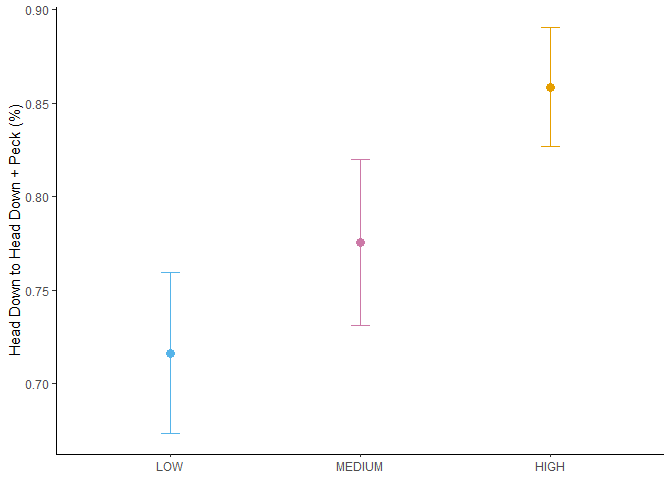
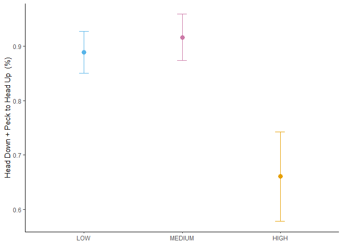

```r
PTWY.raw<-read.csv("DATA.SR.csv", stringsAsFactors = T)
str(PTWY.raw)
```

```
## 'data.frame':	81 obs. of  77 variables:
##  $ VIDEO_ID.                        : Factor w/ 25 levels "037-2","038-2",..: 4 4 5 5 5 6 7 8 9 10 ...
##  $ ID.                              : Factor w/ 64 levels "020-01-01","020-01-02",..: 1 2 3 3 4 5 6 7 8 9 ...
##  $ DATE                             : Factor w/ 19 levels "2022-06-25","2022-07-07",..: 1 1 2 2 2 2 3 4 5 6 ...
##  $ Convert.date                     : Factor w/ 19 levels "2022-06-25","2022-07-07",..: 1 1 2 2 2 2 3 4 5 6 ...
##  $ JULIAN_DATE                      : int  20227825 20227825 20227837 20227837 20227837 20227837 20227843 20227849 20227850 20227852 ...
##  $ TIME                             : Factor w/ 24 levels "6:13:00","6:18:00",..: 3 3 1 1 1 2 7 6 8 6 ...
##  $ DECIMAL_TIME                     : num  6.33 6.33 6.22 6.22 6.22 ...
##  $ LATITUDE                         : num  43.2 43.2 43.2 43.2 43.2 ...
##  $ LONGITUDE                        : num  -79.2 -79.2 -79.2 -79.2 -79.2 ...
##  $ TEMPERATURE                      : int  18 18 16 16 16 16 19 22 24 21 ...
##  $ WEATHER                          : Factor w/ 6 levels "Cloudy","Foggy",..: 6 6 6 6 6 6 3 6 6 5 ...
##  $ TOTAL_VIDEO_DURATION             : num  87.7 87.7 191.5 191.5 191.5 ...
##  $ RECORDED_DURATION                : num  76.2 50 106 39.5 42 ...
##  $ CODED_ENV                        : int  0 0 0 0 0 0 0 0 0 0 ...
##  $ GENERALIZED_ENVIRONMENT          : Factor w/ 2 levels "Commercial","Green Area": 2 2 2 2 2 2 2 2 2 2 ...
##  $ CODED_SENTINEL_PRESENCE          : int  0 0 0 1 0 0 1 0 1 0 ...
##  $ SENTINEL_PRESENCE                : Factor w/ 2 levels "NO","YES": 1 1 1 2 1 1 2 1 2 1 ...
##  $ CODED_BAIT                       : int  0 0 0 0 0 1 1 1 1 1 ...
##  $ BAIT_PRESENCE                    : Factor w/ 2 levels "NO","YES": 1 1 1 1 1 2 2 2 2 2 ...
##  $ NUMBER_OF_CROWS_RECORDED         : int  2 2 2 2 2 1 1 1 1 2 ...
##  $ CODED_GROUP_SIZE                 : int  0 0 0 0 0 0 0 0 0 0 ...
##  $ GROUP_SIZE                       : Factor w/ 2 levels "LARGE","SMALL": 2 2 2 2 2 2 2 2 2 2 ...
##  $ TOTAL_NUMBER_OF_DISTURBANCES     : int  0 0 0 0 0 5 4 1 1 3 ...
##  $ NUMBER_HUMAN_DISTURBANCE         : int  0 0 0 0 0 4 2 1 1 2 ...
##  $ NUMBER_DOM_ANIMAL_DISTURBANCE    : int  0 0 0 0 0 1 2 0 0 1 ...
##  $ NUMBER_HETEROSPECIFIC_DISTURBANCE: int  0 0 0 0 0 0 0 0 0 0 ...
##  $ NUMBER_VEHICLE_DISTURBANCE       : int  0 0 0 0 0 0 0 0 0 0 ...
##  $ TOTAL_AGGRESSION                 : int  0 0 0 0 0 0 0 0 0 0 ...
##  $ CONSPECIFIC_AGGRESSION           : int  0 0 0 0 0 0 0 0 0 0 ...
##  $ TOTAL_FREQUENCY_OF_DISTURBANCES  : num  0 0 0 0 0 ...
##  $ DISTURBANCE_FREQUENCY            : Factor w/ 3 levels "HIGH","LOW","MEDIUM": 2 2 2 2 2 3 3 3 3 3 ...
##  $ HU_NUMBER_OF_BOUTS               : int  13 13 13 7 10 21 39 22 11 43 ...
##  $ HU_BEHAVIOR_DURATION             : num  22.9 17.7 72 30.8 19 ...
##  $ HU_MEAN_BOUT_DURATION            : num  1.76 1.36 5.54 4.4 1.9 ...
##  $ HU_SD_BOUT_DURATION              : num  2.737 1.305 3.493 2.839 0.939 ...
##  $ HU_BEHAVIOR_PROPORTION_...       : num  0.301 0.354 0.68 0.779 0.453 ...
##  $ HD_NUMBER_OF_BOUTS               : int  14 9 8 3 6 17 36 19 8 40 ...
##  $ HD_BEHAVIOR_DURATION             : num  39.76 18.77 22.15 4.22 9.25 ...
##  $ HD_MEAN_BOUT_DURATION            : num  2.84 2.09 2.77 1.41 1.54 ...
##  $ HD_SD_BOUT_DURATION              : num  2.44 1.17 2.42 1.22 1.07 ...
##  $ HD_BEHAVIOR_PROPORTION_...       : num  0.522 0.375 0.209 0.107 0.22 ...
##  $ M_NUMBER_OF_BOUTS                : int  6 8 9 4 10 11 10 7 8 12 ...
##  $ M_BEHAVIOR_DURATION              : num  13.48 13.53 11.79 4.51 13.7 ...
##  $ M_MEAN_BOUT_DURATION             : num  2.25 1.69 1.31 1.13 1.37 ...
##  $ M_SD_BOUT_DURATION               : num  2.2 1.507 0.426 0.476 0.742 ...
##  $ M_BEHAVIOR_PROPORTION_...        : num  0.177 0.27 0.111 0.114 0.326 ...
##  $ NUMBER_OF_PECKS                  : int  31 20 9 1 2 36 56 38 8 63 ...
##  $ PECK_RATE                        : num  46.8 63.9 24.4 14.2 13 ...
##  $ TOTAL_NB_BEHAVIORS               : int  46 37 35 15 25 60 118 62 32 127 ...
##  $ TOTAL_NB_TRANSITIONS             : int  45 35 33 14 23 56 116 60 31 124 ...
##  $ NB_HD.HDP                        : int  13 8 5 1 2 13 33 15 6 33 ...
##  $ FREQ_HD.HDP                      : num  0.289 0.229 0.152 0.071 0.087 0.232 0.284 0.25 0.194 0.266 ...
##  $ PTWY_HD.HDP                      : num  0.929 0.889 0.833 0.333 0.4 ...
##  $ NB_HD.HU                         : int  1 1 1 2 3 1 3 4 2 6 ...
##  $ FREQ_HD.HU                       : num  0.022 0.029 0.03 0.143 0.13 0.018 0.026 0.067 0.065 0.048 ...
##  $ PTWY_HD.HU                       : num  0.0714 0.1111 0.1667 0.6667 0.6 ...
##  $ NB_HD.M                          : int  0 0 0 0 0 1 0 0 0 0 ...
##  $ FREQ_HD.M                        : num  0 0 0 0 0 0.018 0 0 0 0 ...
##  $ PTWY_HD.M                        : num  0 0 0 0 0 ...
##  $ NB_HDP.HU                        : int  10 7 3 1 2 12 33 15 6 33 ...
##  $ FREQ_HDP.HU                      : num  0.222 0.2 0.091 0.071 0.087 0.214 0.284 0.25 0.194 0.266 ...
##  $ PTWY_HDP.HU                      : num  0.769 0.875 0.6 1 1 ...
##  $ NB_HDP.M                         : int  3 1 2 0 0 1 0 0 0 1 ...
##  $ FREQ_HDP.M                       : num  0.067 0.029 0.061 0 0 0.018 0 0 0 0.008 ...
##  $ PTWY_HDP.M                       : num  0.231 0.125 0.4 0 0 ...
##  $ NB_HU.HD                         : int  10 9 6 2 4 15 30 16 4 33 ...
##  $ FREQ_HU.HD                       : num  0.222 0.257 0.182 0.143 0.174 0.268 0.259 0.267 0.129 0.266 ...
##  $ PTWY_HU.HD                       : num  0.769 0.692 0.462 0.333 0.4 ...
##  $ NB_HU.M                          : int  3 4 7 4 6 6 9 6 7 9 ...
##  $ FREQ_HU.M                        : num  0.067 0.114 0.212 0.286 0.261 0.107 0.078 0.1 0.226 0.073 ...
##  $ PTWY_HU.M                        : num  0.231 0.308 0.538 0.667 0.6 ...
##  $ NB_M.HD                          : int  3 0 1 0 2 1 6 3 4 5 ...
##  $ FREQ_M.HD                        : num  0.067 0 0.03 0 0.087 0.018 0.052 0.05 0.129 0.04 ...
##  $ PTWY_M.HD                        : num  0.6 0 0.111 0 0.333 ...
##  $ NB_M.HU                          : int  2 5 8 4 4 6 2 1 2 4 ...
##  $ FREQ_M.HU                        : num  0.044 0.143 0.242 0.286 0.174 0.107 0.017 0.017 0.065 0.032 ...
##  $ PTWY_M.HU                        : num  0.4 1 0.889 1 0.667 ...
```

Nice, it opened as it should. Let's subset the dataset to only contain what we want.


```r
PTWY<- PTWY.raw %>%
  dplyr::select(VIDEO_ID.,ID., DECIMAL_TIME, GENERALIZED_ENVIRONMENT, SENTINEL_PRESENCE, BAIT_PRESENCE, NUMBER_OF_CROWS_RECORDED, GROUP_SIZE, TOTAL_FREQUENCY_OF_DISTURBANCES, DISTURBANCE_FREQUENCY | starts_with("PTWY"))
```

Next, let's group together the transitions to vigilance, and transitions to vulnerability.
 

```r
Vulnerable<-cbind(PTWY$PTWY_HD.HDP, PTWY$PTWY_HU.HD)
Vigilant<-cbind(PTWY$PTWY_HD.HU, PTWY$PTWY_HDP.HU)
# This does not work
```

Let's try fitting the model.

## Vulnerable


```r
PTWY.vuln<-MANOVA.wide(cbind(PTWY$PTWY_HD.HDP, PTWY$PTWY_HU.HD)~SENTINEL_PRESENCE*GENERALIZED_ENVIRONMENT, data = PTWY, subject = "ID.", iter=1000)
summary(PTWY.vuln)
```

```
## Call: 
## cbind(PTWY$PTWY_HD.HDP, PTWY$PTWY_HU.HD) ~ SENTINEL_PRESENCE * 
##     GENERALIZED_ENVIRONMENT
## 
## Descriptive:
##   SENTINEL_PRESENCE GENERALIZED_ENVIRONMENT  n PTWY$PTWY_HD.HDP
## 1                NO              Commercial 18            0.710
## 2                NO              Green Area 14            0.793
## 3               YES              Commercial 30            0.834
## 4               YES              Green Area 19            0.702
##    PTWY$PTWY_HU.HD
## 1            0.504
## 2            0.666
## 3            0.525
## 4            0.599
## 
## Wald-Type Statistic (WTS):
##                                           Test statistic df  p-value
## SENTINEL_PRESENCE                         "0.517"        "2" "0.772"
## GENERALIZED_ENVIRONMENT                   "7.701"        "2" "0.021"
## SENTINEL_PRESENCE:GENERALIZED_ENVIRONMENT "3.575"        "2" "0.167"
## 
## modified ANOVA-Type Statistic (MATS):
##                                           Test statistic
## SENTINEL_PRESENCE                                  0.224
## GENERALIZED_ENVIRONMENT                            4.170
## SENTINEL_PRESENCE:GENERALIZED_ENVIRONMENT          3.985
## 
## p-values resampling:
##                                           paramBS (WTS) paramBS (MATS)
## SENTINEL_PRESENCE                         "0.784"       "0.884"       
## GENERALIZED_ENVIRONMENT                   "0.035"       "0.126"       
## SENTINEL_PRESENCE:GENERALIZED_ENVIRONMENT "0.193"       "0.154"
```

Interesting... While Sentinel presence and the interaction of sentinel presence and generalized environment had no significant effects, generalized environment had an effect on the frequency of transitions to vulnerability.

**Figure out if you need to recalculate PTWY data to only include those 4 transitions. **

Let's perform a pairwise comparison.

### Post Hoc


```r
simCI(PTWY.vuln, contrast = "pairwise", type = "Tukey", interaction  = F, factor = "GENERALIZED_ENVIRONMENT")
```

```
## 
##  #------ Call -----# 
##  
##  - Contrast:  Tukey 
##  - Confidence level: 95 % 
## 
##  #------Multivariate post-hoc comparisons: p-values -----# 
##  
##                  contrast p.value
## 1 Green Area - Commercial   0.515
## 
##  #-----------Confidence intervals for summary effects-------------# 
##  
##                         Estimate      Lower     Upper
## Green Area - Commercial    0.063 -0.1219257 0.2479257
```

HMMMM... Very weird... Now its not significant... Let's compute univariate comparisons.


```r
PTWY.HD.HDP<-MANOVA.wide(PTWY_HD.HDP~GENERALIZED_ENVIRONMENT, data = PTWY, iter = 1000)
PTWY.HU.HD<-MANOVA.wide(PTWY_HU.HD~GENERALIZED_ENVIRONMENT, data = PTWY, iter = 1000)

p.adjust(c(PTWY.HD.HDP$resampling[,1], PTWY.HU.HD$resampling[,1]), method = "bonferroni")
```

```
## [1] 0.762 0.092
```

```r
#using the parametric bootstrap Wald-type statistic
```

Very cool! Turns out that only the transitions from head up to head down is significantly affected by the generalized environment. This is only if we use the Wald-type statistic and not the modified ANOVA-type statistic.

### Plots


```r
source("./Calculate Summary Table with SE, SD, CI by grouping variables.R")
G.ENV.PTWY<-PTWY %>%
  summarySE(measurevar = "PTWY_HU.HD"
            , groupvars = "GENERALIZED_ENVIRONMENT") %>%
    ggplot(aes(x = GENERALIZED_ENVIRONMENT
                     , y = PTWY_HU.HD
                     , color = GENERALIZED_ENVIRONMENT))+
  geom_point(position = position_dodge(width=0.9)
             , size = 3) +
  geom_errorbar(aes(ymin=(PTWY_HU.HD-se)
                    , ymax=(PTWY_HU.HD+se))
                , width = 0.1
                , position = position_dodge(width=0.9))+
  theme_classic() +
  ylab("Head Up to Head Down (%)") +
  scale_colour_manual(values = cbPalette
                      , guide="none")+
  theme(axis.title.x = element_blank()
        , legend.position = "bottom"
        , legend.box="vertical"
        , legend.margin=margin())
```

```
## Loading required package: doBy
```

```
## 
## Attaching package: 'doBy'
```

```
## The following object is masked from 'package:dplyr':
## 
##     order_by
```

```r
G.ENV.PTWY
```

<!-- -->

## Vigilance


```r
PTWY.vigil<-MANOVA.wide(cbind(PTWY$PTWY_HD.HU, PTWY$PTWY_HDP.HU)~SENTINEL_PRESENCE*GENERALIZED_ENVIRONMENT, data = PTWY, subject = "ID.", iter=1000)
summary(PTWY.vigil)
```

```
## Call: 
## cbind(PTWY$PTWY_HD.HU, PTWY$PTWY_HDP.HU) ~ SENTINEL_PRESENCE * 
##     GENERALIZED_ENVIRONMENT
## 
## Descriptive:
##   SENTINEL_PRESENCE GENERALIZED_ENVIRONMENT  n PTWY$PTWY_HD.HU
## 1                NO              Commercial 18           0.161
## 2                NO              Green Area 14           0.131
## 3               YES              Commercial 30           0.124
## 4               YES              Green Area 19           0.192
##    PTWY$PTWY_HDP.HU
## 1             0.872
## 2             0.848
## 3             0.771
## 4             0.914
## 
## Wald-Type Statistic (WTS):
##                                           Test statistic df  p-value
## SENTINEL_PRESENCE                         "0.265"        "2" "0.876"
## GENERALIZED_ENVIRONMENT                   "1.013"        "2" "0.603"
## SENTINEL_PRESENCE:GENERALIZED_ENVIRONMENT "2.92"         "2" "0.232"
## 
## modified ANOVA-Type Statistic (MATS):
##                                           Test statistic
## SENTINEL_PRESENCE                                  0.194
## GENERALIZED_ENVIRONMENT                            1.212
## SENTINEL_PRESENCE:GENERALIZED_ENVIRONMENT          3.712
## 
## p-values resampling:
##                                           paramBS (WTS) paramBS (MATS)
## SENTINEL_PRESENCE                         "0.866"       "0.893"       
## GENERALIZED_ENVIRONMENT                   "0.603"       "0.543"       
## SENTINEL_PRESENCE:GENERALIZED_ENVIRONMENT "0.257"       "0.177"
```

The results of this test suggest that no transitions to vigilance are significantly affected by either the presence of a sentinel or the generalized environment.

**Figure out what to do with factors such as bait presence, group size and disturbance frequency**

## The other variables - Vulnerability

We still have bait presence, group size and disturbance frequency to look at. I want to try and make a quick function to run all the tests.


```r
PTWY.vuln.all<-lapply(PTWY[,c("SENTINEL_PRESENCE"
                              ,"GENERALIZED_ENVIRONMENT"
                              , "GROUP_SIZE"
                              , "BAIT_PRESENCE"
                              , "DISTURBANCE_FREQUENCY")
                              ]
                         , function(x) MANOVA.wide(cbind(PTWY$PTWY_HD.HDP, PTWY$PTWY_HU.HD)~x, data = PTWY, iter = 1000)
                         )
```

```
## Call: 
## cbind(PTWY$PTWY_HD.HDP, PTWY$PTWY_HU.HD) ~ x
## <environment: 0x0000018a223eaf80>
## 
## Descriptive:
##     x  n PTWY$PTWY_HD.HDP  PTWY$PTWY_HU.HD
## 1  NO 32            0.747            0.575
## 2 YES 49            0.782            0.554
## 
## Wald-Type Statistic (WTS):
##   Test statistic df  p-value
## x "1.052"        "2" "0.591"
## 
## modified ANOVA-Type Statistic (MATS):
##   Test statistic
## x          0.511
## 
## p-values resampling:
##   paramBS (WTS) paramBS (MATS)
## x "0.603"       "0.756"
```

```
## Call: 
## cbind(PTWY$PTWY_HD.HDP, PTWY$PTWY_HU.HD) ~ x
## <environment: 0x0000018a2aa106b0>
## 
## Descriptive:
##            x  n PTWY$PTWY_HD.HDP  PTWY$PTWY_HU.HD
## 1 Commercial 48            0.787            0.517
## 2 Green Area 33            0.740            0.627
## 
## Wald-Type Statistic (WTS):
##   Test statistic df  p-value
## x "9.816"        "2" "0.007"
## 
## modified ANOVA-Type Statistic (MATS):
##   Test statistic
## x          4.957
## 
## p-values resampling:
##   paramBS (WTS) paramBS (MATS)
## x "0.014"       "0.089"
```

```
## Call: 
## cbind(PTWY$PTWY_HD.HDP, PTWY$PTWY_HU.HD) ~ x
## <environment: 0x0000018a2ee4ab00>
## 
## Descriptive:
##       x  n PTWY$PTWY_HD.HDP  PTWY$PTWY_HU.HD
## 1 LARGE 36            0.790            0.513
## 2 SMALL 45            0.751            0.601
## 
## Wald-Type Statistic (WTS):
##   Test statistic df  p-value
## x "5.268"        "2" "0.072"
## 
## modified ANOVA-Type Statistic (MATS):
##   Test statistic
## x          2.839
## 
## p-values resampling:
##   paramBS (WTS) paramBS (MATS)
## x "0.084"       "0.253"
```

```
## Call: 
## cbind(PTWY$PTWY_HD.HDP, PTWY$PTWY_HU.HD) ~ x
## <environment: 0x0000018a2dfb3618>
## 
## Descriptive:
##     x  n PTWY$PTWY_HD.HDP  PTWY$PTWY_HU.HD
## 1  NO 15            0.638            0.510
## 2 YES 66            0.798            0.574
## 
## Wald-Type Statistic (WTS):
##   Test statistic df  p-value
## x "6.214"        "2" "0.045"
## 
## modified ANOVA-Type Statistic (MATS):
##   Test statistic
## x           7.54
## 
## p-values resampling:
##   paramBS (WTS) paramBS (MATS)
## x "0.066"       "0.034"
```

```
## Call: 
## cbind(PTWY$PTWY_HD.HDP, PTWY$PTWY_HU.HD) ~ x
## <environment: 0x0000018a28330bc8>
## 
## Descriptive:
##        x  n PTWY$PTWY_HD.HDP  PTWY$PTWY_HU.HD
## 1   HIGH 20            0.859            0.510
## 2    LOW 38            0.716            0.559
## 3 MEDIUM 23            0.776            0.613
## 
## Wald-Type Statistic (WTS):
##   Test statistic df  p-value
## x "13.982"       "4" "0.007"
## 
## modified ANOVA-Type Statistic (MATS):
##   Test statistic
## x           9.27
## 
## p-values resampling:
##   paramBS (WTS) paramBS (MATS)
## x "0.011"       "0.098"
```

```r
Factor<-c("Sentinel Presence", "Generalized Environment", "Group Size", "Bait Presence", "Disturbance Frequency")
Results.vuln<-cbind(Factor, rbind(PTWY.vuln.SENT, PTWY.vuln.GENV, PTWY.vuln.GS, PTWY.vuln.BP, PTWY.vuln.DF))
Results.vuln
```

```
##   Factor                    paramBS (WTS) paramBS (MATS)
## x "Sentinel Presence"       "0.603"       "0.756"       
## x "Generalized Environment" "0.014"       "0.089"       
## x "Group Size"              "0.084"       "0.253"       
## x "Bait Presence"           "0.066"       "0.034"       
## x "Disturbance Frequency"   "0.011"       "0.098"
```

As seen above, Gen. env has a  significant effect (p-value = 0.007). Interestingly,  group size (p-value ~ 0.072), bait presence (p-value ~ 0.06), and disturbance frequency (p-value ~ 0.01) are have either significant or marginally significant effects on the frequency of pathways to vulnerability.

### Post Hoc - Disturbance Frequency


```r
PTWY.DF.Vuln<-MANOVA.wide(cbind(PTWY$PTWY_HD.HDP, PTWY$PTWY_HU.HD)~DISTURBANCE_FREQUENCY, data = PTWY, iter = 1000)
simCI(PTWY.DF.Vuln, contrast = "pairwise", type = "Tukey", interaction  = F, factor = "DISTURBANCE_FREQUENCY")
```

```
## 
##  #------ Call -----# 
##  
##  - Contrast:  Tukey 
##  - Confidence level: 95 % 
## 
##  #------Multivariate post-hoc comparisons: p-values -----# 
##  
##        contrast p.value
## 1    LOW - HIGH   0.814
## 2 MEDIUM - HIGH   0.989
## 3  MEDIUM - LOW   0.710
## 
##  #-----------Confidence intervals for summary effects-------------# 
##  
##               Estimate      Lower     Upper
## LOW - HIGH      -0.094 -0.4479027 0.2599027
## MEDIUM - HIGH    0.020 -0.3443450 0.3843450
## MEDIUM - LOW     0.114 -0.2172126 0.4452126
```

HMMMMM... Not significant... Univariate analysis time.


```r
PTWY.DF.HD.HDP<-MANOVA.wide(PTWY_HD.HDP~DISTURBANCE_FREQUENCY, data = PTWY, iter = 1000)
PTWY.DF.HU.HD<-MANOVA.wide(PTWY_HU.HD~DISTURBANCE_FREQUENCY, data = PTWY, iter = 1000)

p.adjust(c(PTWY.DF.HD.HDP$resampling[,1], PTWY.DF.HU.HD$resampling[,1]), method = "bonferroni")
```

```
## [1] 0.06 0.84
```

```r
#using the parametric bootstrap Wald-type statistic
```

Curious... the frequency of the pathway HD>HDPeck is marginally significant. Let's quickly plot it.

### Plots


```r
source("./Calculate Summary Table with SE, SD, CI by grouping variables.R")
DF.PTWY.vuln<-PTWY %>%
  summarySE(measurevar = "PTWY_HD.HDP"
            , groupvars = "DISTURBANCE_FREQUENCY") %>%
    ggplot(aes(x = DISTURBANCE_FREQUENCY
                     , y = PTWY_HD.HDP
                     , color = DISTURBANCE_FREQUENCY))+
  geom_point(position = position_dodge(width=0.9)
             , size = 3) +
  geom_errorbar(aes(ymin=(PTWY_HD.HDP-se)
                    , ymax=(PTWY_HD.HDP+se))
                , width = 0.1
                , position = position_dodge(width=0.9))+
  theme_classic() +
  ylab("Head Down to Head Down + Peck (%)") +
  scale_colour_manual(values = cbPalette
                      , guide="none")+
  theme(axis.title.x = element_blank()
        , legend.position = "bottom"
        , legend.box="vertical"
        , legend.margin=margin()) +
  scale_x_discrete(limits = c("LOW", "MEDIUM", "HIGH"))

DF.PTWY.vuln
```

<!-- -->

THATS UNEXPECTED... well.. not that unexpected. It mirrors the results of the peck data! As disturbance frequency increases, so does the peck rate, and therefore the frequency of head down to head down + peck. It could be a sense of urgency.

## The other variables - Vulnerability

We still have bait presence, group size and disturbance frequency to look at. I want to try and make a quick function to run all the tests.


```r
PTWY.vigil.all<-lapply(PTWY[,c("SENTINEL_PRESENCE"
                              ,"GENERALIZED_ENVIRONMENT"
                              , "GROUP_SIZE"
                              , "BAIT_PRESENCE"
                              , "DISTURBANCE_FREQUENCY")
                              ]
                         , function(x) MANOVA.wide(cbind(PTWY$PTWY_HD.HU, PTWY$PTWY_HDP.HU)~x, data = PTWY, iter = 1000)
                         )
```

```
## Call: 
## cbind(PTWY$PTWY_HD.HU, PTWY$PTWY_HDP.HU) ~ x
## <environment: 0x0000018a34b32ef8>
## 
## Descriptive:
##     x  n PTWY$PTWY_HD.HU  PTWY$PTWY_HDP.HU
## 1  NO 32           0.148             0.861
## 2 YES 49           0.150             0.826
## 
## Wald-Type Statistic (WTS):
##   Test statistic df  p-value
## x "0.345"        "2" "0.841"
## 
## modified ANOVA-Type Statistic (MATS):
##   Test statistic
## x          0.293
## 
## p-values resampling:
##   paramBS (WTS) paramBS (MATS)
## x "0.832"       "0.845"
```

```
## Call: 
## cbind(PTWY$PTWY_HD.HU, PTWY$PTWY_HDP.HU) ~ x
## <environment: 0x0000018a2e0ae788>
## 
## Descriptive:
##            x  n PTWY$PTWY_HD.HU  PTWY$PTWY_HDP.HU
## 1 Commercial 48           0.138             0.809
## 2 Green Area 33           0.166             0.886
## 
## Wald-Type Statistic (WTS):
##   Test statistic df  p-value
## x "2.002"        "2" "0.367"
## 
## modified ANOVA-Type Statistic (MATS):
##   Test statistic
## x          2.388
## 
## p-values resampling:
##   paramBS (WTS) paramBS (MATS)
## x "0.383"       "0.312"
```

```
## Call: 
## cbind(PTWY$PTWY_HD.HU, PTWY$PTWY_HDP.HU) ~ x
## <environment: 0x0000018a220c89b0>
## 
## Descriptive:
##       x  n PTWY$PTWY_HD.HU  PTWY$PTWY_HDP.HU
## 1 LARGE 36           0.116             0.792
## 2 SMALL 45           0.176             0.879
## 
## Wald-Type Statistic (WTS):
##   Test statistic df  p-value
## x "4.136"        "2" "0.126"
## 
## modified ANOVA-Type Statistic (MATS):
##   Test statistic
## x          5.041
## 
## p-values resampling:
##   paramBS (WTS) paramBS (MATS)
## x "0.13"        "0.088"
```

```
## Call: 
## cbind(PTWY$PTWY_HD.HU, PTWY$PTWY_HDP.HU) ~ x
## <environment: 0x0000018a2a39e688>
## 
## Descriptive:
##     x  n PTWY$PTWY_HD.HU  PTWY$PTWY_HDP.HU
## 1  NO 15           0.230             0.864
## 2 YES 66           0.131             0.835
## 
## Wald-Type Statistic (WTS):
##   Test statistic df  p-value
## x "3.356"        "2" "0.187"
## 
## modified ANOVA-Type Statistic (MATS):
##   Test statistic
## x           3.59
## 
## p-values resampling:
##   paramBS (WTS) paramBS (MATS)
## x "0.215"       "0.181"
```

```
## Call: 
## cbind(PTWY$PTWY_HD.HU, PTWY$PTWY_HDP.HU) ~ x
## <environment: 0x0000018a2a583758>
## 
## Descriptive:
##        x  n PTWY$PTWY_HD.HU  PTWY$PTWY_HDP.HU
## 1   HIGH 20           0.105             0.660
## 2    LOW 38           0.162             0.889
## 3 MEDIUM 23           0.167             0.916
## 
## Wald-Type Statistic (WTS):
##   Test statistic df  p-value
## x "10.253"       "4" "0.036"
## 
## modified ANOVA-Type Statistic (MATS):
##   Test statistic
## x         10.716
## 
## p-values resampling:
##   paramBS (WTS) paramBS (MATS)
## x "0.068"       "0.061"
```

```r
Results.vigil<-cbind(Factor, rbind(PTWY.vigil.SENT, PTWY.vigil.GENV, PTWY.vigil.GS, PTWY.vigil.BP, PTWY.vigil.DF))
Results.vigil
```

```
##   Factor                    paramBS (WTS) paramBS (MATS)
## x "Sentinel Presence"       "0.832"       "0.845"       
## x "Generalized Environment" "0.383"       "0.312"       
## x "Group Size"              "0.13"        "0.088"       
## x "Bait Presence"           "0.215"       "0.181"       
## x "Disturbance Frequency"   "0.068"       "0.061"
```

Another interesting result! Disturbance frequency is marginally significant for transitions to vigilance. Same workflow as above.


```r
PTWY.DF.Vigil<-MANOVA.wide(cbind(PTWY$PTWY_HD.HU, PTWY$PTWY_HDP.HU)~DISTURBANCE_FREQUENCY, data = PTWY, iter = 1000)
simCI(PTWY.DF.Vigil, contrast = "pairwise", type = "Tukey", interaction  = F, factor = "DISTURBANCE_FREQUENCY")
```

```
## 
##  #------ Call -----# 
##  
##  - Contrast:  Tukey 
##  - Confidence level: 95 % 
## 
##  #------Multivariate post-hoc comparisons: p-values -----# 
##  
##        contrast p.value
## 1    LOW - HIGH   0.088
## 2 MEDIUM - HIGH   0.052
## 3  MEDIUM - LOW   0.931
## 
##  #-----------Confidence intervals for summary effects-------------# 
##  
##               Estimate        Lower     Upper
## LOW - HIGH       0.286 -0.028869806 0.6008698
## MEDIUM - HIGH    0.318 -0.001957442 0.6379574
## MEDIUM - LOW     0.032 -0.186979252 0.2509793
```

Pairwise comparisons for medium - high is marginally significant.


```r
PTWY.DF.HD.HU<-MANOVA.wide(PTWY_HD.HU~DISTURBANCE_FREQUENCY, data = PTWY, iter = 1000)
PTWY.DF.HDP.HU<-MANOVA.wide(PTWY_HDP.HU~DISTURBANCE_FREQUENCY, data = PTWY, iter = 1000)

p.adjust(c(PTWY.DF.HD.HU$resampling[,1], PTWY.DF.HDP.HU$resampling[,1]), method = "bonferroni")
```

```
## [1] 0.522 0.050
```

```r
#using the parametric bootstrap Wald-type statistic
```

Disturbance frequency has a marginally significant effect on transitions from Head Down + Peck to Head Up. Plot time!


```r
source("./Calculate Summary Table with SE, SD, CI by grouping variables.R")
DF.PTWY.vigil<-PTWY %>%
  summarySE(measurevar = "PTWY_HDP.HU"
            , groupvars = "DISTURBANCE_FREQUENCY") %>%
    ggplot(aes(x = DISTURBANCE_FREQUENCY
                     , y = PTWY_HDP.HU
                     , color = DISTURBANCE_FREQUENCY))+
  geom_point(position = position_dodge(width=0.9)
             , size = 3) +
  geom_errorbar(aes(ymin=(PTWY_HDP.HU-se)
                    , ymax=(PTWY_HDP.HU+se))
                , width = 0.1
                , position = position_dodge(width=0.9))+
  theme_classic() +
  ylab("Head Down + Peck to Head Up  (%)") +
  scale_colour_manual(values = cbPalette
                      , guide="none")+
  theme(axis.title.x = element_blank()
        , legend.position = "bottom"
        , legend.box="vertical"
        , legend.margin=margin()) +
  scale_x_discrete(limits = c("LOW", "MEDIUM", "HIGH"))

DF.PTWY.vigil
```

<!-- -->

# Frequency

We'll be fitting another manova on the frequency data.


```r
FREQ<- PTWY.raw %>%
  dplyr::select(VIDEO_ID.,ID., DECIMAL_TIME, GENERALIZED_ENVIRONMENT, SENTINEL_PRESENCE, BAIT_PRESENCE, NUMBER_OF_CROWS_RECORDED, GROUP_SIZE, TOTAL_FREQUENCY_OF_DISTURBANCES, DISTURBANCE_FREQUENCY | starts_with("FREQ"))
```

Let's try fitting the model.

## Vulnerable


```r
FREQ.vuln<-MANOVA.wide(cbind(FREQ$FREQ_HD.HDP, FREQ$FREQ_HU.HD)~SENTINEL_PRESENCE*GENERALIZED_ENVIRONMENT, data = FREQ, subject = "ID.", iter=1000)
summary(FREQ.vuln)
```

```
## Call: 
## cbind(FREQ$FREQ_HD.HDP, FREQ$FREQ_HU.HD) ~ SENTINEL_PRESENCE * 
##     GENERALIZED_ENVIRONMENT
## 
## Descriptive:
##   SENTINEL_PRESENCE GENERALIZED_ENVIRONMENT  n FREQ$FREQ_HD.HDP
## 1                NO              Commercial 18            0.205
## 2                NO              Green Area 14            0.228
## 3               YES              Commercial 30            0.230
## 4               YES              Green Area 19            0.208
##    FREQ$FREQ_HU.HD
## 1            0.178
## 2            0.232
## 3            0.170
## 4            0.197
## 
## Wald-Type Statistic (WTS):
##                                           Test statistic df  p-value
## SENTINEL_PRESENCE                         "2.465"        "2" "0.292"
## GENERALIZED_ENVIRONMENT                   "7.348"        "2" "0.025"
## SENTINEL_PRESENCE:GENERALIZED_ENVIRONMENT "1.428"        "2" "0.49" 
## 
## modified ANOVA-Type Statistic (MATS):
##                                           Test statistic
## SENTINEL_PRESENCE                                  1.119
## GENERALIZED_ENVIRONMENT                            3.967
## SENTINEL_PRESENCE:GENERALIZED_ENVIRONMENT          1.890
## 
## p-values resampling:
##                                           paramBS (WTS) paramBS (MATS)
## SENTINEL_PRESENCE                         "0.284"       "0.503"       
## GENERALIZED_ENVIRONMENT                   "0.031"       "0.153"       
## SENTINEL_PRESENCE:GENERALIZED_ENVIRONMENT "0.528"       "0.386"
```

Same as with the PTWY data, only the generalized environment had a significant effect, and that only with the Wald-type statistic. Weird... 

### Post Hoc


```r
simCI(FREQ.vuln, contrast = "pairwise", type = "Tukey", interaction  = F, factor = "GENERALIZED_ENVIRONMENT")
```

```
## 
##  #------ Call -----# 
##  
##  - Contrast:  Tukey 
##  - Confidence level: 95 % 
## 
##  #------Multivariate post-hoc comparisons: p-values -----# 
##  
##                  contrast p.value
## 1 Green Area - Commercial   0.308
## 
##  #-----------Confidence intervals for summary effects-------------# 
##  
##                         Estimate      Lower     Upper
## Green Area - Commercial    0.034 -0.0357299 0.1037299
```

Womp womp. Not significant. :/
However, this still follows the same pattern as the PTWY analysis. Let's perform a univariate analysis to confirm.


```r
FREQ.HD.HDP<-MANOVA.wide(FREQ_HD.HDP~GENERALIZED_ENVIRONMENT, data = FREQ, iter = 1000)
FREQ.HU.HD<-MANOVA.wide(FREQ_HU.HD~GENERALIZED_ENVIRONMENT, data = FREQ, iter = 1000)

p.adjust(c(FREQ.HD.HDP$resampling[,1], FREQ.HU.HD$resampling[,1]), method = "bonferroni")
```

```
## [1] 1.000 0.074
```

```r
#using the parametric bootstrap Wald-type statistic
```

Cool! HU>HD is marginally insignificant with a p-value of ~0.08.
Onto vigilance!


<!-- # Old code below -->
<!-- # ```{r PTWY Analysis} -->
<!-- # PTWY.ENV <- '  -->
<!-- #  -->
<!-- # # measurement model  -->
<!-- #  -->
<!-- # ENVIRONMENT =~ CODED_ENV + CODED_BAIT + DECIMAL_TIME + TOTAL_FREQUENCY_OF_DISTURBANCES  -->
<!-- #  -->
<!-- # # intercepts  -->
<!-- #  -->
<!-- # CODED_ENV ~ 1 -->
<!-- # CODED_BAIT ~ 1 -->
<!-- # DECIMAL_TIME ~ 1 -->
<!-- # TOTAL_FREQUENCY_OF_DISTURBANCES ~ 1 -->
<!-- # '  -->
<!-- #  -->
<!-- # PTWY.Fit.ENV <- sem(PTWY.ENV, data = PTWY)  -->
<!-- #  -->
<!-- # summary(PTWY.Fit.ENV, fit.measures = TRUE, standardized = TRUE) -->
<!-- # ``` -->
<!-- #  -->
<!-- # ```{r PTWY.SOC Analysis} -->
<!-- # PTWY.Mod.SOC <- '  -->
<!-- #  -->
<!-- # # measurement model  -->
<!-- # SOCIAL =~ CODED_GROUP_SIZE  -->
<!-- #  -->
<!-- # # intercepts -->
<!-- # CODED_GROUP_SIZE ~ 1 -->
<!-- # '  -->
<!-- #  -->
<!-- # PTWY.Fit.SOC <- sem(PTWY.Mod.SOC, data = PTWY)  -->
<!-- #  -->
<!-- # summary(PTWY.Fit.SOC, fit.measures = TRUE, standardized = TRUE) -->
<!-- # ``` -->
<!-- #  -->
<!-- # ```{r PTWY Analysis} -->
<!-- # PTWY.Mod <- '  -->
<!-- #  -->
<!-- # # measurement model  -->
<!-- #  -->
<!-- # ENVIRONMENT =~ CODED_ENV + CODED_BAIT + DECIMAL_TIME + TEMPERATURE + TOTAL_FREQUENCY_OF_DISTURBANCES  -->
<!-- #  -->
<!-- # VIGILANCE =~ PTWY_HDP.HU + PTWY_HD.HU + PTWY_M.HU  -->
<!-- #  -->
<!-- # FORAGING =~ PTWY_HD.HDP + PTWY_HU.HD + PTWY_M.HD  -->
<!-- #  -->
<!-- #   -->
<!-- #  -->
<!-- # # regressions  -->
<!-- #  -->
<!-- # VIGILANCE ~ ENVIRONMENT + CODED_GROUP_SIZE + CODED_SENTINEL_PRESENCE -->
<!-- #  -->
<!-- # FORAGING ~ ENVIRONMENT + VIGILANCE + CODED_GROUP_SIZE + CODED_SENTINEL_PRESENCE -->
<!-- #  -->
<!-- # '  -->
<!-- #  -->
<!-- # PTWY.Fit <- sem(PTWY.Mod, data = PTWY)  -->
<!-- #  -->
<!-- # summary(PTWY.Fit, fit.measures = TRUE, standardized = TRUE) -->
<!-- # ``` -->
