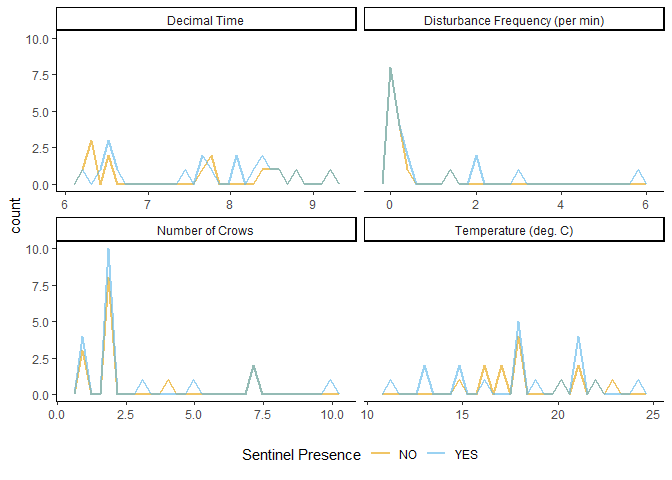

# Preamble
This script will deal with determining if different environmental factors affect the likelihood of a sentinel being present in the area. These factors will include group size, temperature, time of day, and disturbance frequency to name a few.

The main test we will be implementing is the binary logistic regression to determine the relationship between a binary target variable (sentinel presence) and a set of independent variables.

We will be reusing the 'Single Row' dataset for this script.


```r
SENT<-read.csv("DATA.SR.csv", stringsAsFactors = T)
SENT<-SENT[1:81,]
str(SENT)
```

```
## 'data.frame':	81 obs. of  77 variables:
##  $ VIDEO_ID.                        : Factor w/ 25 levels "037-2","038-2",..: 4 4 5 5 5 6 7 8 9 10 ...
##  $ ID.                              : Factor w/ 64 levels "020-01-01","020-01-02",..: 1 2 3 3 4 5 6 7 8 9 ...
##  $ DATE                             : Factor w/ 19 levels "2022-06-25","2022-07-07",..: 1 1 2 2 2 2 3 4 5 6 ...
##  $ Convert.date                     : Factor w/ 19 levels "2022-06-25","2022-07-07",..: 1 1 2 2 2 2 3 4 5 6 ...
##  $ JULIAN_DATE                      : int  20227825 20227825 20227837 20227837 20227837 20227837 20227843 20227849 20227850 20227852 ...
##  $ TIME                             : Factor w/ 24 levels "6:13:00","6:18:00",..: 3 3 1 1 1 2 7 6 8 6 ...
##  $ DECIMAL_TIME                     : num  6.33 6.33 6.22 6.22 6.22 ...
##  $ LATITUDE                         : num  43.2 43.2 43.2 43.2 43.2 ...
##  $ LONGITUDE                        : num  -79.2 -79.2 -79.2 -79.2 -79.2 ...
##  $ TEMPERATURE                      : int  18 18 16 16 16 16 19 22 24 21 ...
##  $ WEATHER                          : Factor w/ 6 levels "Cloudy","Foggy",..: 6 6 6 6 6 6 3 6 6 5 ...
##  $ TOTAL_VIDEO_DURATION             : num  87.7 87.7 191.5 191.5 191.5 ...
##  $ RECORDED_DURATION                : num  76.2 50 106 39.5 42 ...
##  $ CODED_ENV                        : int  0 0 0 0 0 0 0 0 0 0 ...
##  $ GENERALIZED_ENVIRONMENT          : Factor w/ 2 levels "Commercial","Green Area": 2 2 2 2 2 2 2 2 2 2 ...
##  $ CODED_SENTINEL_PRESENCE          : int  0 0 0 1 0 0 1 0 1 0 ...
##  $ SENTINEL_PRESENCE                : Factor w/ 2 levels "NO","YES": 1 1 1 2 1 1 2 1 2 1 ...
##  $ CODED_BAIT                       : int  0 0 0 0 0 1 1 1 1 1 ...
##  $ BAIT_PRESENCE                    : Factor w/ 2 levels "NO","YES": 1 1 1 1 1 2 2 2 2 2 ...
##  $ NUMBER_OF_CROWS_RECORDED         : int  2 2 2 2 2 1 1 1 1 2 ...
##  $ CODED_GROUP_SIZE                 : int  0 0 0 0 0 0 0 0 0 0 ...
##  $ GROUP_SIZE                       : Factor w/ 2 levels "LARGE","SMALL": 2 2 2 2 2 2 2 2 2 2 ...
##  $ TOTAL_NUMBER_OF_DISTURBANCES     : int  0 0 0 0 0 5 4 1 1 3 ...
##  $ NUMBER_HUMAN_DISTURBANCE         : int  0 0 0 0 0 4 2 1 1 2 ...
##  $ NUMBER_DOM_ANIMAL_DISTURBANCE    : int  0 0 0 0 0 1 2 0 0 1 ...
##  $ NUMBER_HETEROSPECIFIC_DISTURBANCE: int  0 0 0 0 0 0 0 0 0 0 ...
##  $ NUMBER_VEHICLE_DISTURBANCE       : int  0 0 0 0 0 0 0 0 0 0 ...
##  $ TOTAL_AGGRESSION                 : int  0 0 0 0 0 0 0 0 0 0 ...
##  $ CONSPECIFIC_AGGRESSION           : int  0 0 0 0 0 0 0 0 0 0 ...
##  $ TOTAL_FREQUENCY_OF_DISTURBANCES  : num  0 0 0 0 0 ...
##  $ DISTURBANCE_FREQUENCY            : Factor w/ 3 levels "HIGH","LOW","MEDIUM": 2 2 2 2 2 3 3 3 3 3 ...
##  $ HU_NUMBER_OF_BOUTS               : int  13 13 13 7 10 21 39 22 11 43 ...
##  $ HU_BEHAVIOR_DURATION             : num  22.9 17.7 72 30.8 19 ...
##  $ HU_MEAN_BOUT_DURATION            : num  1.76 1.36 5.54 4.4 1.9 ...
##  $ HU_SD_BOUT_DURATION              : num  2.737 1.305 3.493 2.839 0.939 ...
##  $ HU_BEHAVIOR_PROPORTION_...       : num  0.301 0.354 0.68 0.779 0.453 ...
##  $ HD_NUMBER_OF_BOUTS               : int  14 9 8 3 6 17 36 19 8 40 ...
##  $ HD_BEHAVIOR_DURATION             : num  39.76 18.77 22.15 4.22 9.25 ...
##  $ HD_MEAN_BOUT_DURATION            : num  2.84 2.09 2.77 1.41 1.54 ...
##  $ HD_SD_BOUT_DURATION              : num  2.44 1.17 2.42 1.22 1.07 ...
##  $ HD_BEHAVIOR_PROPORTION_...       : num  0.522 0.375 0.209 0.107 0.22 ...
##  $ M_NUMBER_OF_BOUTS                : int  6 8 9 4 10 11 10 7 8 12 ...
##  $ M_BEHAVIOR_DURATION              : num  13.48 13.53 11.79 4.51 13.7 ...
##  $ M_MEAN_BOUT_DURATION             : num  2.25 1.69 1.31 1.13 1.37 ...
##  $ M_SD_BOUT_DURATION               : num  2.2 1.507 0.426 0.476 0.742 ...
##  $ M_BEHAVIOR_PROPORTION_...        : num  0.177 0.27 0.111 0.114 0.326 ...
##  $ NUMBER_OF_PECKS                  : int  31 20 9 1 2 36 56 38 8 63 ...
##  $ PECK_RATE                        : num  46.8 63.9 24.4 14.2 13 ...
##  $ TOTAL_NB_BEHAVIORS               : int  46 37 35 15 25 60 118 62 32 127 ...
##  $ TOTAL_NB_TRANSITIONS             : int  45 35 33 14 23 56 116 60 31 124 ...
##  $ NB_HD.HDP                        : int  13 8 5 1 2 13 33 15 6 33 ...
##  $ FREQ_HD.HDP                      : num  0.289 0.229 0.152 0.071 0.087 0.232 0.284 0.25 0.194 0.266 ...
##  $ PTWY_HD.HDP                      : num  0.929 0.889 0.833 0.333 0.4 ...
##  $ NB_HD.HU                         : int  1 1 1 2 3 1 3 4 2 6 ...
##  $ FREQ_HD.HU                       : num  0.022 0.029 0.03 0.143 0.13 0.018 0.026 0.067 0.065 0.048 ...
##  $ PTWY_HD.HU                       : num  0.0714 0.1111 0.1667 0.6667 0.6 ...
##  $ NB_HD.M                          : int  0 0 0 0 0 1 0 0 0 0 ...
##  $ FREQ_HD.M                        : num  0 0 0 0 0 0.018 0 0 0 0 ...
##  $ PTWY_HD.M                        : num  0 0 0 0 0 ...
##  $ NB_HDP.HU                        : int  10 7 3 1 2 12 33 15 6 33 ...
##  $ FREQ_HDP.HU                      : num  0.222 0.2 0.091 0.071 0.087 0.214 0.284 0.25 0.194 0.266 ...
##  $ PTWY_HDP.HU                      : num  0.769 0.875 0.6 1 1 ...
##  $ NB_HDP.M                         : int  3 1 2 0 0 1 0 0 0 1 ...
##  $ FREQ_HDP.M                       : num  0.067 0.029 0.061 0 0 0.018 0 0 0 0.008 ...
##  $ PTWY_HDP.M                       : num  0.231 0.125 0.4 0 0 ...
##  $ NB_HU.HD                         : int  10 9 6 2 4 15 30 16 4 33 ...
##  $ FREQ_HU.HD                       : num  0.222 0.257 0.182 0.143 0.174 0.268 0.259 0.267 0.129 0.266 ...
##  $ PTWY_HU.HD                       : num  0.769 0.692 0.462 0.333 0.4 ...
##  $ NB_HU.M                          : int  3 4 7 4 6 6 9 6 7 9 ...
##  $ FREQ_HU.M                        : num  0.067 0.114 0.212 0.286 0.261 0.107 0.078 0.1 0.226 0.073 ...
##  $ PTWY_HU.M                        : num  0.231 0.308 0.538 0.667 0.6 ...
##  $ NB_M.HD                          : int  3 0 1 0 2 1 6 3 4 5 ...
##  $ FREQ_M.HD                        : num  0.067 0 0.03 0 0.087 0.018 0.052 0.05 0.129 0.04 ...
##  $ PTWY_M.HD                        : num  0.6 0 0.111 0 0.333 ...
##  $ NB_M.HU                          : int  2 5 8 4 4 6 2 1 2 4 ...
##  $ FREQ_M.HU                        : num  0.044 0.143 0.242 0.286 0.174 0.107 0.017 0.017 0.065 0.032 ...
##  $ PTWY_M.HU                        : num  0.4 1 0.889 1 0.667 ...
```
Next, we will subset the dataframe to include only the variables we want to keep.


```r
SENT<-SENT[1:81,c(1,2,7,10,11,15,17,20,22,30,31)]
str(SENT)
```

```
## 'data.frame':	81 obs. of  11 variables:
##  $ VIDEO_ID.                      : Factor w/ 25 levels "037-2","038-2",..: 4 4 5 5 5 6 7 8 9 10 ...
##  $ ID.                            : Factor w/ 64 levels "020-01-01","020-01-02",..: 1 2 3 3 4 5 6 7 8 9 ...
##  $ DECIMAL_TIME                   : num  6.33 6.33 6.22 6.22 6.22 ...
##  $ TEMPERATURE                    : int  18 18 16 16 16 16 19 22 24 21 ...
##  $ WEATHER                        : Factor w/ 6 levels "Cloudy","Foggy",..: 6 6 6 6 6 6 3 6 6 5 ...
##  $ GENERALIZED_ENVIRONMENT        : Factor w/ 2 levels "Commercial","Green Area": 2 2 2 2 2 2 2 2 2 2 ...
##  $ SENTINEL_PRESENCE              : Factor w/ 2 levels "NO","YES": 1 1 1 2 1 1 2 1 2 1 ...
##  $ NUMBER_OF_CROWS_RECORDED       : int  2 2 2 2 2 1 1 1 1 2 ...
##  $ GROUP_SIZE                     : Factor w/ 2 levels "LARGE","SMALL": 2 2 2 2 2 2 2 2 2 2 ...
##  $ TOTAL_FREQUENCY_OF_DISTURBANCES: num  0 0 0 0 0 ...
##  $ DISTURBANCE_FREQUENCY          : Factor w/ 3 levels "HIGH","LOW","MEDIUM": 2 2 2 2 2 3 3 3 3 3 ...
```

```r
dim(SENT)
```

```
## [1] 81 11
```
81 observations across 9 variables. BUT that's with all the individuals. Let's remove those replicates.


```r
SENT<- SENT[,-2] %>%
  distinct()
str(SENT)
```

```
## 'data.frame':	33 obs. of  10 variables:
##  $ VIDEO_ID.                      : Factor w/ 25 levels "037-2","038-2",..: 4 5 5 6 7 8 9 10 10 11 ...
##  $ DECIMAL_TIME                   : num  6.33 6.22 6.22 6.3 6.52 ...
##  $ TEMPERATURE                    : int  18 16 16 16 19 22 24 21 21 22 ...
##  $ WEATHER                        : Factor w/ 6 levels "Cloudy","Foggy",..: 6 6 6 6 3 6 6 5 5 4 ...
##  $ GENERALIZED_ENVIRONMENT        : Factor w/ 2 levels "Commercial","Green Area": 2 2 2 2 2 2 2 2 2 2 ...
##  $ SENTINEL_PRESENCE              : Factor w/ 2 levels "NO","YES": 1 1 2 1 2 1 2 1 2 2 ...
##  $ NUMBER_OF_CROWS_RECORDED       : int  2 2 2 1 1 1 1 2 2 1 ...
##  $ GROUP_SIZE                     : Factor w/ 2 levels "LARGE","SMALL": 2 2 2 2 2 2 2 2 2 2 ...
##  $ TOTAL_FREQUENCY_OF_DISTURBANCES: num  0 0 0 0.142 0.223 ...
##  $ DISTURBANCE_FREQUENCY          : Factor w/ 3 levels "HIGH","LOW","MEDIUM": 2 2 2 3 3 3 3 3 3 2 ...
```
33 observations across 8 variables. This includes the videos where a transition in sentinel presence occurred.

## Chi Square Time


```r
library(descr)
```

```
## Warning: package 'descr' was built under R version 4.3.1
```

```r
library(MASS)
```

```
## 
## Attaching package: 'MASS'
```

```
## The following object is masked from 'package:dplyr':
## 
##     select
```

```r
CHISQ<-lapply(SENT[,c("GENERALIZED_ENVIRONMENT"
                                 , "GROUP_SIZE"
                                 , "DISTURBANCE_FREQUENCY")
                              ]
                         , function(x) CrossTable(x,SENT$SENTINEL_PRESENCE
                                                  , fisher = T
                                                  , chisq = T
                                                  , expected = T
                                                  , prop.c = F
                                                  , prop.t = F
                                                  , prop.chisq = F
                                                  , sresid = T
                                                  , format = 'SPSS')
                         )
```

```
## Warning in chisq.test(tab, correct = FALSE, ...): Chi-squared approximation may
## be incorrect
```

```
## Warning in chisq.test(tab, correct = TRUE, ...): Chi-squared approximation may
## be incorrect
```

```
## Warning in chisq.test(tab, correct = FALSE, ...): Chi-squared approximation may
## be incorrect
```

```r
CHISQ
```

```
## $GENERALIZED_ENVIRONMENT
##    Cell Contents 
## |-------------------------|
## |                   Count | 
## |         Expected Values | 
## |             Row Percent | 
## |            Std Residual | 
## |-------------------------|
## 
## =====================================
##               SENT$SENTINEL_PRESENCE
## x                 NO      YES   Total
## -------------------------------------
## Commercial        6        7      13 
##                 5.5      7.5         
##                46.2%    53.8%   39.4%
##               0.206   -0.177         
## -------------------------------------
## Green Area        8       12      20 
##                 8.5     11.5         
##                40.0%    60.0%   60.6%
##              -0.166    0.143         
## -------------------------------------
## Total            14       19      33 
## =====================================
## 
## Statistics for All Table Factors
## 
## Pearson's Chi-squared test 
## ------------------------------------------------------------
## Chi^2 = 0.1221515      d.f. = 1      p = 0.727 
## 
## Pearson's Chi-squared test with Yates' continuity correction 
## ------------------------------------------------------------
## Chi^2 = 0      d.f. = 1      p = 1 
## 
##  
## Fisher's Exact Test for Count Data
## ------------------------------------------------------------
## Sample estimate odds ratio: 1.275883 
## 
## Alternative hypothesis: true odds ratio is not equal to 1 
## p = 1 
## 95% confidence interval: 0.2492462 6.528091 
## 
## Alternative hypothesis: true odds ratio is less than 1 
## p = 0.761 
## 95%s confidence interval: % 0 5.198388 
## 
## Alternative hypothesis: true odds ratio is greater than 1 
## p = 0.503 
## 95%s confidence interval: % 0.3131908 Inf 
## 
##         Minimum expected frequency: 5.515152 
## 
## 
## $GROUP_SIZE
##    Cell Contents 
## |-------------------------|
## |                   Count | 
## |         Expected Values | 
## |             Row Percent | 
## |            Std Residual | 
## |-------------------------|
## 
## ================================
##          SENT$SENTINEL_PRESENCE
## x            NO      YES   Total
## --------------------------------
## LARGE        2        4       6 
##            2.5      3.5         
##           33.3%    66.7%   18.2%
##         -0.342    0.293         
## --------------------------------
## SMALL       12       15      27 
##           11.5     15.5         
##           44.4%    55.6%   81.8%
##          0.161   -0.138         
## --------------------------------
## Total       14       19      33 
## ================================
## 
## Statistics for All Table Factors
## 
## Pearson's Chi-squared test 
## ------------------------------------------------------------
## Chi^2 = 0.2481203      d.f. = 1      p = 0.618 
## 
## Pearson's Chi-squared test with Yates' continuity correction 
## ------------------------------------------------------------
## Chi^2 = 0.001723058      d.f. = 1      p = 0.967 
## 
##  
## Fisher's Exact Test for Count Data
## ------------------------------------------------------------
## Sample estimate odds ratio: 0.6337315 
## 
## Alternative hypothesis: true odds ratio is not equal to 1 
## p = 1 
## 95% confidence interval: 0.04933611 5.337857 
## 
## Alternative hypothesis: true odds ratio is less than 1 
## p = 0.49 
## 95%s confidence interval: % 0 4.034101 
## 
## Alternative hypothesis: true odds ratio is greater than 1 
## p = 0.829 
## 95%s confidence interval: % 0.07362799 Inf 
## 
##         Minimum expected frequency: 2.545455 
## Cells with Expected Frequency < 5: 2 of 4 (50%)
## 
## 
## $DISTURBANCE_FREQUENCY
##    Cell Contents 
## |-------------------------|
## |                   Count | 
## |         Expected Values | 
## |             Row Percent | 
## |            Std Residual | 
## |-------------------------|
## 
## =================================
##           SENT$SENTINEL_PRESENCE
## x             NO      YES   Total
## ---------------------------------
## HIGH          1        5       6 
##             2.5      3.5         
##            16.7%    83.3%   18.2%
##          -0.969    0.831         
## ---------------------------------
## LOW           7        7      14 
##             5.9      8.1         
##            50.0%    50.0%   42.4%
##           0.435   -0.374         
## ---------------------------------
## MEDIUM        6        7      13 
##             5.5      7.5         
##            46.2%    53.8%   39.4%
##           0.206   -0.177         
## ---------------------------------
## Total        14       19      33 
## =================================
## 
## Statistics for All Table Factors
## 
## Pearson's Chi-squared test 
## ------------------------------------------------------------
## Chi^2 = 2.032678      d.f. = 2      p = 0.362 
## 
## 
##  
## Fisher's Exact Test for Count Data
## ------------------------------------------------------------
## Alternative hypothesis: two.sided 
## p = 0.476 
##         Minimum expected frequency: 2.545455 
## Cells with Expected Frequency < 5: 2 of 6 (33.33333%)
```

Hmm... The results of the chi square test suggest that none of the factors, either generalized environment, group size, or disturbance frequency have a significant effect.

# The continuous variables

To look more closely at the effects of continuous variables on the presence of a sentinel, I propose to plot the following figures:
- Count of sentinel presence across time
- Count of sentinel presence across temperature
- Count of sentinel presence across disturbance frequency
- Count of sentinel presence across the number of crows recorded


```r
SENT %>% 
  rename("Temperature (deg. C)" = "TEMPERATURE"
         , "Decimal Time" = "DECIMAL_TIME"
         , "Disturbance Frequency (per min)" = "TOTAL_FREQUENCY_OF_DISTURBANCES"
         , "Number of Crows" = "NUMBER_OF_CROWS_RECORDED") %>%
  pivot_longer(., cols = c("Temperature (deg. C)"
                           , "Decimal Time"
                           , "Number of Crows"
                           , "Disturbance Frequency (per min)")
               , names_to = "Var"
               , values_to = "Val") %>%
  ggplot(aes(
    x = Val
    , colour = SENTINEL_PRESENCE))+
  geom_freqpoly(linewidth = 1
                , alpha=I(.6)) +
  scale_colour_manual(values = cbPalette
                      , name = "Sentinel Presence") +
  facet_wrap(~Var, scale = "free_x") +
  theme_classic() +
  theme(legend.position = "bottom"
        , axis.title.x = element_blank())
```

```
## `stat_bin()` using `bins = 30`. Pick better value with `binwidth`.
```

<!-- -->

OK! There do not appear to be any patterns suggesting that the likelihood of a sentinel being present is affected by either the temperature, time, number of foraging crows or frequency of disturbances. In fact, the presence or absence of a sentinel does not appear to follow different patterns at all, in many cases having the same or similar peaks across the continuous variables.

# Results

The likelihood of a sentinel being present is not significantly affected by either the generalized environment, the binned group size, nor the binned disturbance frequency. 
When we looked at the effects of decimal time, number of foraging crows, temperature, and disturbance frequency (nb. disturb/min), we observed strikingly similar patterns between the number of observations with and without a sentinel. This suggests that neither variable affects the likelihood of a sentinel being present.

<!-- # Old glm stuff below -->
<!-- # ```{r SENT model - Simple} -->
<!-- # SENT.mod1<-glm(SENTINEL_PRESENCE~GENERALIZED_ENVIRONMENT+GROUP_SIZE+TOTAL_FREQUENCY_OF_DISTURBANCES+DECIMAL_TIME+TEMPERATURE -->
<!-- #               , family = binomial() -->
<!-- #               , data = SENT) -->
<!-- #  -->
<!-- # summary(SENT.mod1) -->
<!-- # ``` -->

<!-- OOF. By removing the duplicates, we now have no significant effects of any variable. -->
<!-- Next, let's try and see if we can run a glmm and include the video ID as a random effect. -->

<!-- ```{r SENT GLMM} -->
<!-- SENT.mod2<-glmer(SENTINEL_PRESENCE~GENERALIZED_ENVIRONMENT+TOTAL_FREQUENCY_OF_DISTURBANCES+DECIMAL_TIME+TEMPERATURE+(1|VIDEO_ID.) -->
<!--                 , family = binomial()        -->
<!--                 , data = SENT -->
<!--                        ) -->

<!-- summary(SENT.mod2) -->
<!-- ``` -->
<!-- Ok, the model is singular. Let's see if we can improve the model by reducing the number of factors. -->

<!-- ```{r AIC testing} -->
<!-- drop1(SENT.mod2, tests = "F") -->
<!-- ``` -->
<!-- From the results of the drop1 function, we see that the removal of temperature and decimal time would improve the model fit. Let's do that next. -->

<!-- ```{r SENT GLMM2} -->
<!-- SENT.mod3<-glmer(SENTINEL_PRESENCE~GENERALIZED_ENVIRONMENT+TOTAL_FREQUENCY_OF_DISTURBANCES+(1|VIDEO_ID.) -->
<!--                 , family = binomial()        -->
<!--                 , data = SENT -->
<!--                        ) -->

<!-- summary(SENT.mod3) -->
<!-- ``` -->
<!-- Still singular. It seems like my sample size is too small to determine any significant effects. Let's see if we can remove additional variables. -->

<!-- ```{r AIC testing2} -->
<!-- drop1(SENT.mod3, tests = "F") -->
<!-- ``` -->
<!-- Removing Generalized Environment would improve the model. Let's fit the final model. -->

<!-- ```{r SENT GLMM3} -->
<!-- SENT.mod4<-glmer(SENTINEL_PRESENCE~TOTAL_FREQUENCY_OF_DISTURBANCES+(1|TEMPERATURE) -->
<!--                 , family = binomial()        -->
<!--                 , data = SENT -->
<!--                        ) -->

<!-- summary(SENT.mod4) -->
<!-- ``` -->
<!-- Bummer... Still singular. I will need to look into bootstrapping or something else to improve the sample size. As it stands, the total frequency of disturbances appears to have the greatest effect on the likelihood of a sentinel being present. Next, I will run another 'simple' glm. -->

<!-- ```{r SENT model - Simple 2} -->
<!-- SENT.mod5<-glm(SENTINEL_PRESENCE~TOTAL_FREQUENCY_OF_DISTURBANCES -->
<!--               , family = binomial() -->
<!--               , data = SENT) -->

<!-- summary(SENT.mod5) -->
<!-- ``` -->

<!-- Same results as the glmm. Let's quickly try code I found on R-bloggers (https://www.r-bloggers.com/2015/08/bootstrap-with-logistic-regression/) -->

<!-- ```{r Bootstrapped model} -->
<!-- library(boot) -->
<!-- logit_test <- function(d,indices) {   -->
<!-- d <- d[indices,]   -->
<!-- fit <- glmer(SENTINEL_PRESENCE~TOTAL_FREQUENCY_OF_DISTURBANCES+(1|VIDEO_ID.) -->
<!--                 , family = binomial()        -->
<!--                 , data = d -->
<!--                        )  -->
<!-- return(coef(fit))   -->
<!-- } -->
<!-- boot_fit <- boot(   -->
<!--    data = SENT,  -->
<!--    statistic = logit_test,  -->
<!--    R = 1e5 -->
<!-- )  -->
<!-- ``` -->

<!-- Ok, still singular and the bootstrap failed. It is possible that there are too many levels in the frequency of disturbances. Let's try to simplify by binning the disturbance frequencies. -->

<!-- ```{r SENT GLMM 4} -->
<!-- SENT.mod6<-glmer(SENTINEL_PRESENCE~GENERALIZED_ENVIRONMENT+DISTURBANCE_FREQUENCY+DECIMAL_TIME+TEMPERATURE+(1|VIDEO_ID.) -->
<!--                 , family = binomial()        -->
<!--                 , data = SENT -->
<!--                        ) -->

<!-- summary(SENT.mod6) -->
<!-- ``` -->

<!-- Still singular. Let's remove some factors using drop 1. -->

<!-- ```{r AIC testing3} -->
<!-- drop1(SENT.mod6, tests = "F") -->
<!-- ``` -->

<!-- We can remove TEMPERATURE. -->

<!-- ```{r SENT GLMM 5} -->
<!-- SENT.mod7<-glmer(SENTINEL_PRESENCE~GENERALIZED_ENVIRONMENT+DISTURBANCE_FREQUENCY+DECIMAL_TIME+(1|VIDEO_ID.) -->
<!--                 , family = binomial()        -->
<!--                 , data = SENT -->
<!--                        ) -->

<!-- summary(SENT.mod7) -->
<!-- drop1(SENT.mod7) #remove decimal time -->
<!-- ``` -->

<!-- ```{r SENT GLMM 6} -->
<!-- SENT.mod8<-glmer(SENTINEL_PRESENCE~GENERALIZED_ENVIRONMENT+DISTURBANCE_FREQUENCY+(1|VIDEO_ID.) -->
<!--                 , family = binomial()        -->
<!--                 , data = SENT -->
<!--                        ) -->

<!-- summary(SENT.mod8) -->
<!-- drop1(SENT.mod8) #remove environment -->
<!-- ``` -->

<!-- ```{r SENT GLMM 7} -->
<!-- SENT.mod9<-glmer(SENTINEL_PRESENCE~DISTURBANCE_FREQUENCY+(1|VIDEO_ID.) -->
<!--                 , family = binomial()        -->
<!--                 , data = SENT -->
<!--                        ) -->

<!-- summary(SENT.mod9) -->
<!-- drop1(SENT.mod9) -->
<!-- ``` -->

<!-- Still singular. Let's try removing the random effect and running yet another simple model. -->

<!-- ```{r SENT model - Simple 3} -->
<!-- SENT.mod10<-glm(SENTINEL_PRESENCE~DISTURBANCE_FREQUENCY -->
<!--               , family = binomial() -->
<!--               , data = SENT) -->

<!-- summary(SENT.mod10) -->
<!-- ``` -->

<!-- Disturbance frequency is not significant. What about another bootstrap? -->

<!-- ```{r Bootstrapped model 2} -->
<!-- library(boot) -->
<!-- logit_test <- function(d,indices, formula) {   -->
<!-- d <- d[indices,]   -->
<!-- fit <- glm(formula -->
<!--            , family = binomial() -->
<!--            , data = d -->
<!--            )  -->
<!-- return(coef(fit))   -->
<!-- } -->

<!-- boot_fit <- boot( -->
<!--    data = SENT -->
<!--    , statistic = logit_test -->
<!--    , R = 1000 -->
<!--    , formula=SENTINEL_PRESENCE~DISTURBANCE_FREQUENCY -->
<!--    ) -->


<!-- ``` -->

<!-- RUN A CHI SQUARED!!! -->


